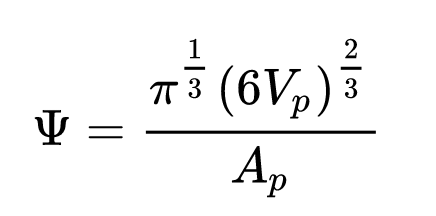

# Compute Surface Area to Volume & Sphericity

## Group (Subgroup)

Statistics (Morphological)

## Description

This **Filter** calculates the ratio of surface area to volume for each **Feature** in an **Image Geometry**, and optionally the [Sphericity](https://en.wikipedia.org/wiki/Sphericity) of each **Feature**.

The **Feature** surface area is accumulated one **Cell** face at a time. Walking every **Cell** of the geometry, each of the **Cell**'s six face neighbors is examined and the area of the shared face is added to the owning **Feature**'s total when **both** of the following hold:

+ the neighboring **Cell** lies **inside** the geometry, and
+ the neighboring **Cell**'s *Feature Id* is **different** from the current **Cell**'s.

The area added is the product of the two spacings that span the shared face: a face shared with the ±Z neighbor contributes `dx·dy`, a face shared with the ±Y neighbor contributes `dx·dz`, and a face shared with the ±X neighbor contributes `dy·dz`. On anisotropic spacing these are three different numbers, so the orientation of a **Feature** changes its surface area.

The **Feature** volume is the *Number of Cells* value the user selects, multiplied by the volume of one **Cell** (`dx·dy·dz`). The filter does **not** recount the **Cells** of each **Feature** from the *Feature Ids* array — whatever the selected *Number of Cells* array says is what is used.

Feature Id 0 is normally used to mark "bad data" or unindexed **Cells**. This filter does not compute a value for **Feature** 0: the first tuple of both output arrays is left at 0.

## Algorithm Details

1. Every **Cell** with a *Feature Id* of 1 or greater is visited.
2. For each of that **Cell**'s six face neighbors, the shared face area is added to the **Feature**'s running total when the neighbor is inside the geometry and carries a different *Feature Id*.
3. For each **Feature**, `SurfaceAreaVolumeRatio = A / V`, where `A` is the accumulated area and `V = NumCells · dx·dy·dz`. The units are inverse length.
4. If *Calculate Sphericity* is on, `Sphericity = π^(1/3) · (6V)^(2/3) / A`, which is 1 for a perfect sphere and less than 1 for every other real solid.

### Feature Id 0 counts as surface

A face shared with a **Cell** whose *Feature Id* is 0 **is** counted — id 0 is treated as an ordinary differing **Feature**. A **Feature** completely surrounded by "bad data" therefore reports the same surface area it would report if it were surrounded by a neighboring **Feature**.

### Faces on the outer boundary of the volume are NOT counted

A face that would look out of the sample is skipped, because there is no neighboring **Cell** on the far side of it. Any **Feature** that touches xmin, xmax, ymin, ymax, zmin or zmax therefore has its surface area **under-estimated** by the total area of the faces it presents to the outside world, and its surface-area-to-volume ratio is correspondingly too low.

Two visible consequences:

+ Because *Sphericity* divides by that under-estimated area, a boundary-touching **Feature** can report a **sphericity greater than 1**, which is geometrically impossible for a real solid. A single **Cell** in the corner of a volume, for example, reports a sphericity of about 1.61.
+ A **Feature** that fills the entire volume presents no interior faces at all, so its area is 0, its ratio is 0, and its sphericity is `+infinity`.

If either matters for your analysis, exclude boundary-touching **Features** first — the *Compute Surface Features* filter identifies them.

### WARNING - Aliasing

The surface area is the area of the **Cell** faces in contact with a neighboring **Feature** and is influenced by the aliasing (voxelization) of the structure. As a result the surface area to volume ratio will generally be over-estimated with respect to the *real* **Feature**, and the sphericity under-estimated. A perfect digital cube, for example, reports a sphericity of `(π/6)^(1/3) ≈ 0.806` at every size rather than the 1.0 of the sphere of equal volume.

### Warning - 2D Image Geometry Results

An **Image Geometry** one **Cell** thick still has *volume* according to DREAM3D-NX, so results are computed. In that case both z-neighbors of every **Cell** are outside the geometry, so no `dx·dy` face is ever counted and the reported "surface area" is really the perimeter of the **Feature** multiplied by the slice thickness. These results should **NOT** be interpreted as "Boundary Length to Area" values.

% Auto generated parameter table will be inserted here

## Example Pipelines

+ (03) Small IN100 Morphological Statistics

## References

Wadell, H. (1935). *Volume, Shape, and Roundness of Quartz Particles*. The Journal of Geology, 43(3), 250-280.

## License & Copyright

Please see the description file distributed with this **Plugin**

## DREAM3D-NX Help

If you need help, need to file a bug report or want to request a new feature, please head over to the [DREAM3DNX-Issues](https://github.com/BlueQuartzSoftware/DREAM3DNX-Issues/discussions) GitHub site where the community of DREAM3D-NX users can help answer your questions.
