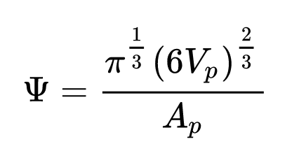

# Compute Surface Area to Volume & Sphericity

## Group (Subgroup)

Statistics (Morphological)

## Description

This **Filter** calculates the ratio of surface area to volume for each **Feature** in an **Image Geometry**.

This filter also optionally calculate the [Sphericity](https://en.wikipedia.org/wiki/Sphericity) of each feature.

This **Filter** determines whether a **Feature** touches an outer *Surface* of the sample volume. A **Feature** is considered touching the *Surface* of the sample if either of the following conditions are met:

+ Any cell location is xmin, xmax, ymin, ymax, zmin or zmax
+ Any cell has **Feature ID = 0** as a neighbor.

## Algorithm Details

- First, all the boundary **Cells** are found for each **Feature**. 
- Next, the surface area for each face that is in contact with a different **Feature** is totalled as long as that neighboring *featureId* is > 0.
- This number is divided by the volume of each **Feature**, calculated by taking the number of **Cells** of each **Feature** and multiplying by the volume of a **Cell**.

### WARNING - Aliasing

The surface area will be the surface area of the **Cells** in contact with the neighboring **Feature** and will be influenced by the aliasing of the structure.  As a result, the surface area to volume will likely be over-estimated with respect to the *real* **Feature**.

### WARNING - Skewed Results for features touching the surface

Because the filter does not include any surface that is touching/connected to a "FeatureId = 0", those features that are in contact with the edge of the virtual volume or in contact with internal features that are labeled as "FeatureId = 0" will have their values skewed.

### Warning - 2D Image Geometry Results

Because even a single slice has *volume* according to DREAM3D-NX, results will still be computed. These results should **NOT** be interpreted as "Boundary Length to Area" values.

% Auto generated parameter table will be inserted here

## Example Pipelines

+ (01) SmallIN100 Morphological Statistics

## License & Copyright

Please see the description file distributed with this **Plugin**

## DREAM3D-NX Help

If you need help, need to file a bug report or want to request a new feature, please head over to the [DREAM3DNX-Issues](https://github.com/BlueQuartzSoftware/DREAM3DNX-Issues/discussions) GitHub site where the community of DREAM3D-NX users can help answer your questions.
