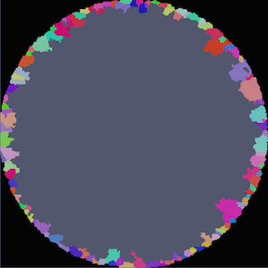
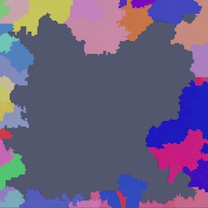

# Compute Surface Features

## Group (Subgroup)

Generic (Spatial)

## Description

This **Filter** flags each **Feature** with whether it touches an outer surface of the sample volume. The output is a feature-level boolean array where *false* (0) means the feature is fully enclosed in the interior and *true* (1) means at least one of its cells sits on the sample surface.

A **Feature** is considered a "surface feature" if either of the following is true:

- Any of its cells sits on the outermost voxel layer of the geometry -- i.e., a cell location equal to xmin, xmax, ymin, ymax, zmin, or zmax.
- Any of its cells has a neighbor with **Feature ID = 0**. (Feature ID 0 is the "unassigned" / "outside sample" label, typically produced by a mask or by [Isolate Largest Feature](IdentifySampleFilter.md).)

Surface features are usually excluded from size distributions, neighbor statistics, and other analyses because their measured volume is artificially truncated by the sample boundary. See [Compute Biased Features](ComputeBiasedFeaturesFilter.md) for a more statistically rigorous treatment of boundary bias.

### WARNING - Feature ID=0 Voxels

If there are voxels within the volume that have **Feature ID=0** then any feature touching those voxels will be considered a *Surface* feature.

### WARNING - Fixed bugs

The version of this filter in legacy DREAM3D-NX (version 6.x) had two bugs: one that indexed into neighboring features incorrectly [DREAM3D-NX repo issue #988](https://github.com/BlueQuartzSoftware/DREAM3D/issues/988), and another that incorrectly labeled feature 0 as a surface feature when feature 0 exists in the feature ids array [DREAM3D-NX repo issue #989](https://github.com/BlueQuartzSoftware/DREAM3D/issues/989). Both of these bugs have been fixed in this new version.

### 2D Image Geometry

If the structure/data is actually 2D, then the dimension that is planar is not considered and only the **Features** touching the edges are considered surface **Features**.

### Example Output

|       |        |
|-------|--------|
|  |   |
| Example showing features touching Feature ID=0 (Black voxels) "Mark Feature 0 Neighbors" is **ON** | Example showing features touching the outer surface of the bounding box |

### Required Input Sources

- **Cell Feature Ids** -- produced by a segmentation filter such as [Segment Features (Misorientation)](../OrientationAnalysis/EBSDSegmentFeaturesFilter.md) or [Segment Features (Scalar)](ScalarSegmentFeaturesFilter.md).

% Auto generated parameter table will be inserted here

## Example Pipelines

+ (06) SmallIN100 Synthetic

## License & Copyright

Please see the description file distributed with this **Plugin**

## DREAM3D-NX Help

If you need help, need to file a bug report or want to request a new feature, please head over to the [DREAM3DNX-Issues](https://github.com/BlueQuartzSoftware/DREAM3DNX-Issues/discussions) GitHub site where the community of DREAM3D-NX users can help answer your questions.
