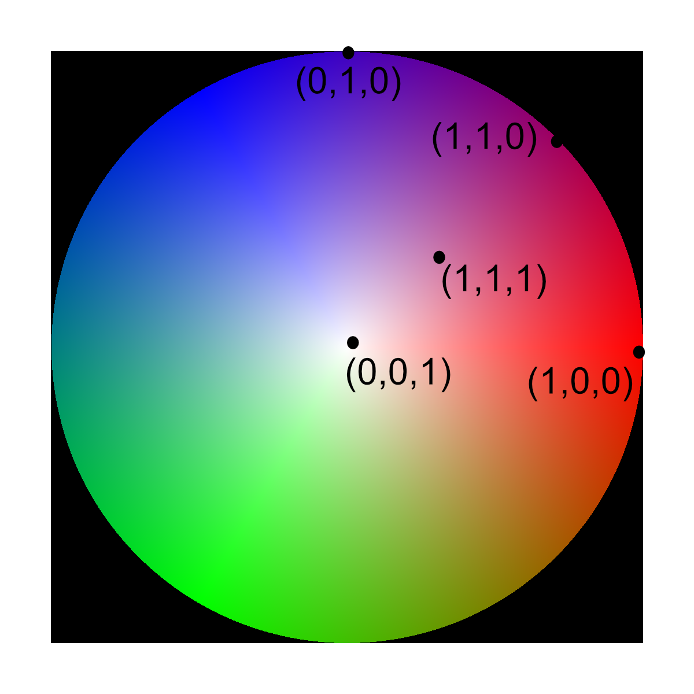

# Generate Vector Colors

## Group (Subgroup)

Generic (Coloring)

## Description

This filter generates an RGB color for each **Cell** based on the vector assigned to that **Cell** in the input vector data. The input is a 3-component (float32) vector **Cell** array, and the output is a 3-component unsigned 8-bit (uint8) RGB array with values in the range 0-255. Each input vector is normalized to unit length before its direction is mapped to a color, so only the *direction* of the vector affects the color; its magnitude is ignored. The color scheme assigns a unique color to every direction on the unit hemisphere using an HSV-like scheme. The color space is approximately represented by the following legend.

When *Apply to Good Voxels Only* is enabled, the supplied boolean or uint8 **Mask** array marks which **Cells** are valid; **Cells** flagged as bad are left black (RGB 0,0,0) instead of being colored.

### Required Input Sources

- **Vector Attribute Array** -- a 3-component float32 per-**Cell** vector array. This may come from any filter that produces a per-**Cell** vector field (for example, a dipole, gradient, or orientation-derived vector array).

% Auto generated parameter table will be inserted here

## Example Pipelines

## License & Copyright

Please see the description file distributed with this **Plugin**

## DREAM3D-NX Help

If you need help, need to file a bug report or want to request a new feature, please head over to the [DREAM3DNX-Issues](https://github.com/BlueQuartzSoftware/DREAM3DNX-Issues/discussions) GitHub site where the community of DREAM3D-NX users can help answer your questions.
