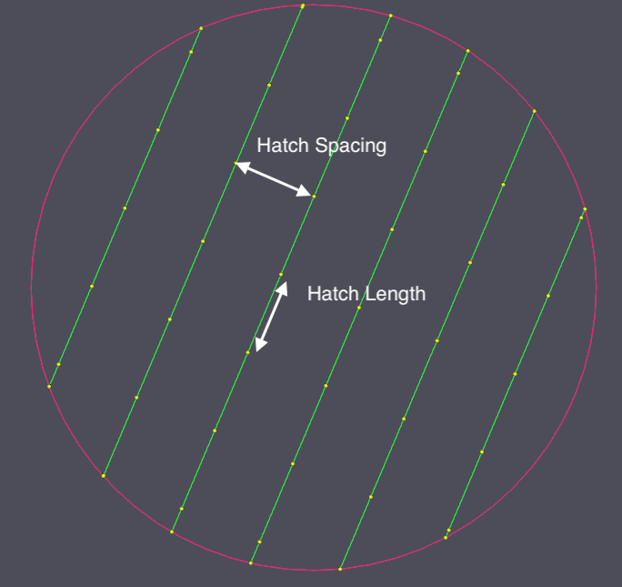
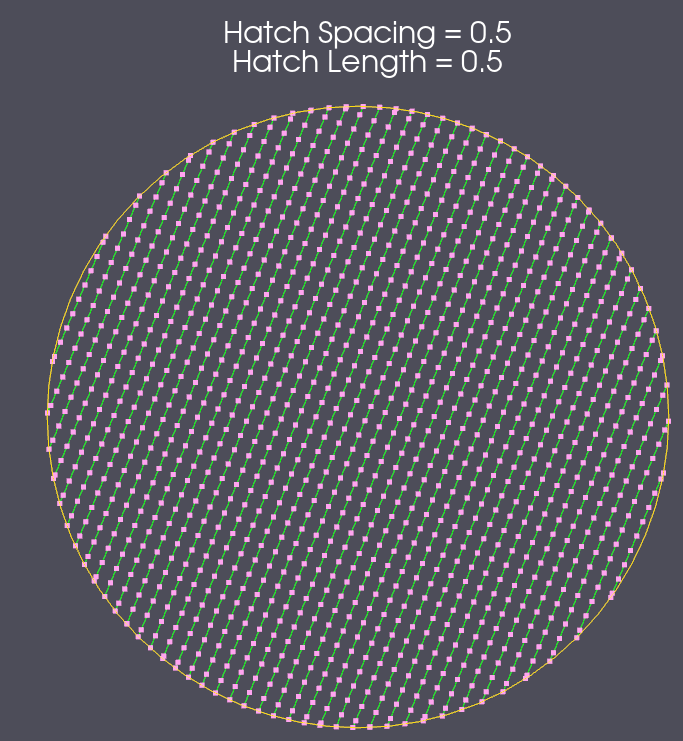
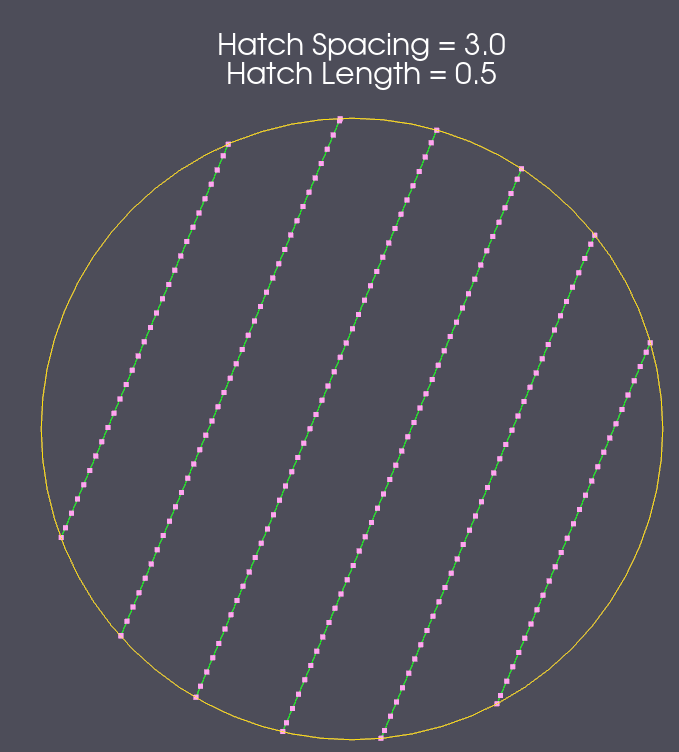
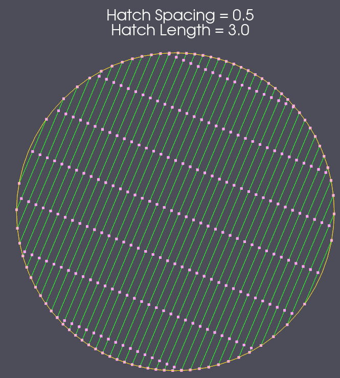
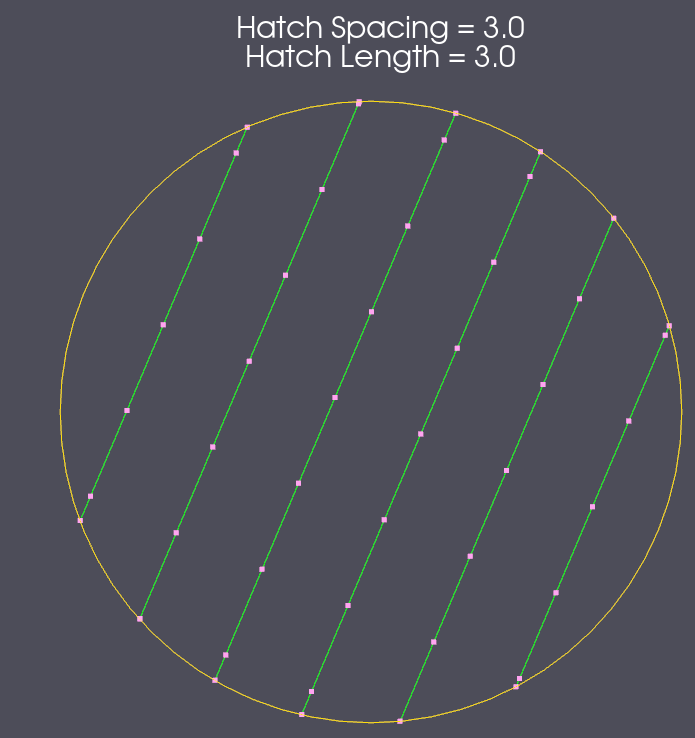

# Create AM Scan Paths Filter

## Group (Subgroup)

Core (Geometry/Processing)

## Description

Given an input **Edge Geometry**, stripe width, hatch spacing, laser power, and scan speed, this **Filter** will generate an **Edge Geometry** representing the additive manufacturing scan paths along with arrays containing times for each scan path node and powers, region ids, and slice ids for each scan path. The "SliceTriangleGeometry" filter is typically used before this filter to generate the proper edge geometry.

## Examples of Scan Vector Width and Spacing Values

|   | Hatch Spacing=0.5 | Hatch Spacing=3.0 |
|----------------|--------------------|--------|
| Hatch Length=0.5  |  |   |
| Hatch Length=3.0  |  |   |

% Auto generated parameter table will be inserted here

## Example Pipelines

CreateScanVectors

## License & Copyright

Please see the description file distributed with this **Plugin**

## DREAM3D-NX Help

If you need help, need to file a bug report or want to request a new feature, please head over to the [DREAM3DNX-Issues](https://github.com/BlueQuartzSoftware/DREAM3DNX-Issues/discussions) GitHub site where the community of DREAM3D-NX users can help answer your questions.
