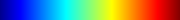

# Create Color Map

## Description

This **Filter** generates a color table array for a given 1-component input array.  Each element of the input array
is normalized and converted to a color based on where the value falls in the spectrum of the selected color preset.

The user can apply an optional data mask and then set the RGB values (0-255) that will be used if the data mask has a FALSE
value.

## Preset Values

These are the valid preset strings that can be used.

| Preset Name | Color Space | Example |
|-------------|-------------|---------|
| 2hot | Lab |  |
| Asymmetrical Earth Tones (6_21b) | Lab | .png) |
| Black-Body Radiation | RGB |  |
| Black, Blue and White | RGB |  |
| Black, Orange and White | RGB |  |
| Blue - Green - Orange | CIELAB |  |
| Blue Orange (divergent) | Lab | .png) |
| Blue to Yellow | RGB |  |
| BLUE-WHITE | Lab |  |
| blue2cyan | Lab |  |
| blue2yellow | Lab |  |
| Blues | Lab |  |
| bone_Matlab | Lab |  |
| BrBG | Lab |  |
| BrOrYl | Lab |  |
| BuGn | Lab |  |
| BuGnYl | Lab |  |
| BuPu | Lab |  |
| BuRd | Lab |  |
| CIELab Blue to Red | Lab |  |
| Cividis | Lab |  |
| Cold and Hot | RGB |  |
| Cool to Warm (Extended) | Lab | .png) |
| Cool to Warm | Diverging |  |
| copper_Matlab | Lab |  |
| erdc_blue_BW | Lab |  |
| erdc_blue2cyan_BW | Lab |  |
| erdc_blue2gold | Lab |  |
| erdc_blue2gold_BW | Lab |  |
| erdc_blue2green_BW | Lab |  |
| erdc_blue2green_muted | Lab |  |
| erdc_blue2yellow | Lab |  |
| erdc_brown_BW | Lab |  |
| erdc_cyan2orange | Lab |  |
| erdc_divHi_purpleGreen | Lab |  |
| erdc_divHi_purpleGreen_dim | Lab |  |
| erdc_divLow_icePeach | Lab |  |
| erdc_divLow_purpleGreen | Lab |  |
| erdc_gold_BW | Lab |  |
| erdc_green2yellow_BW | Lab |  |
| erdc_iceFire_H | Lab |  |
| erdc_iceFire_L | Lab |  |
| erdc_magenta_BW | Lab |  |
| erdc_marine2gold_BW | Lab |  |
| erdc_orange_BW | Lab |  |
| erdc_pbj_lin | Lab |  |
| erdc_purple_BW | Lab |  |
| erdc_purple2green | Lab |  |
| erdc_purple2green_dark | Lab |  |
| erdc_purple2pink_BW | Lab |  |
| erdc_rainbow_bright | Lab |  |
| erdc_rainbow_dark | Lab |  |
| erdc_red_BW | Lab |  |
| erdc_red2purple_BW | Lab |  |
| erdc_red2yellow_BW | Lab |  |
| erdc_sapphire2gold_BW | Lab |  |
| Fast | RGB |  |
| GBBr | Lab |  |
| gist_earth | Lab |  |
| GnBu | Lab |  |
| GnBuPu | Lab |  |
| GnRP | Lab |  |
| GnYlRd | Lab |  |
| Gray and Red | Lab |  |
| Grayscale | RGB |  |
| Green-Blue Asymmetric Divergent (62Blbc) | Lab | .png) |
| GREEN-WHITE_LINEAR | Lab |  |
| Greens | Lab |  |
| GYPi | Lab |  |
| GyRd | Lab |  |
| Haze | RGB |  |
| Haze_cyan | Lab |  |
| Haze_green | Lab |  |
| Haze_lime | Lab |  |
| heated_object | Lab |  |
| hsv | RGB |  |
| hue_L60 | Lab |  |
| Inferno (matplotlib) | Diverging | .png) |
| Jet | RGB |  |
| Linear Blue (8_31f) | Lab | .png) |
| Linear Green (Gr4L) | Lab | .png) |
| Linear YGB 1211g | Lab |  |
| magenta | Lab |  |
| Magma (matplotlib) | Diverging | .png) |
| Muted Blue-Green | Lab |  |
| nic_CubicL | Lab |  |
| nic_CubicYF | Lab |  |
| nic_Edge | Lab |  |
| Oranges | Lab |  |
| OrPu | Lab |  |
| pink_Matlab | Lab |  |
| PiYG | Lab |  |
| Plasma (matplotlib) | Diverging | .png) |
| PRGn | Lab |  |
| PuBu | Lab |  |
| PuOr | Lab |  |
| PuRd | Lab |  |
| Purples | Lab |  |
| Rainbow | RGB |  |
| Rainbow Blended Black | RGB |  |
| Rainbow Blended Grey | RGB |  |
| Rainbow Blended White | RGB |  |
| Rainbow Desaturated | RGB |  |
| Rainbow Uniform | RGB |  |
| RdOr | Lab |  |
| RdOrYl | Lab |  |
| RdPu | Lab |  |
| RED_TEMPERATURE | Lab |  |
| RED-PURPLE | Lab |  |
| Reds | Lab |  |
| Spectral_lowBlue | Lab |  |
| Turbo | RGB |  |
| Viridis (matplotlib) | Diverging | .png) |
| Warm to Cool (Extended) | Lab | .png) |
| Warm to Cool | Diverging |  |
| X Ray | RGB |  |
| Yellow - Gray - Blue | Lab |  |
| Yellow 15 | Lab |  |

% Auto generated parameter table will be inserted here

## Example Pipelines

## License & Copyright

Please see the description file distributed with this plugin.

## DREAM3D-NX Help

If you need help, need to file a bug report or want to request a new feature, please head over to the [DREAM3DNX-Issues](https://github.com/BlueQuartzSoftware/DREAM3DNX-Issues/discussions) GItHub site where the community of DREAM3D-NX users can help answer your questions.
