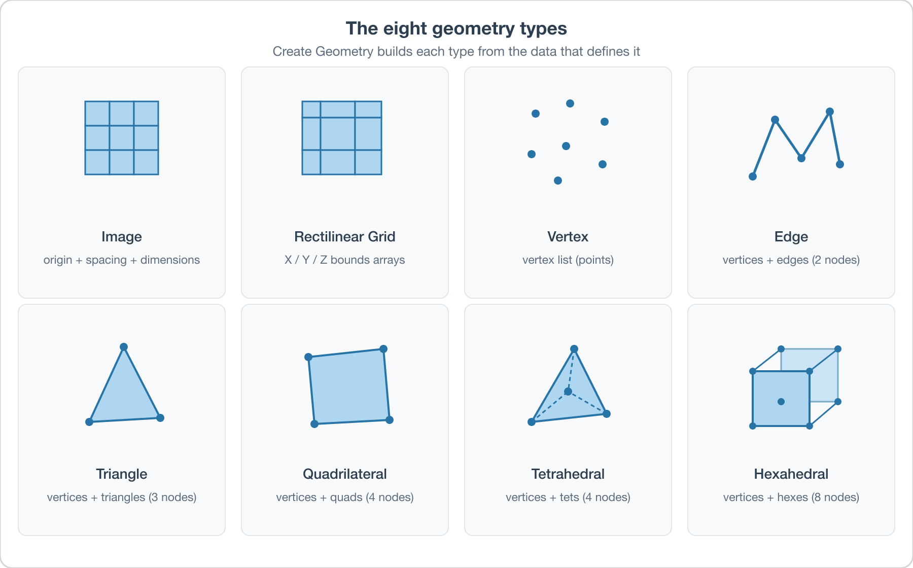

# Create Geometry

## Group (Subgroup)

DREAM3D Review (Geometry)

## Description

This **Filter** creates a new **Geometry** object of one of eight supported types, together with the **Attribute Matrices** and **Attribute Arrays** needed to define its topology. Use this filter when you have raw coordinate/connectivity data (typically from an external file or an upstream filter) and need to wrap it in a DREAM3D-NX geometry object.

For grid-type geometries (Image, Rectilinear Grid), the topology is defined entirely by numeric parameters (dimensions, spacing, origin, or bounds arrays). For mesh-type geometries (Vertex, Edge, Triangle, Quadrilateral, Tetrahedral, Hexahedral), the user supplies a *shared vertex list* and an *element connectivity list* as input arrays.

### Supported Geometry Types

| Type | Topology | Element Type | Required Inputs |
|---|---|---|---|
| Image | Regular voxel grid | Cell (voxel) | Dimensions + Spacing + Origin |
| Rectilinear Grid | Variable-spacing grid | Cell | x/y/z Bounds arrays |
| Vertex | Point cloud | Vertex | Vertex coordinates |
| Edge | Line mesh | Edge (2 vertices) | Vertex list + Edge list |
| Triangle | Surface mesh | Face (3 vertices) | Vertex list + Triangle list |
| Quadrilateral | Surface mesh | Face (4 vertices) | Vertex list + Quad list |
| Tetrahedral | Volume mesh | Cell (4 vertices) | Vertex list + Tet list |
| Hexahedral | Volume mesh | Cell (8 vertices) | Vertex list + Hex list |

### Grid Geometries

**Image Geometry** is a *regular, rectilinear grid* defined by three vectors of three numbers each: dimensions, spacing, and origin.

- **Dimensions** -- grid extents stored as unsigned 64-bit integers. Dimensions are **0-based**, so a dimension of 10 has extents 0-9. No dimension may be zero or negative.
- **Spacing** -- physical distance between grid planes along each axis, stored as 32-bit floats. Units match whatever the source data uses (e.g., microns per voxel). Spacing must be positive and non-zero. (Older docs called this *resolution*; *spacing* is preferred because *resolution* is ambiguous.)
- **Origin** -- physical location of the bottom-left grid point in the geometry's coordinate system. Stored as 32-bit floats. No value restriction.

All Image Geometries are stored as 3D; a 2D image is represented by setting one dimension to exactly 1, producing a plane. Downstream filters that care (e.g., *Compute Feature Shapes*) detect this automatically.

**Rectilinear Grid Geometry** is similar to an Image Geometry but allows variable spacing along each axis. It is defined by three monotonically-increasing 32-bit float bounds arrays (x, y, z). The spacing between any two adjacent planes is the difference between consecutive entries in the bounds array. No origin is needed -- the bounds arrays explicitly encode position.

### Unstructured (Mesh) Geometries

Mesh geometries are defined by a **shared vertex list** (a 3-component float array of vertex coordinates) plus an **element connectivity list** (a multi-component unsigned 64-bit integer array, where each tuple is the list of vertex IDs that make up one element).

**Shared vertex** means a vertex used by multiple elements appears only once in the vertex list. For example, two quadrilaterals sharing one edge have 6 unique vertices (not 8). Element IDs are always **0-based**.

**Element winding** matters for surface meshes. By convention, vertex order in each element tuple follows the **right-hand rule** -- when fingers curl in the order of the vertices, the thumb points in the direction of the element's surface normal. For tetrahedra, the first three vertices define the base; their winding by the right-hand rule defines a normal pointing toward the fourth vertex. Consistent winding makes tetrahedron volume *signed*, which lets downstream filters detect inverted elements.

The shared-list scheme is space-efficient and supports *nonmanifold* meshes (e.g., triangle meshes where more than two triangles share an edge, which occurs at triple lines and quadruple points in polycrystalline surface meshes). Its downside: computing adjacency (e.g., "what elements share this vertex?") requires iterating the whole mesh.

### Array Handling

The *Array Handling* parameter controls what happens to the input arrays passed to this filter:

- **Copy Attribute Arrays [0]**: input arrays are copied into the new geometry. Originals are left in place.
- **Move Attribute Arrays [1]**: input arrays are moved into the new geometry and removed from their original location. Saves memory when the original copies are no longer needed.

### Validation

The filter validates that the supplied arrays "make sense" for the chosen geometry type (e.g., bounds arrays for a Rectilinear Grid have at least 2 values; no vertex ID in a connectivity list exceeds the vertex count). Checks that require reading actual values run at execute time. By default these checks produce warnings; enable *Treat Geometry Warnings as Errors* to make them fail the pipeline.

% Auto generated parameter table will be inserted here

## Example Pipelines

+ CreateVertexGeometry
+ CreateTriangleGeometry
+ CreateEdgeGeometry
+ CreateQuadGeometry
+ CreateRectilinearGrid

## License & Copyright

Please see the description file distributed with this plugin.

## DREAM3D-NX Help

If you need help, need to file a bug report or want to request a new feature, please head over to the [DREAM3DNX-Issues](https://github.com/BlueQuartzSoftware/DREAM3DNX-Issues/discussions) GitHub site where the community of DREAM3D-NX users can help answer your questions.
