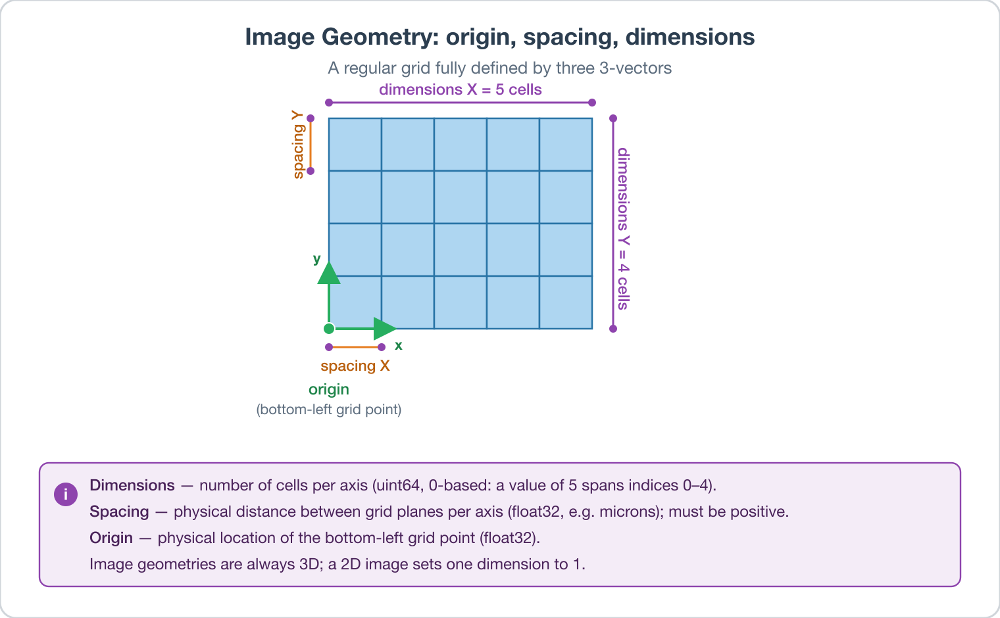

# Create Geometry (Image)

## Group (Subgroup)

Core (Generation)

> ⚠ **Deprecation Notice.** This filter is deprecated. Use the more general [Create Geometry](CreateGeometryFilter.md) filter instead. This filter is retained for compatibility with legacy pipelines.

## Description

This **Filter** creates an **Image Geometry** -- a regular grid of voxels (3D) or pixels (2D). The user supplies the dimensions, spacing, and origin; the filter creates a new geometry object with no cell data attached. Use it before reading raw binary data into a grid, before creating synthetic data on a regular grid, or whenever you need a fresh empty Image Geometry.

An Image Geometry is the simplest and most widely used DREAM3D-NX geometry type. For dimensionality *d*, only 3 × *d* numbers are needed to completely define it: three *d*-vectors for the dimensions, origin, and spacing.

- **Dimensions** -- grid extents. Stored as unsigned 64-bit integers. Dimensions are **0-based**, so a dimension of 10 spans extents 0-9. No dimension may be zero or negative.
- **Spacing** -- physical distance between grid planes along each axis. Stored as 32-bit floats. Units match the source data (e.g., microns per voxel). Spacing must be positive and non-zero. (*Resolution* was the older name; *spacing* is preferred because *resolution* is ambiguous.)
- **Origin** -- physical location of the bottom-left grid point in the geometry's coordinate system. Stored as 32-bit floats. No value restriction.

All Image Geometries are stored as 3D; a 2D image is represented by setting one dimension to exactly 1, producing a plane. Downstream filters that care about dimensionality (e.g., *Compute Feature Shapes*) detect the 2D case automatically.

Since all Image Geometries are implicitly 3D, the building block is a *voxel*, which is a 3D object. The basic **Element** type for an Image Geometry is **Cell**. Attribute arrays associated with cells are stored in x-y-z raster order (fastest to slowest).

### Example Usage

When importing raw binary data on a regular grid, run this filter first to create the geometry description; then attach data via subsequent reader filters.

### Required Input Sources

None. The geometry is created from user-supplied parameters.

% Auto generated parameter table will be inserted here

## Example Pipelines

## License & Copyright

Please see the description file distributed with this **Plugin**

## DREAM3D-NX Help

If you need help, need to file a bug report or want to request a new feature, please head over to the [DREAM3DNX-Issues](https://github.com/BlueQuartzSoftware/DREAM3DNX-Issues/discussions) GitHub site where the community of DREAM3D-NX users can help answer your questions.
