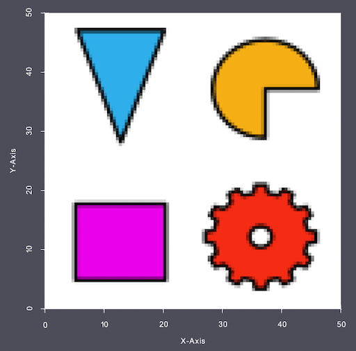
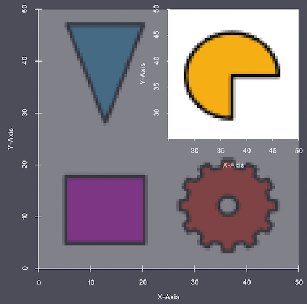
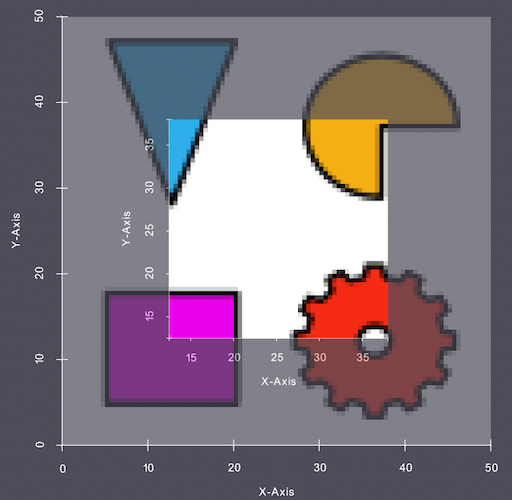
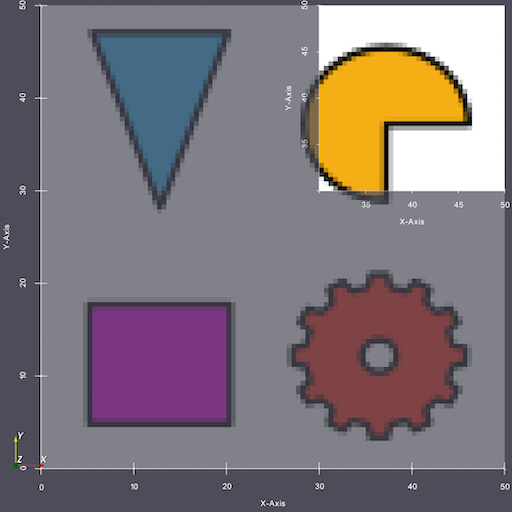

# Crop Geometry (Image)

## Description

This **Filter** allows the user to crop a region of interest (ROI) from an **Image Geometry**.  The input parameters are in units of voxels or physical coordinates.  

## Examples

In the following examples, the following image is being used.

- Origin:     [0.0, 0.0, 0.0]
- Spacing:    {0.5, 0.5, 1.0}
- Dimensions: {100, 100, 1}

So the bounds of the image is (0-50 micron, 0-50 micron, 0-1 micron)

### Example 1

If the user wanted to crop the last 50 voxels in the X and Y axis then the user would use the following values:

    Xmin = 50,
    Xmax = 99,
    Ymin = 50,
    Ymax = 99,
    Zmin = 0,
    Zmax = 0 

**Note:** the units in the above image is in microns.

**Note:** The input parameters are *inclusive* and begin at *0*, so in the above example *50-99* will include the last 50 voxels.

### Example 2

If the user would like to crop out the `middle` 50 voxels from the image, these are the inputs:

    Xmin = 25,
    Xmax = 74,
    Ymin = 25,
    Ymax = 74,
    Zmin = 0,
    Zmax = 0

### Example 3

In this example the user is going to define the crop using physical coordinates and also selecting an upper bound that exceeds the actual bounds of the image. In this case, the filter will instead use the maximum bounds from that axis.

    Xmin = 30 microns,
    Xmax = 65 microns,
    Ymin = 30 microns,
    Ymax = 65 microns,
    Zmin = 0 microns,
    Zmax = 65 microns

**Note:** This will work because at least some portion of the cropped image is within the original image. If **ALL** cropped values fall out side of the image bounds then the filter will error out in preflight.

User may note that the way the bounds are determined are affected by the origin and spacing, so be sure to take these into account when supplying coordinate bounds for the crop.

## Renumber Features

It is possible with this **Filter** to fully remove **Features** from the volume, possibly resulting in consistency errors if more **Filters** process the data in the pipeline. If the user selects to *Renumber Features* then the *Feature Ids* array will be adjusted so that all **Features** are continuously numbered starting from 1. The user should decide if they would like their **Features** renumbered or left alone (in the case where the cropped output is being compared to some larger volume).

The user has the option to save the cropped volume as a new **Data Container** or overwrite the current volume.

% Auto generated parameter table will be inserted here

## Example Pipelines

## License & Copyright

Please see the description file distributed with this **Plugin**

## DREAM3D-NX Help

If you need help, need to file a bug report or want to request a new feature, please head over to the [DREAM3DNX-Issues](https://github.com/BlueQuartzSoftware/DREAM3DNX-Issues/discussions) GItHub site where the community of DREAM3D-NX users can help answer your questions.
