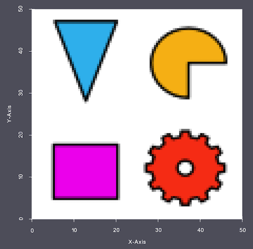
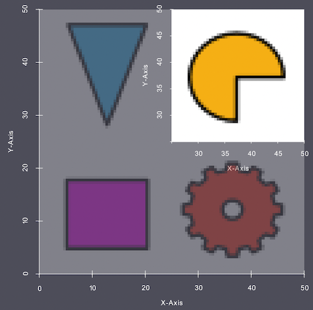
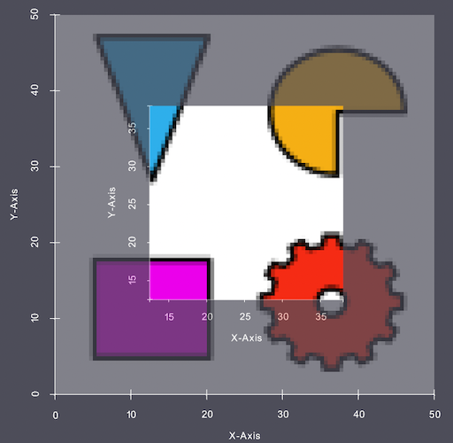
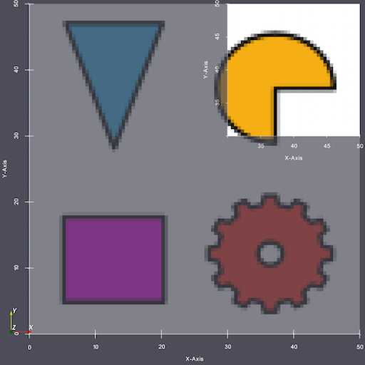

# Crop Geometry (Image)

## Description

This **Filter** allows the user to crop a region of interest (ROI) from an **Image Geometry**.  The input parameters are in units of voxels or physical coordinates.  

It is possible to also crop specific dimensions of the **Image Geometry** by toggling **Crop X Dimension**, **Crop Y Dimension**, and **Crop Z Dimension** ON and OFF.

## WARNING: NeighborList Removal

If the option to "Renumber Features" is turn ON and the Cell Feature AttributeMatrix contains any *NeighborList* data arrays, those arrays will be **REMOVED** because those lists are now invalid. Re-run the *Find Neighbors* filter to re-create the lists.


## Examples

In the following examples, the following image is being used.

- Origin:     [0.0, 0.0, 0.0]
- Spacing:    {0.5, 0.5, 1.0}
- Dimensions: {100, 100, 1}

So the bounds of the image is (0-50 micron, 0-50 micron, 0-1 micron)



### Example 1

If the user wanted to crop the last 50 voxels in the X and Y axis then the user would use the following values:

    Xmin = 50,
    Xmax = 99,
    Ymin = 50,
    Ymax = 99,
    Zmin = 0,
    Zmax = 0 



**Note:** the units in the above image is in microns.

**Note:** The input parameters are *inclusive* and begin at *0*, so in the above example *50-99* will include the last 50 voxels.

### Example 2

If the user would like to crop out the `middle` 50 voxels from the image, these are the inputs:

    Xmin = 25,
    Xmax = 74,
    Ymin = 25,
    Ymax = 74,
    Zmin = 0,
    Zmax = 0



### Example 3

In this example the user is going to define the crop using physical coordinates and also selecting an upper bound that exceeds the actual bounds of the image. In this case, the filter will instead use the maximum bounds from that axis.

    Xmin = 30 microns,
    Xmax = 65 microns,
    Ymin = 30 microns,
    Ymax = 65 microns,
    Zmin = 0 microns,
    Zmax = 65 microns

**Note:** This will work because at least some portion of the cropped image is within the original image. If **ALL** cropped values fall out side of the image bounds then the filter will error out in preflight.



User may note that the way the bounds are determined are affected by the origin and spacing, so be sure to take these into account when supplying coordinate bounds for the crop.

## Algorithm

### What the filter does

Cropping an **Image Geometry** is conceptually a 3D subarray copy. The user supplies an axis-aligned bounding box in voxel (or physical) coordinates, and for every destination voxel `(x, y, z)` in the cropped output, the filter reads the source voxel at `(x + xMin, y + yMin, z + zMin)`. Every **Cell Attribute Array** (FeatureIds, image intensities, orientations, etc.) is copied through the same mapping so the output volume is a self-consistent slice of the input.

In pseudocode:

```
for each destination voxel (dx, dy, dz):
    for each cell-level array A:
        A_out[dx, dy, dz] = A_in[dx + xMin, dy + yMin, dz + zMin]
```

The challenge is doing this efficiently when `A_in` and `A_out` are backed by **out-of-core (OOC)** storage — HDF5-chunked arrays that live on disk and stream into memory on demand.

### Z-slice-batched bulk I/O

For each cell-level array, the filter processes **K consecutive Z-slices per batch** (`K = 32`) using three steps:

1. **Bulk read** — a single `copyIntoBuffer()` call reads K full source Z-slices (the entire `X * Y * K` slab, not just the crop region) into a contiguous RAM buffer. Reading the full slab is cheaper than reading only the crop region because HDF5 chunks are typically aligned to full X-Y slices.

2. **In-memory extraction** — for each of the K slices in the batch, the filter copies the `[yMin, yMax) × [xMin, xMax)` region row-by-row into a contiguous destination buffer via `std::memcpy`. No disk I/O happens in this step; it operates entirely on RAM slabs.

3. **Bulk write** — a single `copyFromBuffer()` call writes the K cropped destination Z-slices back to the output array.

The outer loop advances by K slices until the full Z range is processed.

### Why this is fast

The filter's peak working memory is bounded by:

```
K * (srcDimX * srcDimY + cropX * cropY) * numComps * sizeof(T)
```

This is O(slab), **not** O(volume) — memory stays constant as the dataset grows. For a 1472×1139×1174 uint16 volume with K=32, the source slab is ~86 MB.

Previously, the filter issued one `copyIntoBuffer()`/`copyFromBuffer()` pair per `(z, y)` row — on a 1472×1139×1174 volume, that is roughly 1.7 million I/O call pairs **per cell array**. Each call carries fixed HDF5 chunk-lookup overhead; at that call count the overhead dominates the real I/O. Batching by K collapses the call count by a factor of `K * Y_range`, which in practice is a 100×+ reduction in HDF5 chunk-op overhead.

Multiple cell arrays are cropped concurrently using `ParallelTaskAlgorithm`: one task per array, each task owning its own slab buffers. The per-thread memory is bounded by the slab size above.

### Optional Renumber Features step

When **Renumber Features** is enabled, after the cell-data copy the filter invokes the shared `Sampling::RenumberFeatures` helper to remap **FeatureIds** into a contiguous `1..N` range, then shrinks the **Cell Feature Attribute Matrix** to match. Deep copies of the feature-level arrays (which can include string arrays) are taken before the renumber so the original feature data is not destructively mutated.

## Renumber Features

It is possible with this **Filter** to fully remove **Features** from the volume, possibly resulting in consistency errors if more **Filters** process the data in the pipeline. If the user selects to *Renumber Features* then the *Feature Ids* array will be adjusted so that all **Features** are continuously numbered starting from 1. The user should decide if they would like their **Features** renumbered or left alone (in the case where the cropped output is being compared to some larger volume).

The user has the option to save the cropped volume as a new **Data Container** or overwrite the current volume.

% Auto generated parameter table will be inserted here

## Example Pipelines

## License & Copyright

Please see the description file distributed with this **Plugin**

## DREAM3D-NX Help

If you need help, need to file a bug report or want to request a new feature, please head over to the [DREAM3DNX-Issues](https://github.com/BlueQuartzSoftware/DREAM3DNX-Issues/discussions) GitHub site where the community of DREAM3D-NX users can help answer your questions.
