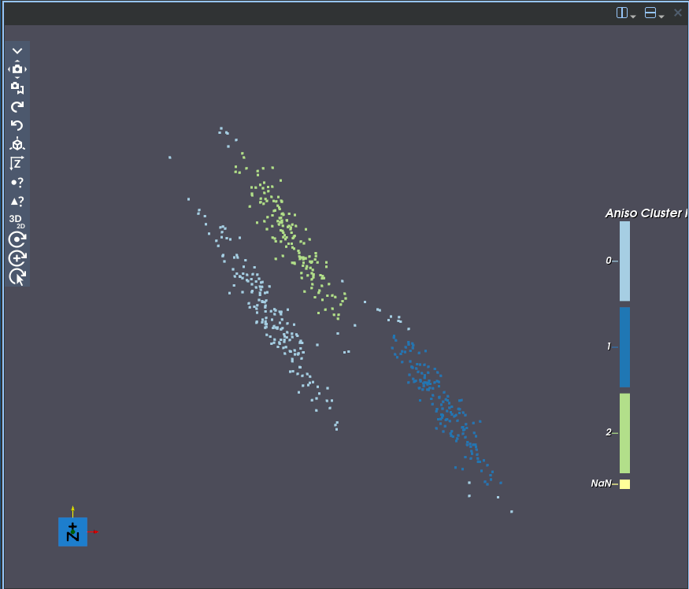
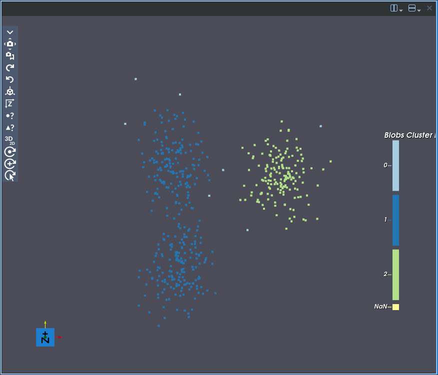
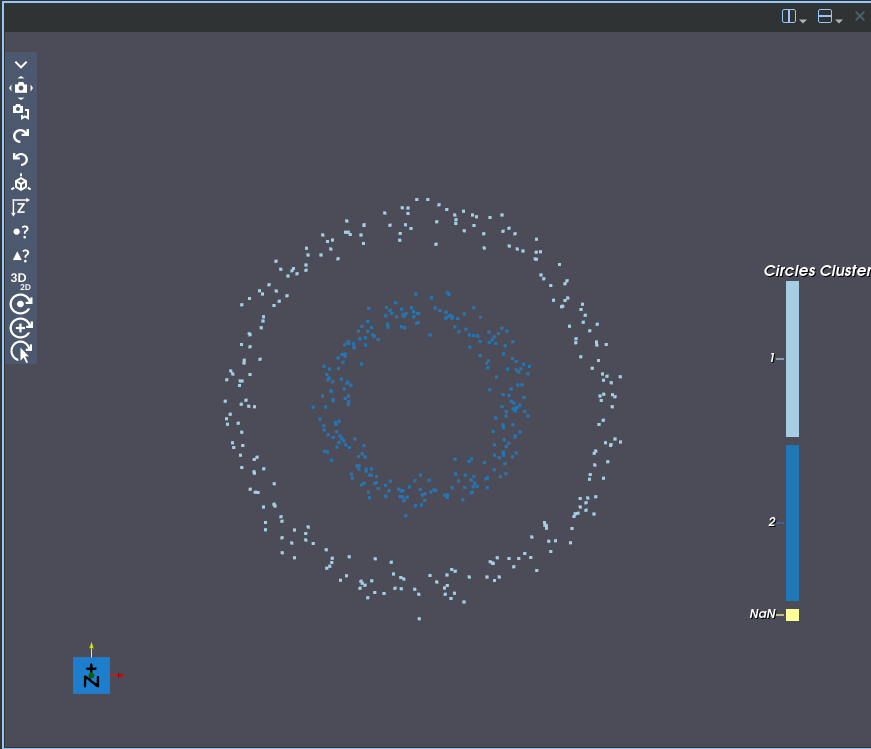
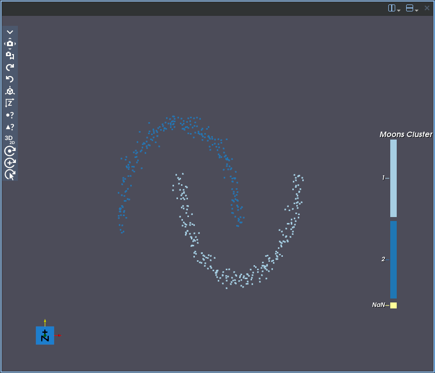
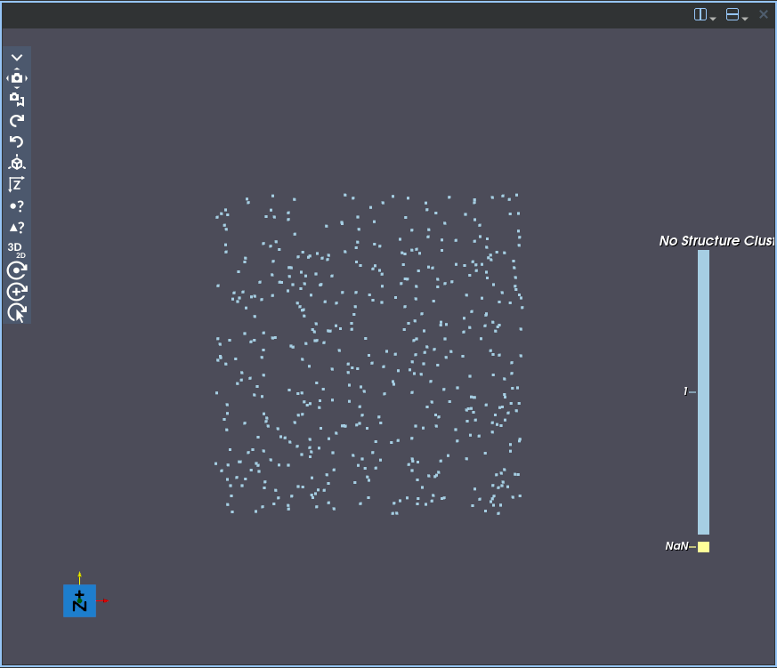
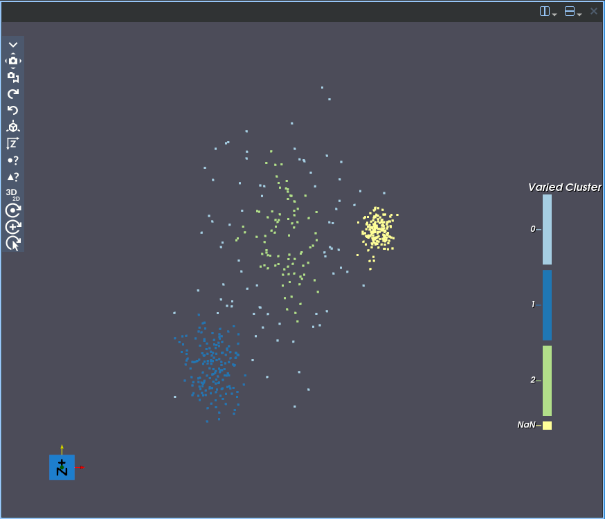

# DBSCAN

## Group (Subgroup)

Analysis (Clustering)

## Description

**Table of Contents:**

- Acknowledgements
- Overview
- Examples
- Visualization Tips
- Hyperparameter Tuning

### Acknowledgements

The algorithm used in this filter is derived from *Grid-based DBSCAN: Indexing and inference* [1].

*Note from Developers*: We are aware of a paper that outlines an algorithm that can reasonably predict the hyperparameter values, but at the current time implementation is left up to potential contributors [2].

### Overview

This **Filter** implements a modified version of the classic DBSCAN (density-based spatial clustering of applications with noise) algorithm. DBSCAN is designed to group points (2D and 3D) according to their density in physical space and distance from other points. There are two important hyperparameters to consider with this filter `Minimum Points` and `Epsilon`, a brief overview of these follows, for a more in depth look see the **Hyperparameter Tuning** section. `Epsilon`, simply put, is *the maximum distance between two points for them to be considered connected*. `Minimum Points` is *the minimum number of points that need to be around any given point for it to be able to form it's own distinct cluster*. Based on these two hyperparameters, the algorithm attempts to cluster the supplied array. These clusters are marked at the cell level via a "Cluster Id" array, which is functionally equivalent to "Feature Id" arrays elsewhere in the library.

Points that are in sparse regions of the data space are considered "outliers"; these points will belong to cluster Id 0. Additionally, the user may opt to use a mask to ignore certain points; where the mask is *false*, the points will be categorized as outliers and placed in cluster 0.

The user may select from a number of options to use as the distance metric.

An advantage of DBSCAN over other clustering approaches (e.g., [k means](@ref kmeans)) is that the number of clusters is not defined *a priori*.  Additionally, DBSCAN is capable of finding arbitrarily shaped, nonlinear clusters, and is robust to noise.

### Examples

All of the available examples are 2D as they come from [Sci-Kit Learn Toy Datasets](https://scikit-learn.org/stable/auto_examples/cluster/plot_cluster_comparison.html).

Keeping in mind 0 is unlabeled, here is a table of the results:

| name | Image |
|------|-------|
| `aniso` |  |
| `blobs` |  |
| `noisy_circles` |  |
| `noisy_moons` |  |
| `no_structure` |  |
| `varied` |  |

Here is a table of Hyperparameters used to generate the above images:

| name | `Epsilon` | `Minimum Points` |
|------|-----------|------------------|
| `aniso` | 0.15 | 7 |
| `blobs` | 0.3 | 7 |
| `noisy_circles` | 0.3 | 3 |
| `noisy_moons` | 0.3 | 7 |
| `no_structure` | 0.3 | 3 |
| `varied` | 0.18 | 3 |

There is a 3D test case but it is tough to efficiently visualize due to the nature of the data so it was omitted here.

### Visualization Tips

This filter is designed to be applicable to any 2D or 3D array (other than bool arrays) that can be created in `simplnx`. The downside of this comes with some complexity in visualization if you are not working with an existing geometry. The additional post-processing is listed below. If your data is 3D (3 component input array you can skip the steps labeled `2D only`).

**Step 1: DBSCAN filter**
Take note of the name of your input array referred to as `input_array` from here on, and the cluster ids array name referred to as `cluster_array` from here on.

**Step 2 (2D only): Create a 1 compontent array of 0s named `Z`**
This can be done with the *Create Data Array* filter. **Its important to ensure the created array has the same length and type as `input_array`**

**Step 3 (2D only): Merge `input_array` and `Z` array**
This can be done with the *Combine Attribute Arrays* filter. Make sure **`input_array` is above the `Z` array** in the "Attribute Arrays to Combine" parameter. **The output array will now be the new `input_array` for the following steps**, so it's recommended to enable the "Move Data" parameter to avoid confusion and keep data structure tree clean.

**Step 4: Convert `input_array` to `float32` (skip step if not applicable)**
This can be done with the "Convert AttributeArray DataType" filter. Be sure to set "Scalar Type" parameter to `float32`.

**Step 5: Create Vertex Geometry**
This can be done with the "Create Geometry" filter. Be sure to set "Geometry Type" to `Vertex`. Your `input_array` is going to be the "Shared Vertex List", so place it in the corresponding parameter with the same name. Take note of the created "Vertex Data" *AttributeMatrix* this will be referred to as `vertex_data` in following steps.

**Step 6: Move the `cluster_array` into `vertex_data` *AttributeMatrix***
This can be done with the "Move Data" filter. Place the `cluster_data` array in the "Data to Move" parameter, and place `vertex_data` in the "New Parent" parameter.

**Step 7: Run the pipeline**
This concludes the post-processing.

Here are some additional visiualization tips that make it easier to analyze the data:

- In the visualization render property tree be sure to change the data view to `points`. Steps: Right-Click the nested `*type* view *num*` under the target geometry -> `Change Data View` -> `Points`
- Be sure the active array is the cluster ids array, look in first drop box in `Coloring` section
- In the points view settings window, increase the `Point Size` to make clusters more visible (size between 3-5 recommended)
- For datasets with less than 32 clusters, in the points view settings window, enabling `Interpret Values as Categories` is a great color scheme that shows clear distinctions between clusters
- In the points view settings window, enabling `Color Legend` under `Annotations` helps distinguish clusters and process order.

### Hyperparameter Tuning

This implementation of DBSCAN uses a grid approach to greatly increase the speed in which it is processed. This comes with a few caveats compared to the traditional algorithm, but in many ways it is easier to comprehend the effect of hyperparameter on the output. In this section we will be discussing just that, as well as how to optimize and quickly identify good initial guesses.

#### Understanding the Grid

The most important part to understand for the function to click into place is the Grid. The Grid is a regular grid that contains all the points in the input array. It serves as a way to spatially partition the dataset for processing. The voxel cells all have a side length of `Epsilon / sqaure_root(Dimensions)` where `Epsilon` is the user supplied hyperparameter and `Dimensions` is the number of components in the input array. This means that if your input array has 2 components the regular grid can be visualized as a square and 3 components can be visualized as a cube.

#### Minimum Points

This hyperparameter is the more straightforward of the two, as it was previously described, *the minimum number of points that need to be around any given point for it to be able to form it's own distinct cluster*. However, that's not quite how it is used. In practice, it is the minimum number of points that must fall in a voxel for it to be considered a core object. Core objects are special as they can form their own clusters. This means that with a minimum points value of 5, any grid containing 5 points will be able to receive a unique cluster id regardless of how far it is from other points. This makes it very easy to accidentally classify noise points as a cluster if an improper value is selected.

This hyperparameter has outsized effects on how many cluster expansion/merge iterations need to be run after initial core object classifications and how much the Parse Order is able to speed up processing. Detailed further in the **Optimization** section below.

#### Epsilon

This hyperparameter is the basis for the entire algorithm. It actually has two seperate use cases in this implementation. The first was laid out already in the **Understanding the Grid** section, as it effects the size of the voxels in the regular grid. The second is the maximum distance allowed between any two points in the input array for them to be considered density connected. As you may have percieved, these two use cases are connected, in that the voxels side length ensures all points within the same voxel satisfy the density connected requirement inherently. When preforming merge checks between voxels, every point in a grid is compared against every point in the other grid to see if there are any points that have a distance *less than* `Epsilon`.

This hyperparameter has outsized effects on how accurate cluster result is to ground truth and what value is appropriate for `Minimum Points`. Detailed further in the **Optimization** section below.

#### Prediciting Starter Values

For `Epsilon`, idealy you want a little *a priori* knowledge on what the average distance between points in the dataset is, and start with slightly above that. However, this can be supplemented by visualizing the dataset, selecting a couple of areas you would consider clusters, finding the distance between some of the points on the edges of each of the clusters, and setting an `Epsilon` slightly above that.

For `Minimum Points`, previous recommendations suggested 1 above the dimensions of input data (for 2D - 3 and for 3D - 4). However, the density of points heavily effects this. If you have several packed regions and the rest sparse higher values are reasonable (5-9), and vise versa. **Avoid supplying a 1 as this will result in 0 unlabeled points always, unless that is knowingly the intention.**

#### Optimization

Before any optimization, you should always try cleaning up your data. **Standardizing your data with a scaler**, such as [StandardScaler `fit_transform()` from Sci-Kit](https://scikit-learn.org/stable/modules/generated/sklearn.preprocessing.StandardScaler.html), **will make it much easier to tune the `Epsilon` parameter**. Similarly, **subtle changes in output can be caused by duplicate points in input array**. Duplicate points can be identified and removed with filters like "Identify Duplicate Vertices" and "Remove Flagged Verices". These require your data to be in a `SharedVertexList` which is type-locked to `float32`, if typecasting is safe this can be done with steps similar to the ones layed out in the **Visualization** section. Otherwise you may need to clean the data before import to `simplnx`.

Optimization is going to rely on extensive *a priori* knowledge of the data no matter what. However, this knowledge can be obtained through sequential runs of the filter and some visualization of the output. That said here is how to interpret results to optimize the speed and/or increase accuracy of output:

**If you notice a change in the number of "cluster expansion pass:".** See output window.
This can occur from a multitude of factors, and is not necessarily an indication of a problem. If your data has long clusters, similar to `aniso` from **Examples**, you can expect a few of these passes. This is due to the core grid set not including more sparse regions. Grid voxels that have points, but less than `Minimum Points` are called border grids. These grids cannot be their own cluster so they must be merged onto an exisitng cluster. This results in each iteration expanding clusters outward until there are no more grids with density reachable points in a neighboring grid. Causes of this are the `Minimum Points` being too high, or the `Epsilon` being too low. Either of these cause less grids to be handled in "Identifying Qualifying Independent Clusters" (see output window), which is where the core grids are processed.

**If you notice discrepancies in the number of noise points. (Points labeled 0)**
This is caused primarily by an inverse relationship with `Epsilon`. Too many noise points means `Epsilon` is too low, and vise-versa, too few noise points means `Epsilon` is too high. On rare occasions your `Minimum Points` may be too high, but this will usually have the distinct characteristics of very very few clusters and most algorithm time being spent in "cluster expansion pass:" in the output window. Another rare case is when your dataset contains duplicate points, these can be hard to visualize since they overlap and can cause what looks like noise to be considered its own cluster.

**If you notice discrepancies in the clusters.**
This can be caused by a variety of factors unfortunately, but here are
a few potential cases and likely causes:

| Discrepancy | `Epsilon` | `Minimum Points` |
|-------------|-----------|------------------|
| Clusters merging together that shouldn't | High | Negligible |
| Too many clusters | Low | Low |
| Too few clusters | High/Low | High |
| Clusters not merging | Low | Negligible |

Additionally, oddities such as duplicates in the dataset or non-standardized data cause outsized discrepancies in the clusters specifically. See top of section.

**If your algorithm is execessively slow.**
This can obviously be caused by large datasets, but it can be mitigated with some changes. Firstly, the "Parse Order" parameter can result in immediate speedups of 60% or more on a majority of datasets by switching to `Low Density First`. The idea being that lower density regions are cheaper for merge checks, so other denser core grids can be picked off early if they are close to sparser core grids, meaning that the expensive grids have less of a chance of running against one another. Another change is tightening the voxels grids by lowering the `Epsilon` and reducing the `Minimum Points` slightly. For ideal preformance, in the vast majority of cases, you want to reach the lowest value for both of these that still produces expected clustering. This is because the most costly part is the distance check most of the time. Logically, grids with less points run less distance checks.

**If your algorithm spends more time in "cluster expansion pass: than "Identifying Qualifying Independent Clusters".** See output window.
There are many datasets that this is normal in such as `No Structure` from **Examples**. This typically happens when `Minimum Points` is too high. This results in too few Core grids being identified. Since few clusters are able to be formed, most of the time is spent in iterative loops expanding the clusters rather than just preforming the early merges in the Core grid step.

## Note on Randomness

The inclusion of randomness in this algorithm is solely to attempt to reduce bias from starting cluster. Low Density First produced identical results faster in our test cases, but the random initialization is truest to the well known DBSCAN algorithm.

% Auto generated parameter table will be inserted here

## References

[1] Thapana Boonchoo, Xiang Ao, Yang Liu, Weizhong Zhao, Fuzhen Zhuang, Qing He, Grid-based DBSCAN: Indexing and inference, https://doi.org/10.1016/j.patcog.2019.01.034

[2] Yang, Y., Qian, C., Li, H. et al. An efficient DBSCAN optimized by arithmetic optimization algorithm with opposition-based learning. J Supercomput 78, 19566–19604 (2022). https://doi.org/10.1007/s11227-022-04634-w

## Example Pipelines

## License & Copyright

Please see the description file distributed with this plugin.

## DREAM3D-NX Help

If you need help, need to file a bug report or want to request a new feature, please head over to the [DREAM3DNX-Issues](https://github.com/BlueQuartzSoftware/DREAM3DNX-Issues/discussions) GitHub site where the community of DREAM3D-NX users can help answer your questions.
