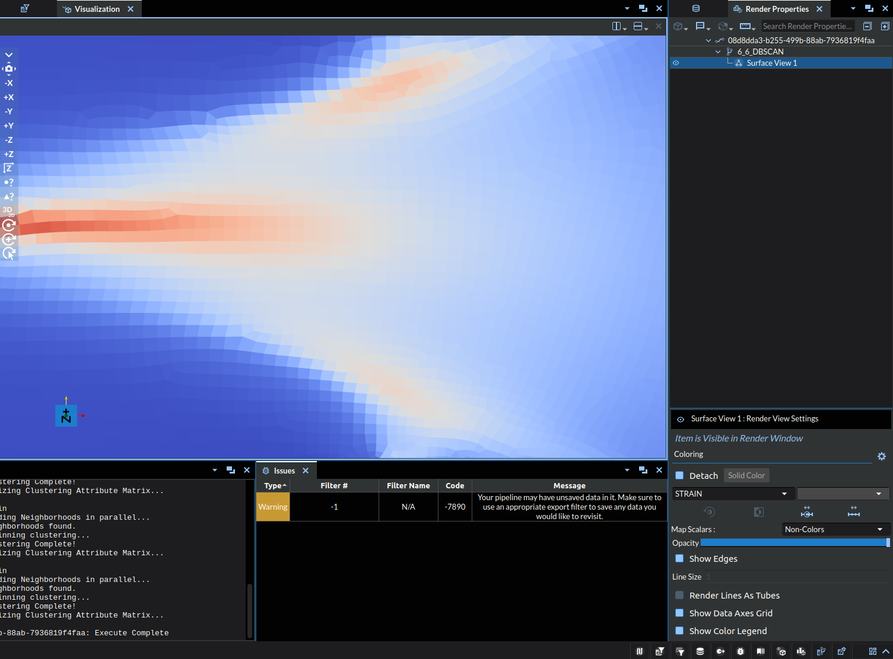

# DBSCAN

## Group (Subgroup)

DREAM3D Review (Clustering)

## Description

This **Filter** applies the DBSCAN (density-based spatial clustering of applications with noise) algorithm to an **Attribute Array**.  DBSCAN is a *clustering algorithm* that assigns to each point of the **Attribute Array** a *cluster Id*; points that have the same cluster Id are grouped together more densely (in the sense that the _distance_ between them is small) in the data space (i.e., points that have many nearest neighbors will belong to the same cluster).  The user may select from a number of options to use as the distance metric.  Points that are in sparse regions of the data space are considered "outliers"; these points will belong to cluster Id 0.  Additionally, the user may opt to use a mask to ignore certain points; where the mask is *false*, the points will be categorized as outliers and placed in cluster 0.  The algorithm requires two parameters: a *neighborbood region*, called epsilon; and the minimum number of points needed to form a cluster.  The algorithm, in pseudocode, proceeds as follows:

    for each point p in dataset
    {
      cluster = 0
      if p has been visited
      {
        continue to next point
      }
      mark p as visited
      neighbor_points = all points within epsilon distance from p
      if the number of neighbor_points < minimum number of points
      {
        mark p is outlier (cluster Id = 0)
      }
      else
      {
        cluster++
        add p to cluster
        for each point p_prime in neighbor_points
        {
          if p_prime has not been visited
          {
            mark p_prime as visited
            neighbor_points_prime = all points within epsilon distance from p_prime
            if the number of neighbor_points_prime >= minimum number of points
            {
              adjoin neighbor_points_prime to neighbor_points
            }
          }
          if p_prime is not a member of any cluster
          {
            add p_prime to cluster
          }
        }
      }
    }

An advantage of DBSCAN over other clustering approaches (e.g., [k means](@ref kmeans)) is that the number of clusters is not defined _a priori_.  Additionally, DBSCAN is capable of finding arbitrarily shaped, nonlinear clusters, and is robust to noise.  However, the choice of epsilon and the minimum number of points affects the quality of the clustering.  In general, a reasonable rule of thumb for choosing the minimum number of points is that it should be, at least, greater than or equal to the dimensionality of the data set plus 1 (i.e., the number of components of the **Attribute Array** plus 1).  The epsilon parameter may be estimated using a _k distance graph_, which can be computed using [this Filter](@ref kdistancegraph).  When computing the k distance graph, set the k nearest neighbors value equal to the minimum number of points intended for DBSCAN.  A reasonable choice of epsilon will be where the graph shows a strong bend.  If using this approach to help estimate epsilon, remember to use the same distance metric in both **Filters**!  An alternative method to choosing the two parameters for DBSCAN is to rely on _domain knowledge_ for the data, considering things like what neighbor distances between points make sense for a given metric.  

Note: In SIMPLNX there is no explicit positional subtyping for Attribute Matrix, so the next section should be treated as a high-level understanding of what is being created. Naming the Attribute Matrix to include the type listed on the respective line in the 'Attribute Matrix Created' column is encouraged to help with readability and comprehension.

A clustering algorithm can be considered a kind of segmentation; this implementation of DBSCAN does not rely on the **Geometry** on which the data lie, only the _topology_ of the space that the array itself forms.  Therefore, this **Filter** has the effect of creating either **Features** or **Ensembles** depending on the kind of array passed to it for clustering.  If an **Element** array (e.g., voxel-level **Cell** data) is passed to the **Filter**, then **Features** are created (in the previous example, a **Cell Feature Attribute Matrix** will be created).  If a **Feature** array is passed to the **Filter**, then an **Ensemble Attribute Matrix** is created.  The following table shows what type of **Attribute Matrix** is created based on what sort of array is used for clustering:

| Attribute Matrix Source | Attribute Matrix Created |
|------------------|--------------------|
| Generic | Generic |
| Vertex | Vertex Feature |
| Edge | Edge Feature |
| Face | Face Feature |
| Cell | Cell Feature|
| Vertex Feature | Vertex Ensemble |
| Edge Feature | Edge Ensemble |
| Face Feature | Face Ensemble |
| Cell Feature | Cell Ensemble|
| Vertex Ensemble | Vertex Ensemble |
| Edge Ensemble | Edge Ensemble |
| Face Ensemble | Face Ensemble |
| Cell Ensemble | Cell Ensemble|

## Note on Randomness

It is not recommended to use iterative for the _Initalization Type_, as it was just included for backwards compatibility. The inclusion of randomness in this algorithm is solely to attempt to reduce bias from starting cluster. Iterative produced identical results in our test cases, but the random initialization is truest to the well known DBSCAN algorithm.

% Auto generated parameter table will be inserted here

## Notes on Hyperparameter Tuning

Machine Learning algorithms, especially unsupervised ones like DBSCAN, depend heavily upon the hyperparameter values passed into the algorithm. In this case the hyperparameters would be Epsilon and Minimum Points. To exemplify this in the context of the filter itself, consider the following image:

The above image depicts the strains experienced by an object, the dataset for which is used to test the algorithm and can be found in our Data Archive under the name "_DBSCAN_test.tar.gz_". In it we can see 3 clearly distinct stress points, one thin stressor running midway across the object from the west side to roughly the center, with the other two being northeast and southeast of the center respectively. Below shows a table of the oucomes of DBSCAN with different hyperparameters:

| Incorrect | Exemplar |
|-----------------------------------|------------------------------------|
| Epsilon: 0.01, Minimum Points: 50 | Epsilon: 0.06, Minimum Points: 100 |
|  |  |
| Epsilon: 0.05, Minimum Points: 100 | Zoomed Image of STRAIN (Reference) |
|  |  |

Note: the colors are just representing index of the cluster at a specific point, it is exclusively a label **NOT a visual representation of a quantitative value**.

Out of the above table, lets focus in on a few specific aspects:

- The top left image (_Epsilon: 0.01, Minimum Points: 50_) is clearly underdeveloped. There are only two clusters and the red clusters are clearly undersized.
- The bottom left image (_Epsilon: 0.05, Minimum Points: 100_) may seem correct at first glance, but there are a two things that stand out:
  - Throughout the boundary of the red cluster there are specks of the dark blue cluster, where it should either be a red or light blue. (Compare to _Zoomed_)
  - The red cluster boundary is seemingly arbitrarily defined on the gradient, in that there is not a clear enough distinction to denote it as a separate cluster. Even if you were looking to make a distinction, arguably the boundary would be far close to the east side of the object.
- The top right image (_Epsilon: 0.06, Minimum Points: 100_) was selected as the exemplar here because it did cluster the three regions of stress into the same cluster, with clear and distinct boundaries. However, this is not perfect either, as it incorrectly incorporated part of the gradient into the cluster as well.

This dataset is not the ideal case for this algorithm, but it is what we were able to source and make available. That said it still demonstrates the idea and potential application.

_Note from Developers_: We are aware of a paper that outlines an algorithm that can reasonably predict the hyperparameter values, but at the current time implementation is left up to potential contributors [2].

## References

[1] A density-based algorithm for discovering clusters in large spatial databases with noise, M. Ester, H.P. Kriegel, J. Sander, and X. Xu, Proceedings of the Second International Conference on Knowledge Discovery and Data Mining, pp. 226-231, 1996.

[2] Yang, Y., Qian, C., Li, H. et al. An efficient DBSCAN optimized by arithmetic optimization algorithm with opposition-based learning. J Supercomput 78, 19566–19604 (2022). https://doi.org/10.1007/s11227-022-04634-w

## Example Pipelines

## License & Copyright

Please see the description file distributed with this plugin.

## DREAM3D-NX Help

If you need help, need to file a bug report or want to request a new feature, please head over to the [DREAM3DNX-Issues](https://github.com/BlueQuartzSoftware/DREAM3DNX-Issues/discussions) GitHub site where the community of DREAM3D-NX users can help answer your questions.
