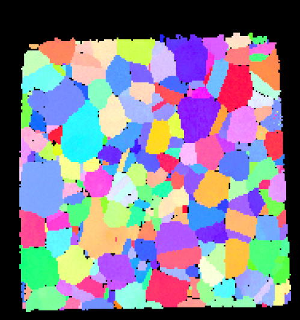
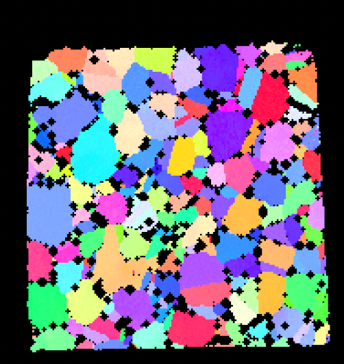
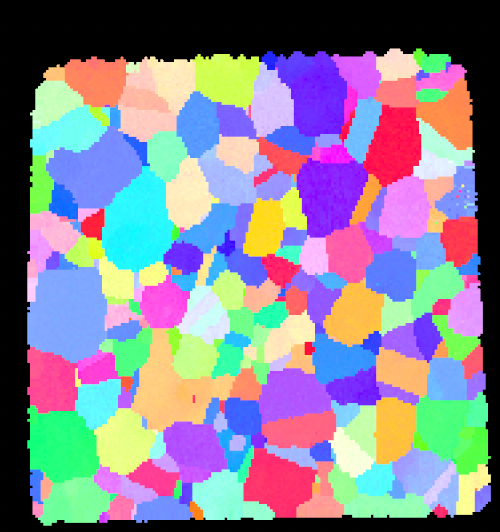

# Erode/Dilate Bad Data

## Group (Subgroup)

Processing (Cleanup)

## Description

Bad data refers to a **Cell** that has a *Feature Id* of *0*, which means the **Cell** has failed some sort of test and
been marked as a *bad* **Cell**.

### Dilation

If the **bad** data is *dilated*, the Filter grows the *bad* data by one **Cell** in
an iterative sequence for a user defined number of iterations. During the *dilate* process the *Feature Id* of any
Cell neighboring a *bad* **Cell** will be changed to *0*.

| Before Dilation                      | After Dilation                       |
|--------------------------------------|--------------------------------------|
|  |  |

### Erosion

If the *bad* data is *eroded*, the Filter shrinks the
bad data by one **Cell** in an iterative sequence for a user defined number of iterations. During the *erode* process
the *Feature Id* of the *bad* **Cell** is changed from *0* to the *Feature Id* of the majority of its neighbors. If
there is a tie between two *Feature Ids*, then one of the *Feature Ids*, chosen randomly, will be assigned to the *bad*
**Cell**.

| Before Erosion                       | After Erosion                        |
|--------------------------------------|--------------------------------------|
|  |  |

`

Goals a user might be trying to accomplish with this Filter include:

- Remove small or thin regions of bad data by running a single (or two) iteration *erode* operation.
- Increase the size of a *bad* data region by running an *dilate* operation. This might be useful if the experimental
  technique tends to underestimates the size of certain objects. For example, when running EBSD, the pores (which show
  up as *bad* data) are generally smaller in the scans than in the specimen, because the beam, when it is just inside
  the pore, still can pick up signal from the material just beneath the pore.

Running the *erode-dilate* operations in pairs can often change the size of some objects without affecting others. For
example, if there were a number of big pores and a number of single *bad* **Cells**, running a single *erode* operation
would remove the single **Cells** and reduce the pores by one **Cell**. If this is followed immediately by a *dilate*
operation, then the pores would grow by one **Cell** and return to near their original size, while the single **Cells**
would remain removed and not "grow back".

## WARNING: Feature Data Will Become Invalid

By modifying the cell level data, any feature data that was previously computed will most likely be invalid at this point. Filters that compute feature level data should be rerun to ensure accurate final results from your pipeline.

% Auto generated parameter table will be inserted here

## Example Pipelines

- (08) SmallIN100 Full Reconstruction
- (07) SmallIN100 Final Processing
- 04_Steiner Compact

## License & Copyright

Please see the description file distributed with this **Plugin**

## DREAM3D-NX Help

If you need help, need to file a bug report or want to request a new feature, please head over to the [DREAM3DNX-Issues](https://github.com/BlueQuartzSoftware/DREAM3DNX-Issues/discussions) GitHub site where the community of DREAM3D-NX users can help answer your questions.
