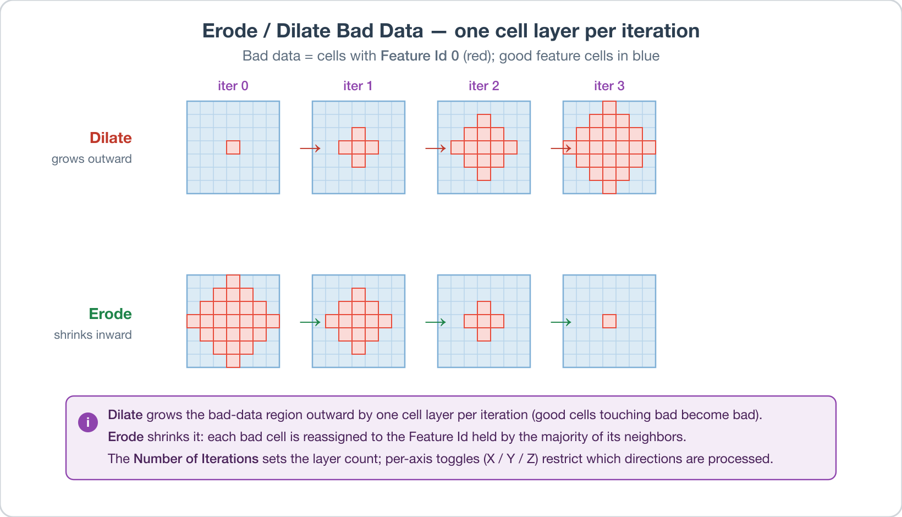
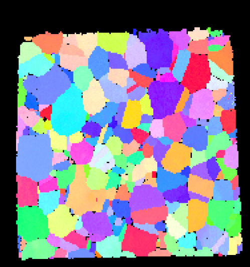
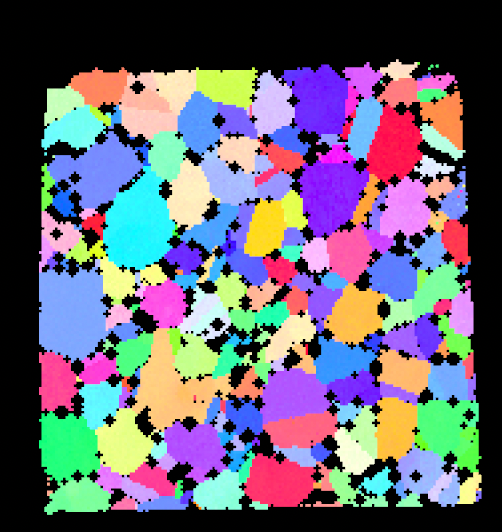
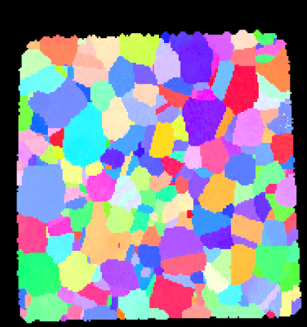

# Erode/Dilate Bad Data

## Group (Subgroup)

Processing (Cleanup)

## Description

This **Filter** grows or shrinks regions of *bad data* (cells with *Feature Id = 0*) by one cell-layer per iteration, using standard image-morphology operations. It is a building block for cleaning up isolated noise or for compensating for boundaries that were systematically under- or over-measured by the experiment.

### Dilation

*Dilate* grows the bad-data region outward. Each iteration changes any cell adjacent to a bad cell into a bad cell, adding a one-cell-thick layer.

| Before Dilation                      | After Dilation                       |
|--------------------------------------|--------------------------------------|
|  |  |

### Erosion

*Erode* shrinks the bad-data region. Each iteration converts each bad cell into the *Feature Id* held by the majority of its neighbors. Ties are broken randomly. Single-cell bad regions disappear in one iteration; thicker regions take more.

| Before Erosion                       | After Erosion                        |
|--------------------------------------|--------------------------------------|
|  |  |

### When to Use This Filter

- **Erode** to remove small or thin regions of bad data — single-cell EBSD dropouts, salt-and-pepper noise.
- **Dilate** to grow under-measured features. For example, EBSD scans tend to under-estimate pore size because the beam picks up signal from material *below* the pore when it sits at the pore edge; dilating the *Feature Id = 0* region restores the true pore boundary.
- **Erode followed by Dilate** (a morphological *opening*) is the classic pattern for removing isolated noise without affecting larger regions. A single erode-dilate pair will erase isolated single-cell bad regions but return larger pores to almost their original size.
- **Dilate followed by Erode** (a morphological *closing*) fills small holes inside bad-data regions while preserving their outer boundary.

### Iterations and Direction

- *Number of Iterations* is in **cell-layers**. An iteration count of 3 grows or shrinks the bad-data region by 3 cells.
- *X Direction*, *Y Direction*, and *Z Direction* toggle whether the morphology is applied along that axis. Disable an axis to perform anisotropic erosion/dilation -- useful when serial-sectioning resolution is anisotropic (typically Z is coarser than X and Y) and you want to limit smoothing along the fine axes.

### Direction Restrictions

The *X Direction*, *Y Direction*, and *Z Direction* parameters control which of the six face neighbors participate. With
all three enabled the Filter uses all six face neighbors (*-Z, -Y, -X, +X, +Y, +Z*); disabling *Z Direction*, for
example, restricts the operation to the four in-plane neighbors so that bad data grows or shrinks only within each XY
slice.

### Preflight Errors

The Filter refuses to run in two cases:

- **-14601**: all three of *X Direction*, *Y Direction*, and *Z Direction* are disabled. At least one direction is
  required, otherwise there are no neighbors to erode or dilate across.
- **-14602**: the selected **Image Geometry** has a dimension of *0* **Cells**. All three dimensions must be non-zero.

## Algorithm

This filter performs iterative morphological erosion or dilation on "bad" voxels (cells with FeatureId == 0) within an ImageGeom grid.

### Erosion

For each bad voxel, the algorithm examines its 6 face-connected neighbors and tallies the FeatureIds of any good (non-zero) neighbors. The bad voxel is then assigned the FeatureId that appears most frequently among its good neighbors (a "majority vote"). If there is a tie, one of the tied FeatureIds is chosen. This process shrinks bad-data regions by one cell per iteration.

### Dilation

For each bad voxel, the algorithm examines its 6 face-connected neighbors. Any good neighbor adjacent to the bad voxel has its FeatureId set to 0, effectively growing the bad-data region outward by one cell per iteration.

In both cases, all sibling data arrays in the same Attribute Matrix (except those in the user's ignored list) are updated to match the FeatureId changes, so the data remains consistent.

### Iteration

The operation is repeated for the user-specified number of iterations. Each iteration makes a full pass over the volume. Because each pass modifies the data, subsequent iterations see the cumulative effect of all prior passes.

### Performance

This algorithm is optimized for both in-memory and out-of-core (OOC) data stores. When data resides on disk in chunked format, random voxel access can cause expensive chunk load/evict cycles. The implementation avoids this by:

- **Sequential Z-slice processing**: The volume is scanned one Z-slice at a time, which aligns with typical chunk boundaries and avoids random access patterns.
- **3-slice rolling window**: Three adjacent Z-slices of FeatureIds are held in memory simultaneously, allowing face-neighbor lookups without hitting the data store for each voxel.
- **Deferred bulk writes**: Data modifications are batched per Z-slice and written back in bulk, minimizing the number of I/O operations.
- **O(sliceSize) memory**: Per-slice mark arrays replace a full-volume neighbor array, keeping peak memory proportional to a single Z-slice rather than the entire volume.

## WARNING: Feature Data Will Become Invalid

By modifying cell-level data, any feature-level data that was previously computed will most likely be invalid after this filter runs. Re-run any downstream feature-level computation filters to ensure accurate results.

### Required Input Sources

- **Cell Feature Ids** -- produced by a segmentation filter such as [Segment Features (Misorientation)](../OrientationAnalysis/EBSDSegmentFeaturesFilter.md) or [Segment Features (Scalar)](ScalarSegmentFeaturesFilter.md). Cells with Feature Id = 0 are treated as bad.

% Auto generated parameter table will be inserted here

## Example Pipelines

- (08) SmallIN100 Full Reconstruction
- (07) SmallIN100 Final Processing
- 04_Steiner Compact

## License & Copyright

Please see the description file distributed with this **Plugin**

## DREAM3D-NX Help

If you need help, need to file a bug report or want to request a new feature, please head over to the [DREAM3DNX-Issues](https://github.com/BlueQuartzSoftware/DREAM3DNX-Issues/discussions) GitHub site where the community of DREAM3D-NX users can help answer your questions.
