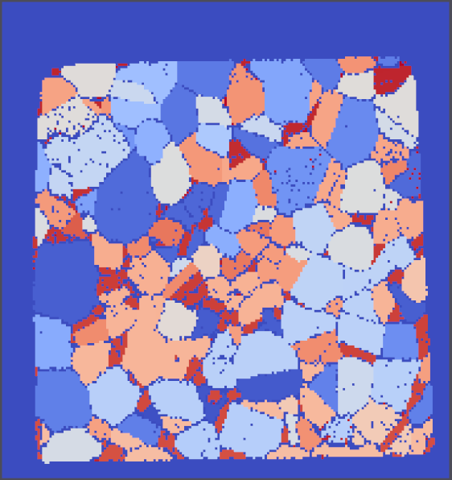
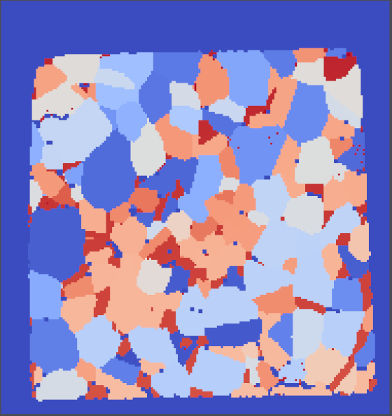

# Erode/Dilate Coordination Number

## Group (Subgroup)

Processing (Cleanup)

## Description

This **Filter** will smooth the interface between *good* and *bad* data. The user can specify a *coordination number*,
which is the number of neighboring **Cells** of opposite type (i.e., *good* or *bad*) compared to a given **Cell** that
is acceptable. For example, a single *bad* **Cell** surrounded by *good* **Cells** would have a *coordination number* of
*6*. The number entered by the user is actually the maximum tolerated *coordination number*. If the user entered a value
of *4*, then all *good* **Cells** with 5 or more *bad* neighbors and *bad* **Cells** with 5 or more *good* neighbors
would be removed. After **Cells** with unacceptable *coordination number* are removed, then the neighboring **Cells**
are *coarsened* to fill the removed **Cells**.

By default, the **Filter** will only perform a single iteration and will not concern itself with the possibility that
after one iteration, **Cells** that were acceptable may become unacceptable by the original *coordination number*
criteria due to the small changes to the structure during the *coarsening*. The user can opt to enable the *Loop Until
Gone* parameter, which will continue to run until no **Cells** fail the original criteria.

The *Coordination Number* must be on the interval [0, 6]; values outside that range fail preflight. Two low settings
interact badly with *Loop Until Gone*, and the **Filter** treats them differently because they fail differently:

- *Coordination Number* **0** with *Loop Until Gone* enabled **fails preflight**. The loop stops only once no **Cell**
  has a coordination number of at least the threshold, and every **Cell** of every volume has a coordination number of
  at least 0, so this combination can never terminate on any input.
- *Coordination Number* **1** with *Loop Until Gone* enabled **produces a preflight warning but still runs**. Here only
  **Cells** on a good/bad boundary meet the threshold, so termination depends on the data. On a boundary-free volume —
  entirely one **Feature**, or entirely bad data — the first iteration changes nothing and the **Filter** completes
  immediately. On a volume containing a boundary each iteration converts **Cells** in both directions, which can recreate
  the boundary rather than remove it, so the **Filter** *may* iterate indefinitely; whether it does depends on the data
  (the run can be cancelled).

Use a *Coordination Number* of 2 or more, or disable *Loop Until Gone*, to guarantee termination.

| Before Filter                      | After Filter                       |
|--------------------------------------|--------------------------------------|
|  |  |

% Auto generated parameter table will be inserted here

## Example Pipelines

## License & Copyright

Please see the description file distributed with this **Plugin**

## DREAM3D-NX Help

If you need help, need to file a bug report or want to request a new feature, please head over to the [DREAM3DNX-Issues](https://github.com/BlueQuartzSoftware/DREAM3DNX-Issues/discussions) GitHub site where the community of DREAM3D-NX users can help answer your questions.
