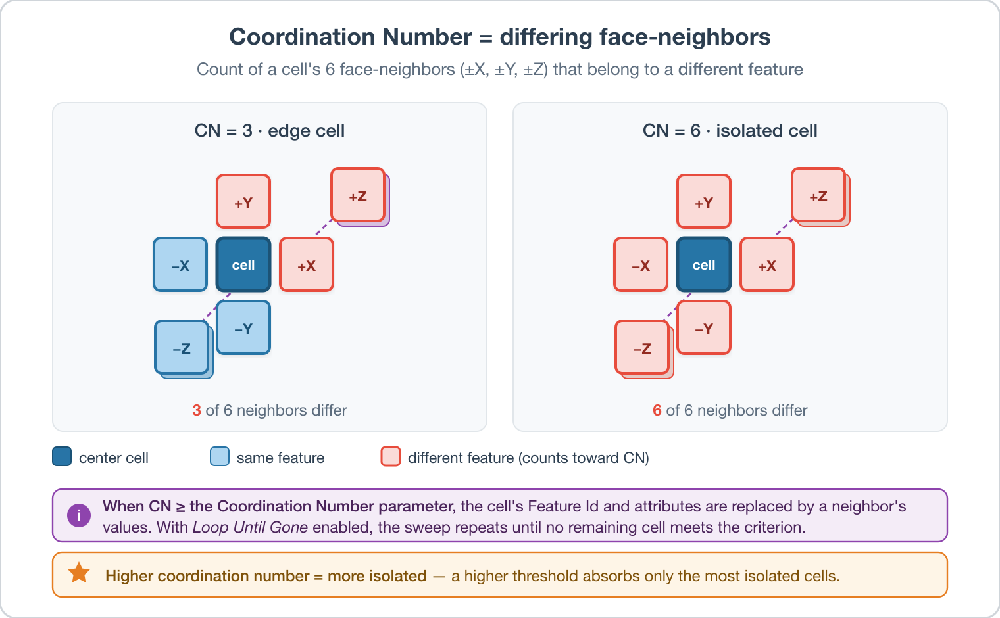

# Erode/Dilate Coordination Number

## Group (Subgroup)

Processing (Cleanup)

## Description

This **Filter** smooths the interface between *good* and *bad* cells (or, more generally, between any two adjacent feature regions) by removing cells whose neighborhood is mostly the opposite class. It targets isolated voxels and small protrusions that are surrounded by cells of a different feature, then fills them in with their neighbors' data via isotropic coarsening.

The *coordination number* is the count of a cell's face-sharing neighbors that belong to a different class. With 6 face neighbors, the coordination number ranges from **0 to 6**:

- **CN = 0** -- all 6 neighbors agree with the cell. Solidly inside a region.
- **CN = 1-2** -- on a flat or gently curved feature boundary.
- **CN = 4-5** -- a thin protrusion or finger of one feature sticking into another.
- **CN = 6** -- a single isolated cell completely surrounded by another feature.

| Before Filter                                        | After Filter                                        |
|------------------------------------------------------|-----------------------------------------------------|
|  |  |

### How This Filter Works

The user specifies a *coordination number* threshold. Any cell whose coordination number is **greater than or equal to** this threshold (and greater than 0) is removed. After the offending cells are identified, neighboring features grow outward (isotropic coarsening) to fill the resulting gaps. See [Remove Minimum Size Features](RequireMinimumSizeFeaturesFilter.md) for the shared definition of isotropic coarsening.

For example, a threshold of *4* removes any cell with 4, 5, or 6 differing neighbors (i.e., isolated voxels and thin protrusions). A threshold of *2* is much more aggressive and will erase any cell with 2 or more differing neighbors.

### Loop Until Gone

By default the filter performs **one** pass. After one pass, the coarsening can leave new cells whose coordination number now exceeds the threshold (because their neighbors changed). Enabling *Loop Until Gone* repeats the algorithm until no remaining cell exceeds the original criterion. Use this for full smoothing; use the single-pass mode when you want a controlled, gentle cleanup.

### When to Use This Filter

This is the right tool for "salt-and-pepper" cleanup -- isolated single-voxel grains, thin two-cell protrusions, and other small geometric anomalies that segmentation produced but are likely noise. It is more morphologically aware than the size-based filters because it considers neighborhood shape, not just cell count.

### Required Input Sources

- **Cell Feature Ids** -- produced by a segmentation filter such as [Segment Features (Misorientation)](../OrientationAnalysis/EBSDSegmentFeaturesFilter.md) or [Segment Features (Scalar)](ScalarSegmentFeaturesFilter.md).

% Auto generated parameter table will be inserted here

## Example Pipelines

## License & Copyright

Please see the description file distributed with this **Plugin**

## DREAM3D-NX Help

If you need help, need to file a bug report or want to request a new feature, please head over to the [DREAM3DNX-Issues](https://github.com/BlueQuartzSoftware/DREAM3DNX-Issues/discussions) GitHub site where the community of DREAM3D-NX users can help answer your questions.
