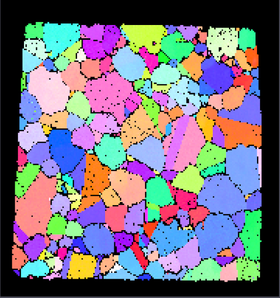
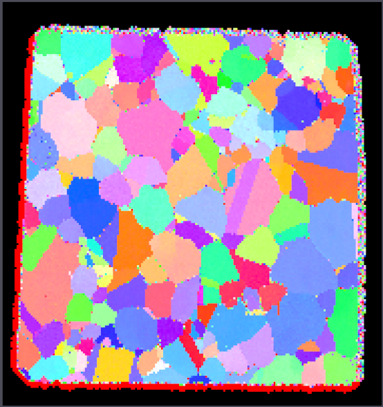
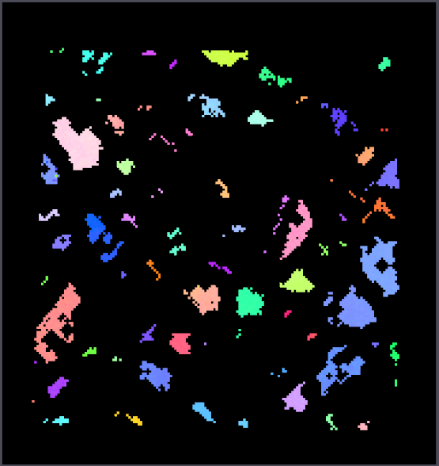
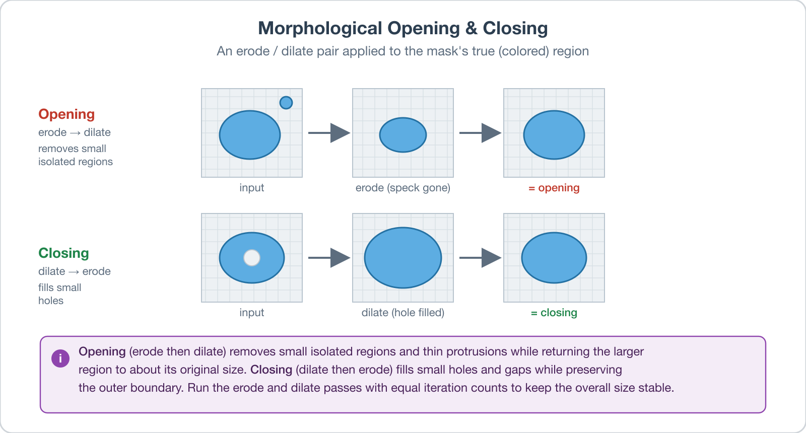

# Erode/Dilate Mask

## Group (Subgroup)

Processing (Cleanup)

## Description

This **Filter** grows or shrinks the *true* region of a boolean *mask* array by one cell-layer per iteration, using standard image-morphology operations. The mask is a cell-level boolean array (typically produced by a threshold operation such as [Multi-Threshold Objects](MultiThresholdObjectsFilter.md)) where *true* marks cells of interest and *false* marks excluded cells.

Only the **Mask** array is modified; no other cell data is changed.

The example images below show the IPF-colored data after the filter has run. Black pixels are cells where the mask is *false*; colored pixels are where the mask is *true*.

| Before Dilation                        | After Dilation                         |
|----------------------------------------|----------------------------------------|
|  |  |

| Before Erosion                         | After Erosion                          |
|----------------------------------------|----------------------------------------|
|  |   |

### When to Use This Filter

- **Erode** the mask to discard the boundary layer of valid cells. Useful before computing feature-level statistics from EBSD data, since cells right at the sample edge are often unreliable even after passing a quality threshold.
- **Dilate** the mask to recover cells that were marked invalid by an over-aggressive threshold but lie immediately adjacent to valid data.

### Opening and Closing

Chaining an erode and a dilate pass (with equal iteration counts) performs the two classic compound morphology operations:

### Iterations and Direction

- *Number of Iterations* is in **cell-layers**. An iteration count of 3 grows or shrinks the *true* region by 3 cells. The value must be at least 1; values below 1 fail preflight.
- *X Direction*, *Y Direction*, and *Z Direction* toggle whether the morphology is applied along that axis. Disable an axis to perform anisotropic morphology -- useful when serial-sectioning resolution is anisotropic (typically Z is coarser than X and Y) and you want to limit growth or shrinking along the fine axes.

### Required Input Sources

- **Mask Array** -- a boolean cell-level array, typically produced by [Multi-Threshold Objects](MultiThresholdObjectsFilter.md) applied to an EBSD confidence index, image quality, or similar scalar.

% Auto generated parameter table will be inserted here

## Example Pipelines

## License & Copyright

Please see the description file distributed with this **Plugin**

## DREAM3D-NX Help

If you need help, need to file a bug report or want to request a new feature, please head over to the [DREAM3DNX-Issues](https://github.com/BlueQuartzSoftware/DREAM3DNX-Issues/discussions) GitHub site where the community of DREAM3D-NX users can help answer your questions.
