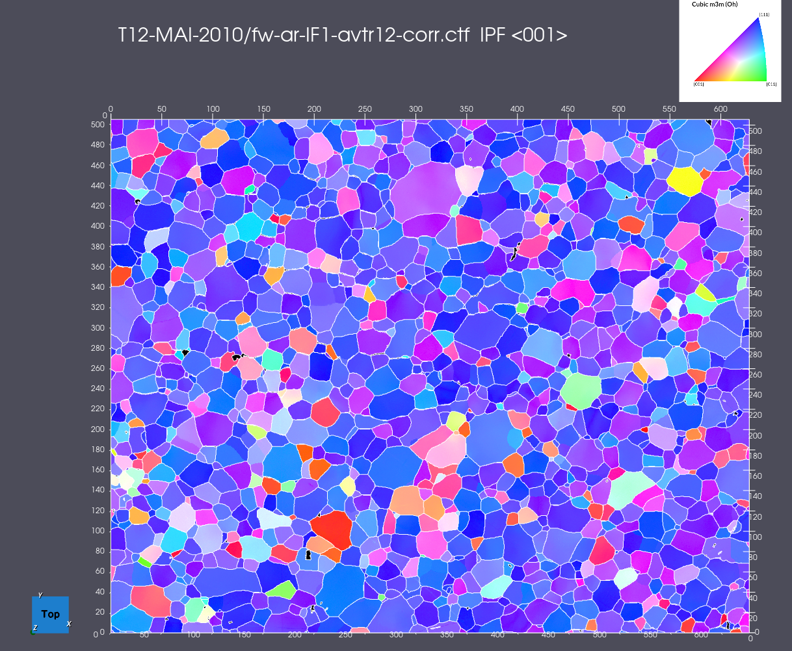

# Create Feature Boundaries (2D)

## Group (Subgroup)

Surface Meshing (Generation)

## Description

This **Filter** extracts the 2D boundaries between **Features** in an **Image Geometry** and builds an **Edge Geometry** that traces the outlines of those features. An **Image Geometry** is a regular grid of rectangular cells (pixels in 2D). A **Feature** is a connected region of cells that share the same identifier, recorded in a **Feature IDs** array (one integer label per cell). An **Edge Geometry** is a node-based geometry made of straight line segments (edges); here each edge lies on the interface between two cells that belong to different features.

The filter operates only in the XY plane and requires the input **Image Geometry** to have a Z dimension of 1 (a single slice).

**NOTE**: The Feature IDs array can be any integer type, not just the *signed int32* type used by typical feature-id arrays. This means it can operate directly on scalar images that have not been segmented. For example, the user could run a simple threshold to create a *uint8* mask (a boolean per-cell flag stored as 0/1) and feed that mask in as the Feature IDs input. This is useful for outlining just the sample border when there is **overscan** — extra collected area surrounding the actual sample — or for outlining specific regions of a 2D **Image Geometry**.

The algorithm scans the Feature IDs array and identifies boundaries where adjacent cells have different feature IDs. For each such boundary, an edge (line segment) is created along the shared cell interface. The resulting **Edge Geometry** contains:

- **Shared Vertex List**: 3D coordinates of all unique vertices at feature boundaries
- **Shared Edge List**: connectivity pairs defining the line segments between those vertices

### Z Value Source

The *Z Value Source* parameter provides the following choices:

- *Use min z value from Image geometry [0]*: Uses the origin Z value of the input **Image Geometry** as the Z coordinate for all generated vertices.
- *Use max z value from Image geometry [1]*: Uses the origin Z plus the spacing times the Z dimension as the Z coordinate for all generated vertices.
- *Use Custom z Offset [2]*: Lets the user specify an arbitrary Z coordinate value for all generated vertices.

### Algorithm Details

The algorithm uses a two-pass approach for efficiency:

1. **Count Pass**: Scans to count the total number of boundary edges (both vertical and horizontal).
2. **Populate Pass**: Creates the vertices and edge connectivity.

After edge creation, duplicate vertices are eliminated to ensure a clean, connected edge network.

## Example Output

### Required Input Sources

- **Image Geometry** -- a 2D **Image Geometry** (Z dimension of 1) holding the Feature IDs.
- **Feature IDs** -- a per-cell integer array. It may be a true segmentation produced by [Segment Features (Scalar)](ScalarSegmentFeaturesFilter.md), or any per-cell integer/mask array produced by a thresholding filter such as [Multi-Threshold Objects](MultiThresholdObjectsFilter.md).

% Auto generated parameter table will be inserted here

## Example Pipelines

- ExtractFeatureBoundaries2D.d3dpipeline

## License & Copyright

Please see the description file distributed with this **Plugin**

## DREAM3D-NX Help

If you need help, need to file a bug report or want to request a new feature, please head over to the [DREAM3DNX-Issues](https://github.com/BlueQuartzSoftware/DREAM3DNX-Issues/discussions) GitHub site where the community of DREAM3D-NX users can help answer your questions.
