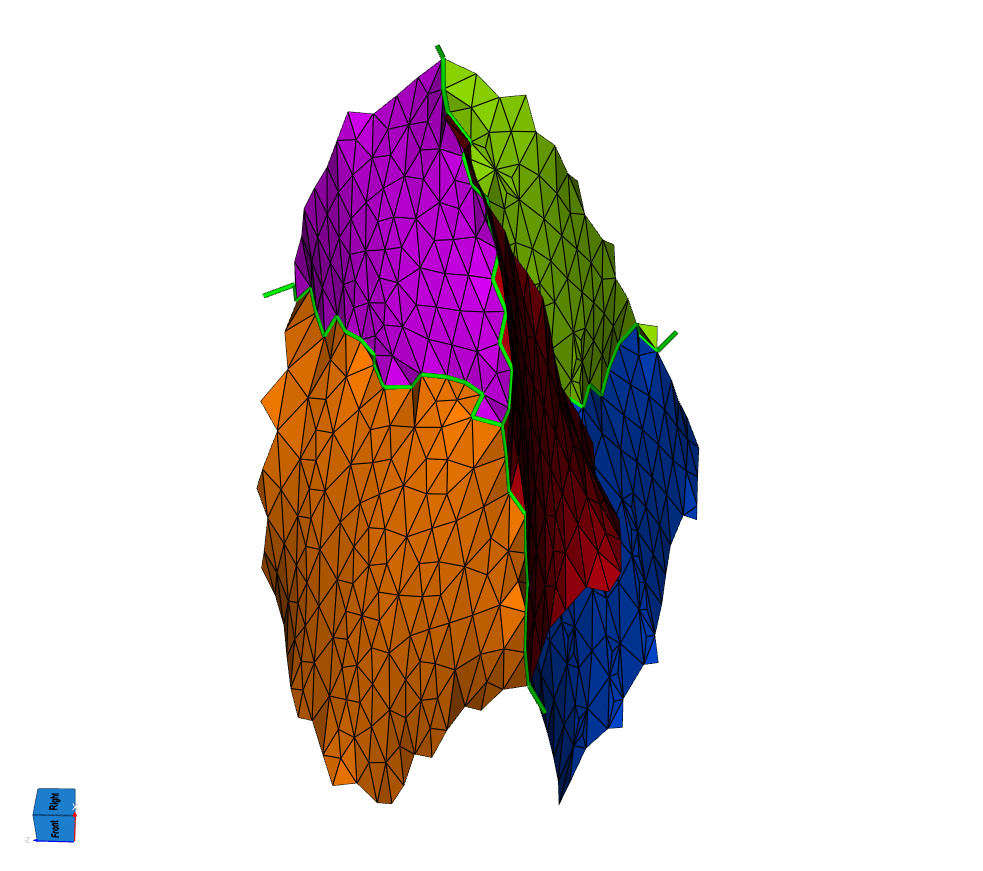
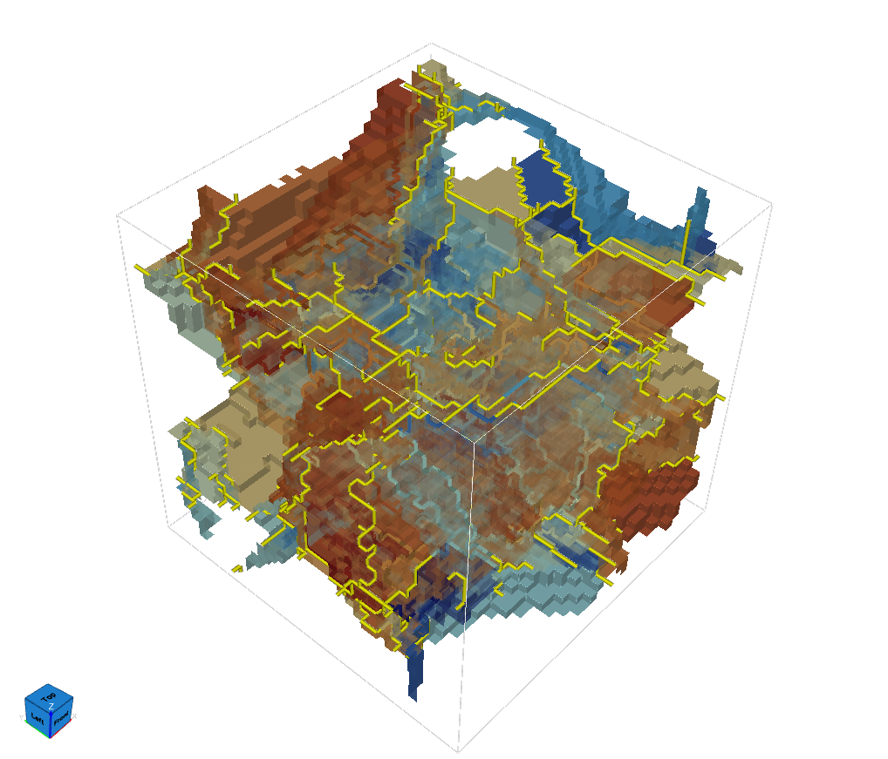
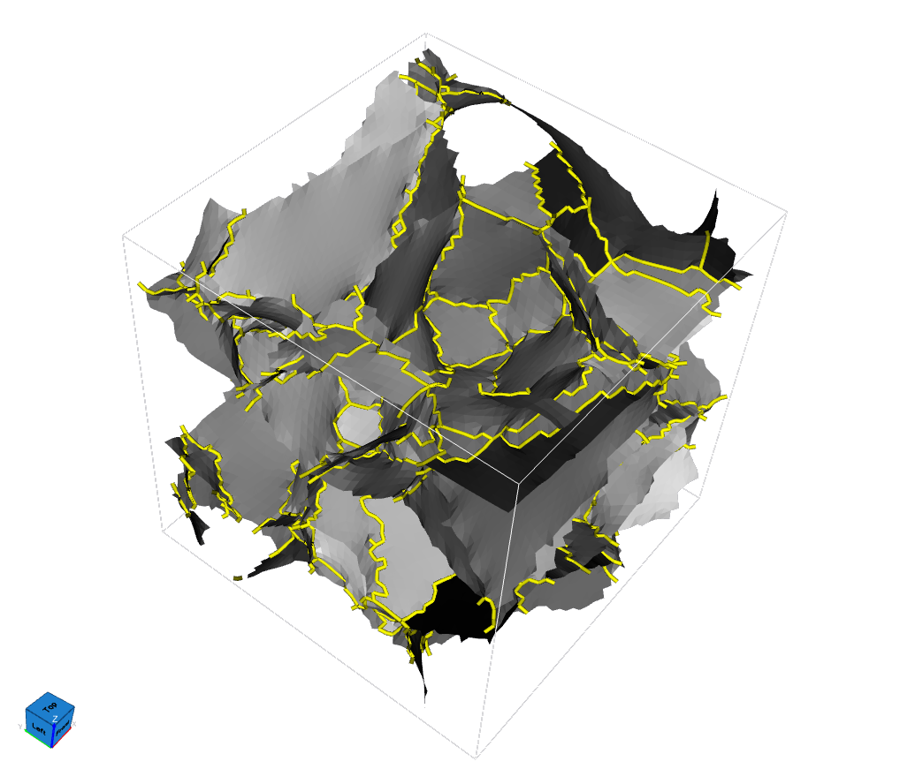
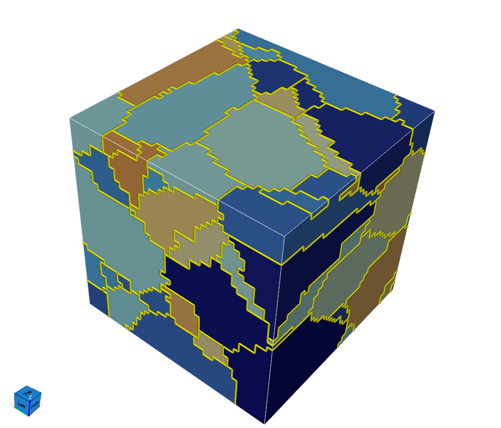

# Extract Triple Lines

## Group (Subgroup)

Surface Meshing (Generation)

## Description

This **Filter** finds the *triple lines* in a surface mesh and saves them as a new **Edge Geometry**.

### What is a Triple Line?

A **Feature** is one region of the microstructure, for example one grain. Each Feature has a number, its
**Feature Id**. A surface mesh separates the Features with triangles. The **Face Labels** array stores,
for each triangle, the two Feature Ids on either side of that triangle.

A **triple line** is a line where three or more Features meet. The **Filter** checks each edge of the
mesh. It collects the Feature Ids of all triangles that use that edge. If the edge has three or more
different Feature Ids, the edge is a triple line segment.

- Three different Feature Ids: the edge is part of a *triple line*.
- Four or more different Feature Ids: the edge is part of a *quadruple point line*.

An edge where only two Features meet is part of a normal grain boundary. It is not a triple line, even
when many triangles use that edge.

<!-- FIGURE PENDING: ExtractTripleLines_Definition.png
     The 2 x 2 x 1 four-grain block (one grain per cell). Show the surface mesh transparent, colored by
     Feature, with the single quadruple point line through the center drawn as a thick dark line.

-->

### Why Is This a Separate Filter?

The **Filter** uses the **Triangle Geometry** that you give it. The triple lines are always exactly on
that mesh. If you smooth the mesh first, the triple lines follow the smoothed surface.

A typical pipeline is:

1. Create the surface mesh with [Create Surface Mesh (QuickMesh)](QuickSurfaceMeshFilter.md),
   [Create Surface Mesh (Surface Nets)](SurfaceNetsFilter.md), or
   [Create Surface Mesh (M3C Multi-Material Marching Cubes)](M3CSurfaceMeshingFilter.md).
2. Smooth the mesh with [Laplacian Smoothing](LaplacianSmoothingFilter.md).
3. Extract the triple lines with this **Filter**.

If you run this **Filter** before the smoothing step, you get the triple lines of the mesh before
smoothing.

<!-- FIGURE PENDING: ExtractTripleLines_BeforeAfterSmoothing_1.png / _2.png
     Small IN100, the same view twice. Left: triple lines extracted from the unsmoothed mesh.
     Right: triple lines extracted after Laplacian Smoothing. Show the triple lines over a
     semi-transparent surface so the reader can see that the lines follow each surface.
| Before smoothing | After smoothing |
|------------------|-----------------|
|  |  |
-->

### Parameter Guidance

#### Include Exterior Triple Lines

The space outside the volume has the value `-1` in **Face Labels**. All three surface meshing filters
listed above use this value.

- **Off (default):** the **Filter** ignores `-1`. You get only the triple lines inside the volume.
- **On:** the **Filter** treats the outside as one more region. A grain boundary that touches the
  outside surface of the volume then becomes a triple line. You get many more segments.

**Feature Id 0** is treated as a normal Feature. Only negative values mean "outside". If your data uses
Feature Id 0 for background or bad data, a grain that touches Feature 0 makes a triple line, even when
this option is off.

<!-- FIGURE PENDING: ExtractTripleLines_ExteriorOff.png / ExtractTripleLines_ExteriorOn.png
     Small IN100, the same view twice. Left: option off (interior lines only). Right: option on
     (the extra lines on the outside surface of the volume are visible).
| Include Exterior Triple Lines: Off | Include Exterior Triple Lines: On |
|------------------------------------|-----------------------------------|
|  |  |
-->

#### Copy Node Types

When this option is on (the default), the **Filter** copies the **Node Types** value of each vertex from
the surface mesh onto the new vertices. Some filters need a Node Types array, for example
[Laplacian Smoothing](LaplacianSmoothingFilter.md), which can also smooth an **Edge Geometry**. Turn the
option off when your **Triangle Geometry** has no Node Types array. Node Types is never used to decide
which edges are triple lines.

### Required Input Sources

- **Triangle Geometry** and **Face Labels** -- produced by
  [Create Surface Mesh (QuickMesh)](QuickSurfaceMeshFilter.md),
  [Create Surface Mesh (Surface Nets)](SurfaceNetsFilter.md), or
  [Create Surface Mesh (M3C Multi-Material Marching Cubes)](M3CSurfaceMeshingFilter.md).
  **Face Labels** must have one tuple for each triangle.
- **Node Types** (only when *Copy Node Types* is on) -- produced by the same surface meshing filters.
  It must have one tuple for each vertex of the **Triangle Geometry**.

### Created Outputs

The new **Edge Geometry** contains:

- A vertex list with only the vertices that are on a triple line. The coordinates are copied from the
  surface mesh.
- An edge list with the triple line segments.
- **Number of Features** (one value for each edge): `3` when three Features meet at the edge. `4` when
  four **or more** Features meet. The value is never larger than 4.
- **Node Types** (one value for each vertex, only when *Copy Node Types* is on).

The new **Edge Geometry** has its own copy of the vertices. If you change or delete the
**Triangle Geometry** later, the triple lines do not change. If you need the triple lines to match a
changed mesh, run this **Filter** again.

The order of the output is the same on every computer. The vertices are in the same order as in the
surface mesh. The edges are sorted by their vertex numbers.

<!-- OPTIONAL FIGURE: ExtractTripleLines_NumFeatures.png
     Small IN100 triple lines colored by Number of Features (3 and 4), to show where quadruple
     point lines occur.
-->

## Algorithm

The **Filter** reads the triangles two times.

1. For each vertex, it records the different Feature Ids of the triangles that use that vertex.
2. An edge can be a triple line only if both of its vertices touch three or more Feature Ids. For these
   edges only, the **Filter** collects the Feature Ids of the triangles that use the edge, and keeps the
   edge when it has three or more.

Because of the first step, the **Filter** stores Feature Id information for the edges that can be triple
lines, not for every edge of the mesh. The working memory is about 17 bytes for each mesh vertex, plus a
small amount for each candidate edge.

% Auto generated parameter table will be inserted here

## Example Pipelines

## License & Copyright

Please see the description file distributed with this **Plugin**

## DREAM3D-NX Help

If you need help, need to file a bug report or want to request a new feature, please head over to the
[DREAM3DNX-Issues](https://github.com/BlueQuartzSoftware/DREAM3DNX-Issues/discussions) GitHub site where
the community of DREAM3D-NX users can help answer your questions.
