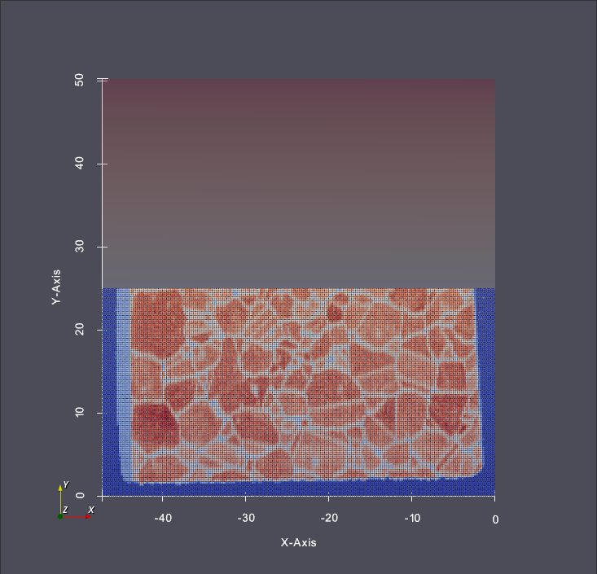

# Extract Vertex Geometry

## Group (Subgroup)

Core Filters (Geometry)

## Description

This filter will extract all the voxel centers of an Image Geometry or a RectilinearGrid geometry
into a new Vertex Geometry. The user is given the option to copy or move cell arrays over to the
newly created VertexGeometry. The user can also supply a mask array which has the effect of only
creating a vertex if the mask value = TRUE.

% Auto generated parameter table will be inserted here

## Example Pipelines

PrebuiltPipelines/Examples/Extract Vertex Geometry.json

## License & Copyright

Please see the description file distributed with this plugin.

## DREAM3D-NX Help

If you need help, need to file a bug report or want to request a new feature, please head over to the [DREAM3DNX-Issues](https://github.com/BlueQuartzSoftware/DREAM3DNX-Issues/discussions) GitHub site where the community of DREAM3D-NX users can help answer your questions.
