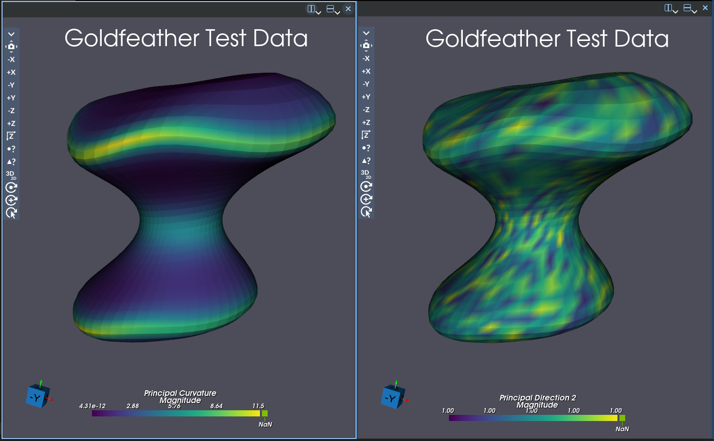
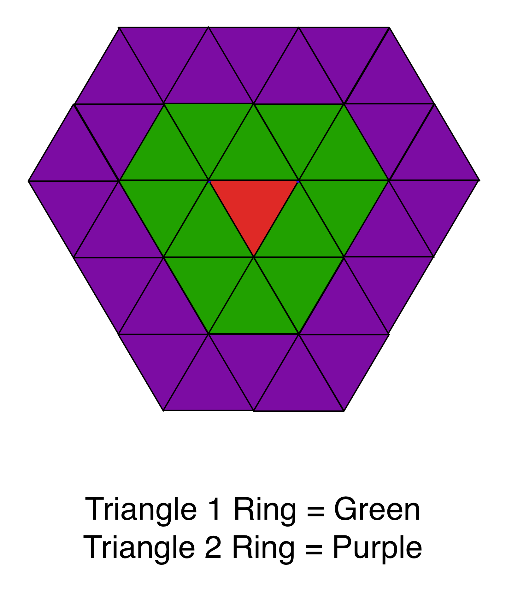

# Compute Feature Face Curvature

## Group (Subgroup)

Surface Meshing (Curvature)

## Description

This **Filter** calculates *principal direction vectors* and the *principal curvatures*, and optionally the *mean* and *Gaussian* curvature, for each **Triangle** in a **Triangle Geometry** using the technique in [1]. The groups of **Triangles** over which to compute the curvatures is determines by the **Features** they are associated, denoted by their **Face Labels**. The curvature information will be stored in a **Face Attribute Matrix**.

Principal Curvatures 1 and 2 are the &kappa; 1  and &kappa; 2  from [1] and are the eigenvalues from the Wiengarten matrix. The Principal Directions 1 and 2 are the eigenvectors from the solution to the least squares fit algorithm. The Mean Curvature is (&kappa; 1  + &kappa; 2  ) / 2, while the Gaussian curvature is (&kappa; 1  *
&kappa; 2 ).

The values of the principal directions can have their signs flipped. They are calculated using eigenvectors which are unique up to a sign.

*Note*: Computing the Weingarten matrix values is an experimental feature, and there is no guarantee at this time that the values are correct.

@image latex FeatureFaceCurvatureFilter.png "Curvature Coloring of a Feature" width = 6in

## Ring Neighbor Schematic

## Parameter Notes:

- The "Feature Face Ids" input data can be computed from the "Compute Triangle Face Ids" filter
- The "Face Normals" input data can be computed from the "Compute Triangle Normals" filter
- The "Face Centroids" input data can be computed from the "Compute Triangle Centroids" filter

% Auto generated parameter table will be inserted here

## References

[1] J. Goldfeather, V. Interrante, "A Novel Cubic-Order Algorithm for Approximating Principal Direction Vectors", ACM Transactions on Graphics 2004, 23(1), pp. 45 - 63.

## Example Pipelines

- Pipelines -> SimplnxCore -> Compute_Feature_Face_Curvature
- Pipelines -> SimplnxCore -> Compute_Feature_Face_Curvature_2

## License & Copyright

Please see the description file distributed with this**Plugin**

## DREAM.3D Mailing Lists

If you need more help with a**Filter**, please consider asking your question on the [DREAM.3D Users Google group!](https://groups.google.com/forum/?hl=en#!forum/dream3d-users)
