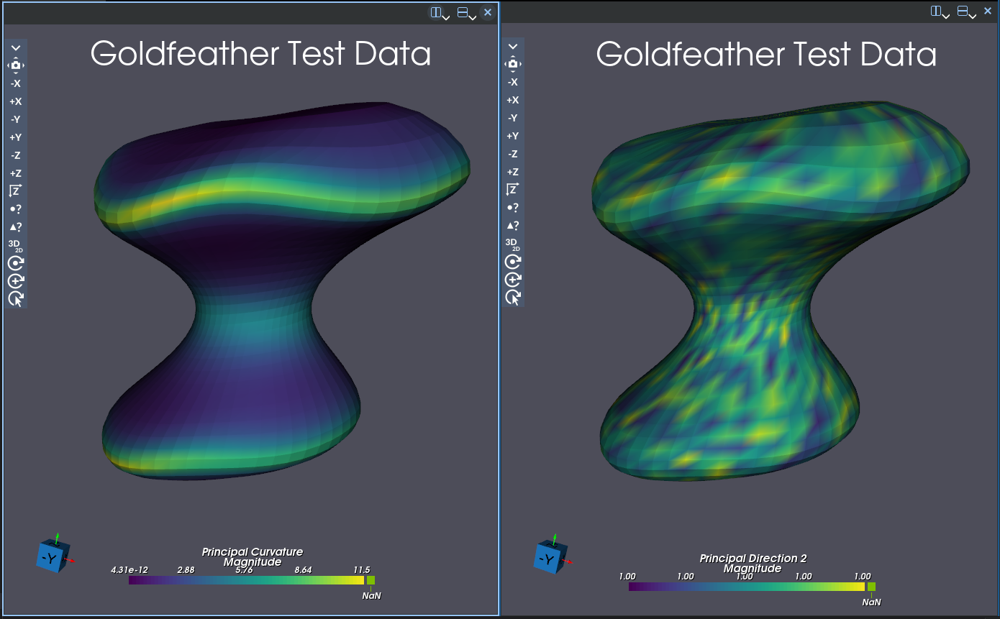
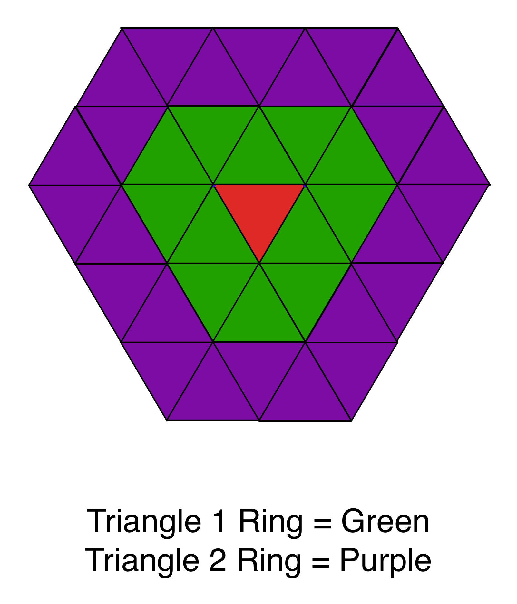

# Compute Feature Face Curvature

## Group (Subgroup)

Surface Meshing (Curvature)

## Description

This filter calculates *principal direction vectors* and the *principal curvatures*, and optionally the *mean* and *Gaussian* curvature, for each **Triangle** in a **Triangle Geometry** (a surface mesh built from triangles) using the technique in [1]. The groups of **Triangles** over which to compute the curvatures are determined by the **Features** they belong to, as denoted by their **Face Labels** (the pair of **Feature** Ids on either side of each triangle). The curvature information is stored in a **Face Attribute Matrix**.

**Curvature** measures how sharply the surface bends at a point: a flat region has zero curvature, while a tightly rounded region has high curvature. The *principal curvatures* are the maximum and minimum bending values at a point, and the *principal directions* are the (unit) directions along the surface in which those extreme bends occur.

Principal Curvatures 1 and 2 are the &kappa;1 and &kappa;2 from [1] and are the eigenvalues of the Weingarten matrix. The Principal Directions 1 and 2 are the eigenvectors from the solution to the least-squares fit. The Mean Curvature is (&kappa;1 + &kappa;2) / 2, while the Gaussian curvature is (&kappa;1 * &kappa;2).

The principal directions can have their signs flipped: they come from eigenvectors, which are unique only up to a sign.

*Note*: Computing the Weingarten matrix values is an experimental feature, and there is no guarantee at this time that the values are correct.

### Units

Principal curvatures and mean curvature are reported in **1/length** (the reciprocal of the geometry length units; the radius of the best-fit circle is its reciprocal). Gaussian curvature, being a product of two curvatures, is reported in **1/length^2**. Principal directions are **dimensionless** unit 3-vectors.

## Ring Neighbor Schematic

### Required Input Sources

- **Triangle Geometry** -- a surface mesh, typically produced by a surface-meshing filter such as [Create Surface Mesh (Surface Nets)](SurfaceNetsFilter.md) or [Create Surface Mesh (QuickMesh)](QuickSurfaceMeshFilter.md).
- **Face Labels** -- the per-triangle pair of **Feature** Ids, produced alongside the mesh by the surface-meshing filter above.
- **Feature Face Ids** -- computed by [Compute Triangle Face Ids](SharedFeatureFaceFilter.md).
- **Face Normals** -- computed by [Compute Triangle Normals](TriangleNormalFilter.md).
- **Face Centroids** -- computed by [Compute Triangle Centroids](TriangleCentroidFilter.md).

% Auto generated parameter table will be inserted here

## References

[1] J. Goldfeather, V. Interrante, "A Novel Cubic-Order Algorithm for Approximating Principal Direction Vectors", ACM Transactions on Graphics 2004, 23(1), pp. 45 - 63.

## Example Pipelines

- Compute_Feature_Face_Curvature
- Compute_Feature_Face_Curvature_2

## License & Copyright

Please see the description file distributed with this **Plugin**

## DREAM3D-NX Help

If you need help, need to file a bug report or want to request a new feature, please head over to the [DREAM3DNX-Issues](https://github.com/BlueQuartzSoftware/DREAM3DNX-Issues/discussions) GitHub site where the community of DREAM3D-NX users can help answer your questions.
