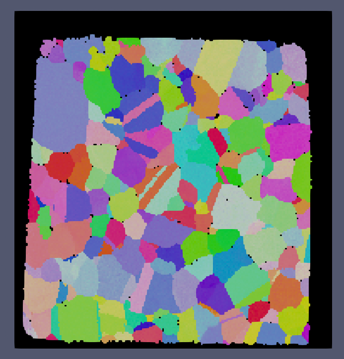
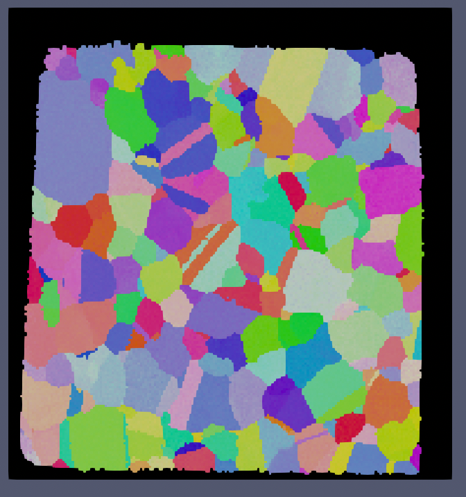

# Fill Bad Data

## Group (Subgroup)

Processing (Cleanup)

## Description

This **Filter** removes small *noise* in the data, but keeps larger regions that are possibly **Features**, e.g., pores or defects. This **Filter** collects the *bad* **Cells** (*Feature Id = 0*) and *erodes* them until none remain. However, contiguous groups of *bad* **Cells** that have at least as many **Cells** as the minimum allowed defect size entered by the user will not be *eroded*.

| Small IN100 Before | Small IN100 After |
|--|--|
|  |  |

The above images show the before and after results of running this filter with a minimum defect size of 1000 voxels. Note that because the minimum defect size was set to 1000 voxels that the over scan area was not modified (the area in all black around the sample).

% Auto generated parameter table will be inserted here

## Example Pipelines

+ (08) SmallIN100 Full Reconstruction

## License & Copyright

Please see the description file distributed with this **Plugin**

## DREAM3D-NX Help

If you need help, need to file a bug report or want to request a new feature, please head over to the [DREAM3DNX-Issues](https://github.com/BlueQuartzSoftware/DREAM3DNX-Issues/discussions) GitHub site where the community of DREAM3D-NX users can help answer your questions.
