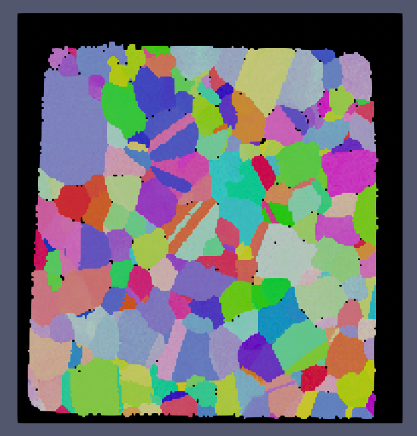
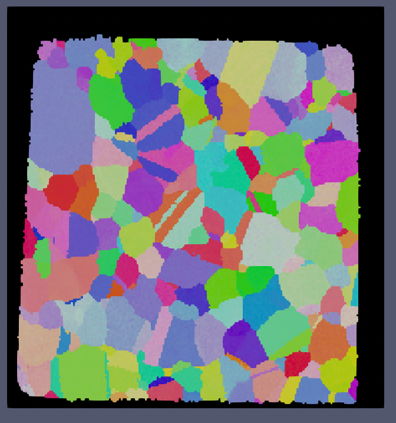

# Fill Bad Data

## Group (Subgroup)

Processing (Cleanup)

## Description

This **Filter** removes small *noise* in the data but keeps larger regions that are possibly **Features**, e.g., pores or defects. This **Filter** identifies *bad* **Cells** (*Feature Id = 0*) and fills small defects by copying data from neighboring good cells, while preserving large defect regions that meet or exceed the minimum allowed defect size specified by the user.

| Small IN100 Before                   | Small IN100 After                   |
|--------------------------------------|-------------------------------------|
|  |  |

The above images show the before and after results of running this filter with a minimum defect size of 1000 voxels. Note that because the minimum defect size was set to 1000 voxels that the over scan area was not modified (the area in all black around the sample).

## Algorithm Overview

The filter uses a four-phase algorithm optimized for both in-memory and out-of-core data processing:

### Phase 1: Connected Component Labeling (CCL)
The algorithm first identifies all connected regions of bad data (voxels with Feature Id = 0) using a chunk-sequential scanline algorithm. Each connected component is assigned a unique provisional label, and equivalences between components that span chunk boundaries are tracked using a Union-Find data structure.

### Phase 2: Global Resolution
All provisional labels are resolved to their root representatives, and the total size (voxel count) of each connected component is computed by aggregating counts across all chunks.

### Phase 3: Classification and Relabeling
Each connected component is classified based on its size:
- **Small defects** (size < minimum allowed defect size): Marked with Feature Id = -1 for filling
- **Large defects** (size ≥ minimum allowed defect size): Retained as Feature Id = 0 (or assigned to a new phase if requested)

### Phase 4: Iterative Morphological Fill
Small defects are filled using an iterative erosion process:
1. For each voxel marked for filling (Feature Id = -1), examine its 6 face-connected neighbors
2. Determine the most common positive Feature Id among the neighbors
3. Copy all cell array data from that neighbor to the current voxel
4. Repeat until all small defects are filled

The algorithm processes data in a chunk-sequential manner, making it efficient for large datasets stored using out-of-core data structures.

## Performance Characteristics

This implementation is optimized for out-of-core processing where data may reside on disk rather than in memory. The chunk-sequential access pattern minimizes disk I/O operations compared to random-access algorithms, providing significant performance improvements for large datasets (10-100x faster for typical use cases with out-of-core storage).

## WARNING: Feature Data Will Become Invalid

By modifying the cell level data, any feature data that was previously computed will most likely be invalid at this point. Filters that compute feature level data should be rerun to ensure accurate final results from your pipeline.

% Auto generated parameter table will be inserted here

## Example Pipelines

+ (08) SmallIN100 Full Reconstruction

## License & Copyright

Please see the description file distributed with this **Plugin**

## DREAM3D-NX Help

If you need help, need to file a bug report or want to request a new feature, please head over to the [DREAM3DNX-Issues](https://github.com/BlueQuartzSoftware/DREAM3DNX-Issues/discussions) GitHub site where the community of DREAM3D-NX users can help answer your questions.
