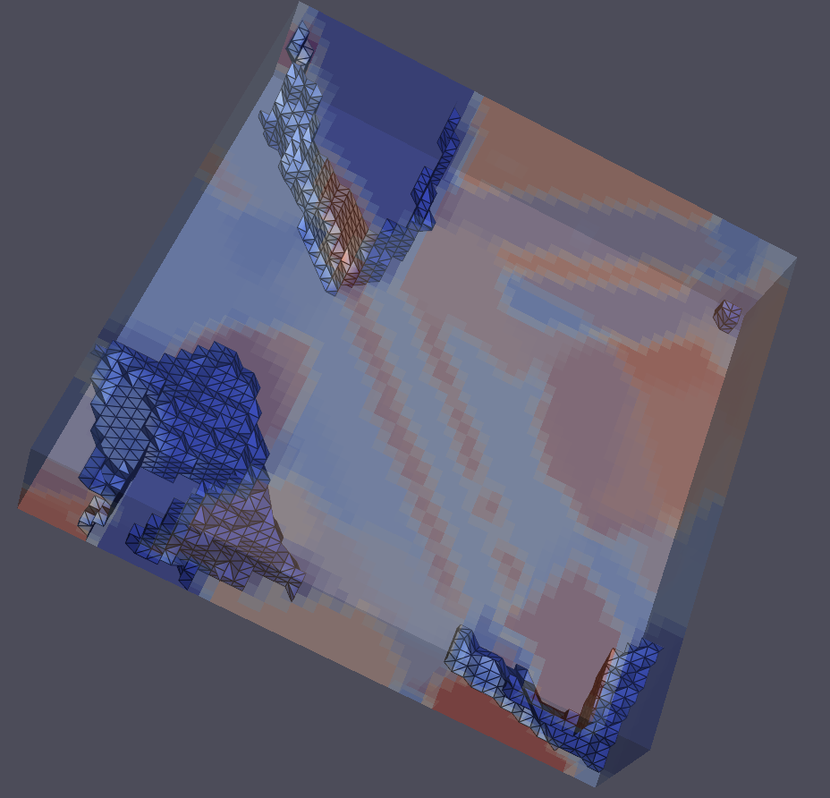

# Surface Contour Filter (Flying Edges 3D)

## Group (Subgroup)

Visual Analysis

## Description

This filter generates a 3D **isosurface** (a contour surface) through the scalar values stored on an **Image Geometry**, and saves it as a **Triangle Geometry**.

### What is an Isosurface?

An **isosurface** is the 3D equivalent of a contour line on a topographic map. Given a scalar value at every **Cell** of a volume (for example density from a CT scan, or a distance field), the isosurface is the connected surface that passes through every point where the scalar equals a chosen threshold — the *Contour Value* (also called the isovalue). Cells with values above the threshold fall on one side of the surface; cells below fall on the other.

"Flying Edges" is a fast, parallel variant of the classic marching-cubes algorithm. It produces the same triangulated surface but scans the volume more efficiently.

### When to Use This Filter

Use this filter to extract a smooth surface from continuous scalar data (CT density, a level-set/distance field, simulation output). If the goal is instead to build a surface mesh around labeled regions (**Feature** Ids from a segmentation), use [Surface Nets](SurfaceNetsFilter.md) or [Quick Surface Mesh](QuickSurfaceMeshFilter.md), which contour an integer label map rather than a continuous field.

### Parameter Guidance

- **Contour Value** — the scalar threshold the surface is drawn at. Its units are the same as the selected **Data Array** (for CT data, density units; for a distance field, length units). The surface only appears where the data actually crosses this value, so the value must lie within the array's range.
- **Data Array to Contour** — the per-Cell scalar field the contour is computed from.

### Required Input Sources

- **Image Geometry** -- the volume to contour, typically from an image/volume reader such as [Read Image](ReadImageFilter.md) or an upstream processing filter.
- **Data Array to Contour** -- any single-component scalar **Cell Data** array on that geometry.

% Auto generated parameter table will be inserted here

## License & Copyright

Please see the description file distributed with this **Plugin**

## DREAM3D-NX Help

If you need help, need to file a bug report or want to request a new feature, please head over to the [DREAM3DNX-Issues](https://github.com/BlueQuartzSoftware/DREAM3DNX-Issues/discussions) GitHub site where the community of DREAM3D-NX users can help answer your questions.
