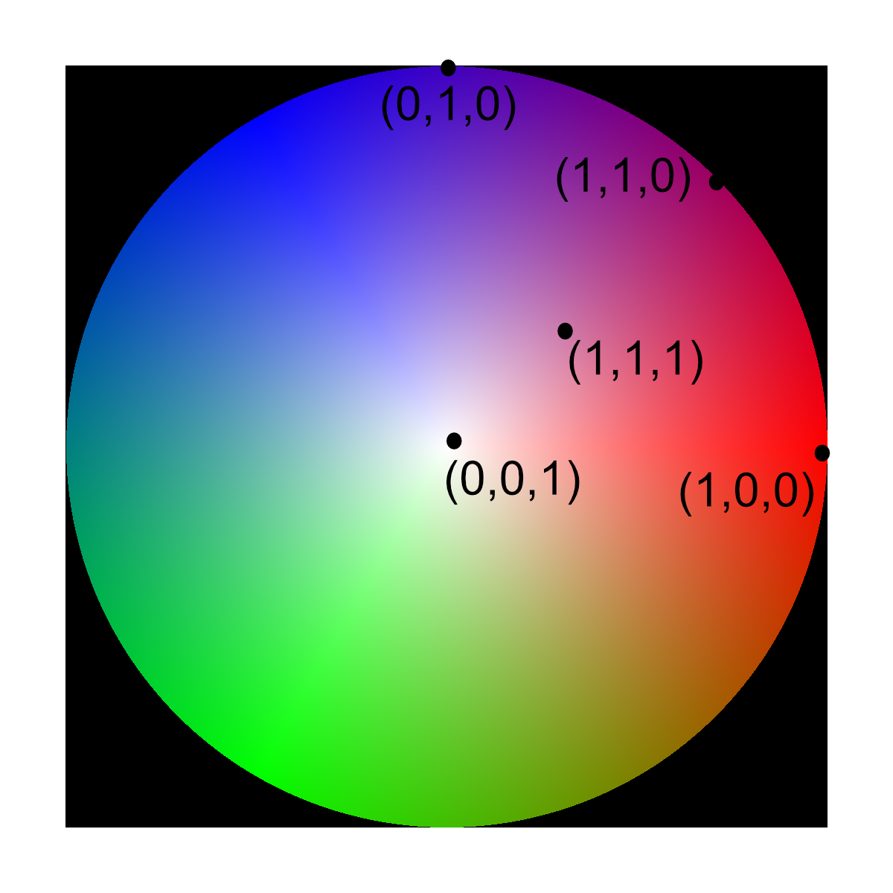

# Generate Vector Colors

## Group (Subgroup)

Generic (Coloring)

## Description

This **Filter** generates a color for each **Element** based on the vector assigned to that **Element** in the input vector data.  The color scheme assigns a unique color to all points on the unit hemisphere using a HSV-like scheme. The color space is approximately represented by the following legend.

% Auto generated parameter table will be inserted here

## Example Pipelines

## License & Copyright

Please see the description file distributed with this **Plugin**

## DREAM3D-NX Help

If you need help, need to file a bug report or want to request a new feature, please head over to the [DREAM3DNX-Issues](https://github.com/BlueQuartzSoftware/DREAM3DNX-Issues/discussions) GItHub site where the community of DREAM3D-NX users can help answer your questions.
