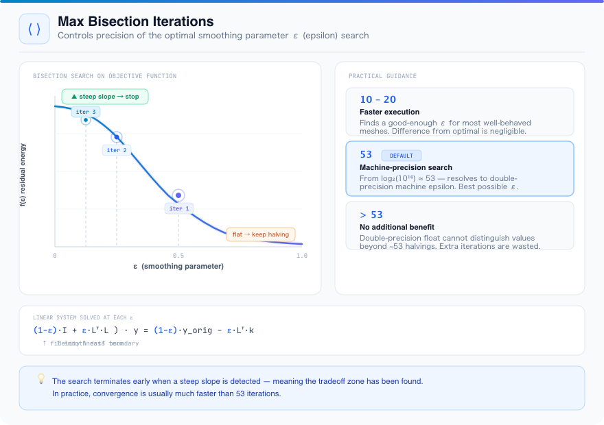
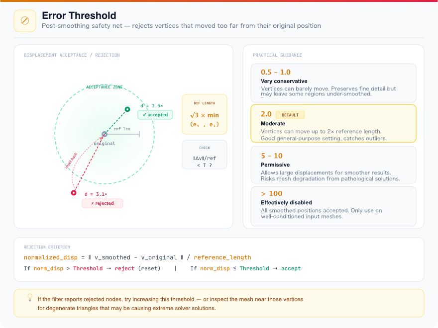

# Hierarchical Smoothing

## Group (Subgroup)

Surface Meshing (Smoothing)

## Description

This **Filter** applies hierarchical smoothing to a triangle surface mesh representing polycrystalline grain boundary networks. Unlike simple Laplacian smoothing, this algorithm respects the topological hierarchy of the mesh:

1. **Quad points** (node type 4 or 14) are held fixed as they represent the intersection of four or more grains.
2. **Triple lines** (edges between quad points along triple junctions) are smoothed as 1D curves with the quad points as fixed endpoints.
3. **Interior boundary surfaces** are smoothed with the already-smoothed triple lines held fixed, solving a Dirichlet boundary value problem using a conjugate gradient solver.

This hierarchical approach preserves the topology of the grain boundary network while producing smooth surfaces. The smoothing parameter is optimized via interval bisection to balance smoothness against displacement from the original mesh.

Because every stage above is driven by the Node Type value, smoothing a mesh produced by Create
Surface Mesh (Surface Nets) now behaves differently than it did previously: that **Filter**'s Node
Types were corrected to follow the `2`/`3`/`4`/`12`/`13`/`14` convention this **Filter** expects,
so vertices that were previously misclassified (and therefore held fixed or smoothed in the wrong
stage) are now classified correctly. This is a correction, not a regression.

Nodes that are displaced beyond the error threshold (a multiple of a reference edge length) are rejected and reset to their original positions.

## Algorithm Overview

The filter applies smoothing in three hierarchical stages. Each stage's output is held fixed during subsequent stages, preserving the topology of the grain boundary network.


The three stages are:

1. **Fix Quad Points** — Vertices where four or more grains meet (node types 4/14) are identified and permanently locked. These topological invariants anchor the entire boundary network.
2. **Smooth Triple Lines** — The 1D curves along triple junctions (node types 3/13) are smoothed as independent curves between fixed quad-point endpoints, using bisection-optimized conjugate gradient.
3. **Smooth Interior Surfaces** — The 2D boundary surfaces (node types 2/12) are smoothed with the triple lines held fixed, solving a constrained Dirichlet boundary value problem via conjugate gradient.

## Parameter Details

### Max Bisection Iterations

At each stage, the algorithm must find the optimal **smoothing parameter** `epsilon` that balances two competing goals: (1) keeping vertices close to their original positions, and (2) minimizing surface curvature. This is framed as solving a weighted linear system:

```
  ((1 - epsilon) * I  +  epsilon * L^T * L) * y  =  (1 - epsilon) * y_original  -  epsilon * L^T * k
   \_____________/        \_______________/          \________________________/     \______________/
     identity term         smoothness term              data fidelity term           boundary term
```

where `I` is the identity matrix, `L` is the reduced graph Laplacian, `y_original` is the original vertex positions, and `k` encodes the fixed boundary constraints.

- When `epsilon = 0`: vertices stay at their original positions (no smoothing).
- When `epsilon = 1`: vertices are fully smoothed to minimize curvature (maximum smoothing).

The algorithm uses **interval bisection** to find the optimal `epsilon`:


1. Start at `epsilon = 0.5`, with a step size of `epsilon / 2`.
2. Compute a numerical derivative (slope) of the objective function (the total Laplacian residual energy) at the current `epsilon`.
3. If the slope's magnitude is still significant, step `epsilon` up or down (in the direction that reduces the slope) by the current step size, then halve the step size.
4. Repeat until the slope's magnitude falls below the convergence threshold (a flat region — the optimal `epsilon` has been found) or the iteration limit is reached.

The **Max Bisection Iterations** parameter controls how many halvings are attempted. The default value of **53** comes from `log2(10^16) ~ 53`, which is the number of bisection steps needed to resolve a double-precision floating point value to machine epsilon. In practice, the search often converges in far fewer iterations because it terminates early once a significant slope is detected.

**Practical guidance:**

| Value | Effect |
|-------|--------|
| 10-20 | Faster execution per boundary. May find a slightly sub-optimal smoothing parameter, but the difference is usually negligible for well-behaved meshes. |
| 53 (default) | Machine-precision search. Guarantees the best possible smoothing parameter for each boundary. |
| >53 | No additional benefit beyond the default since double-precision arithmetic cannot distinguish values at this resolution. |




### Error Threshold

After all boundaries have been smoothed, the algorithm performs a post-processing validation step. Each vertex's displacement from its original position is compared against a **reference length** derived from the mesh:

```
  Reference length = sqrt(3) * min(edge0_length, edge1_length)
```

where the edge lengths come from the first triangle in the mesh. This approximates the characteristic size scale of one mesh element (the height of an equilateral triangle with side length equal to the shortest edge).

Each vertex's displacement is normalized by this reference length:

```
  normalized_displacement = || vertex_smoothed - vertex_original || / reference_length
```

Any vertex whose normalized displacement exceeds the **Error Threshold** is **rejected**: its position is reset to the original (unsmoothed) value, and it is marked as "not smoothed."

This safety mechanism prevents the smoothing from producing mesh artifacts in regions where the solver produces an extreme solution (e.g., highly elongated triangles, unusual boundary conditions, or degenerate configurations).

**Practical guidance:**

| Value | Effect |
|-------|--------|
| 0.5 - 1.0 | Very conservative. Vertices cannot move more than 0.5-1.0 reference lengths. Produces results closer to the original mesh but may leave some regions under-smoothed. Good for preserving fine detail. |
| 2.0 (default) | Moderate. Allows vertices to move up to 2x the reference length. Good general-purpose setting that provides effective smoothing while catching genuine outliers. |
| 5.0 - 10.0 | Permissive. Allows large displacements. Produces smoother results but risks mesh quality degradation if a boundary solver produces a pathological solution. |
| Very large (>100) | Effectively disables rejection. All smoothed positions are accepted regardless of displacement. Only use if you are confident the input mesh is well-conditioned. |



In addition to the two numeric parameters described above, the filter requires the **Triangle Geometry** to smooth, a per-vertex **Node Type** array (Int8, single-component: 2 = interior, 3 = triple line, 4 = quad point; add 10 for the outer-surface variants), and a per-face **Face Labels** array (Int32, 2-component) giving the grain IDs on either side of each face. These three inputs are normally produced together by a surface-meshing filter. Unlike simple [Laplacian Smoothing](LaplacianSmoothingFilter.md), this filter uses the **Node Type** and **Face Labels** information to respect the topological hierarchy of the boundary network.

## Notes

- This filter modifies the vertex coordinates of the input Triangle Geometry **in place**.
- The algorithm processes each grain boundary independently. Progress messages indicate which boundary is being processed.
- Volume surface nodes (types 12, 13, 14) are treated identically to their interior counterparts (types 2, 3, 4) for the purpose of the smoothing hierarchy.
- The conjugate gradient solver handles its own internal convergence; the max iterations parameter controls only the bisection search for the optimal smoothing parameter, not the CG solver iterations.
- If the filter reports rejected nodes, consider increasing the Error Threshold or inspecting the input mesh for degenerate triangles near the rejected vertices.

## Required Input Sources

- **Triangle Geometry**, **Node Type**, and **Face Labels** -- a polycrystalline surface mesh and its node-type and face-label arrays, produced together by a surface-meshing filter such as [Quick Surface Mesh](QuickSurfaceMeshFilter.md).

% Auto generated parameter table will be inserted here

## Reference

- S. Maddali, "HierarchicalSmooth" - Topology-aware smoothing for polycrystalline grain boundary networks. Carnegie Mellon University, 2016-2018.
- S. Maddali, S. Ta'asan, R. M. Suter, Topology-faithful nonparametric estimation and tracking of bulk interface networks, Computational Materials Science 125, 328-340 (2016).

## License & Copyright

Please see the description file distributed with this **Plugin**

## DREAM3D-NX Help

If you need help, need to file a bug report or want to request a new feature, please head over to the [DREAM3DNX-Issues](https://github.com/BlueQuartzSoftware/DREAM3DNX-Issues/discussions) GitHub site where the community of DREAM3D-NX users can help answer your questions.
