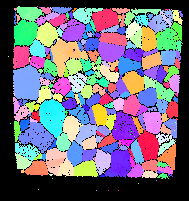

# Isolate Largest Feature (Identify Sample)

## Group (Subgroup)

Processing (Cleanup)

## Description

Often when performing a serial sectioning experiment (especially in the FIB-SEM), the sample is *over scanned* resulting 
in a border of *bad* data around the sample.  This **Filter** attempts to *identify* the sample within the over scanned 
volume.  The **Filter** makes the assumption that there is only one contiguous set of **Cells** that belong to the sample. 
The **Filter** requires that the user has already *thresheld* the data to determine which **Cells** are *good* and which 
are *bad*.  The algorithm for the identification of the sample is then as follows:

1. Search for the largest contiguous set of *good* **Cells**. (This is assumed to be the sample)
2. Change all other *good* **Cells**  to be *bad* **Cells**.  (This removes the "speckling" of what was *threshold* as *good* data in the outer border region)

If *Fill Holes* is set to *true* additional steps are taken:

1. Search for the largest contiguous set of *bad* **Cells**. (This is assumed to be the outer border region)
2. Change all other *bad* **Cells**  to be *good* **Cells**. (This removes the "speckling" of what was *threshold* as *bad* data inside the sample).

*Note:* if there are in fact "holes" in the sample, then this **Filter** will "close" them (if *Fill Holes* is set to true) by calling all the **Cells** "inside" the sample *good*.  If the user wants to reidentify those holes, then reuse the threshold **Filter** with the criteria of *GoodVoxels = 1* and whatever original criteria identified the "holes" as this will limit applying those original criteria to within the sample and not the outer border region.

## Slice-By-Slice Option

Only completely water-tight, internal holes within the sample are addressed when *Fill Holes* 
is enabled.  To fill in a contiguous group of good cells that includes holes located along 
the outer edge of the sample, try enabling *Process Data Slice-By-Slice*.  For each slice 
of the chosen plane, this will search for the largest contiguous set of *good* **Cells**, 
set all other *good* **Cells** to be *bad* **Cells**, and (if *Fill Holes* is enabled) 
fill all water-tight holes PER SLICE instead of the whole 3D volume at once.  This option 
can be used to allow non water-tight holes to be filled without also accidentally 
filling the surrounding overscan area.

| Name                                           | Description                                                                  |
|------------------------------------------------|------------------------------------------------------------------------------|
|  | Good dataset to use this filter                                              |
|     | NOT** a good data set to use because there is **no** overscan of the sample. |

### Slice-By-Slice Plane

When *Process Data Slice-By-Slice* is enabled, the *Slice-By-Slice Plane* parameter selects the plane along which the volume is scanned one slice at a time:

- **XY [0]**: Processes the volume slice by slice along the Z axis, scanning each XY plane independently.
- **XZ [1]**: Processes the volume slice by slice along the Y axis, scanning each XZ plane independently.
- **YZ [2]**: Processes the volume slice by slice along the X axis, scanning each YZ plane independently.

## Algorithm

This filter identifies the largest connected region of "good" voxels (the sample) and marks all other voxels as "bad." Two algorithm paths are available, selected automatically based on the underlying data storage.

### In-Core Path (BFS)

When data resides entirely in memory, a **breadth-first search (BFS)** flood fill is used:

1. Iterate through all voxels and, for each unvisited "good" voxel, start a BFS that explores all 6-connected face neighbors.
2. Track the largest connected component found — this is identified as the sample.
3. Set all "good" voxels **not** in the largest component to "bad."
4. If **Fill Holes** is enabled, run a second BFS pass over "bad" voxels: any connected region of "bad" voxels that does not touch the volume boundary is filled back to "good."

BFS is efficient for in-memory data because the queue-driven traversal has excellent cache locality when all data fits in RAM.

### Out-of-Core Path (CCL)

When any input array uses chunked on-disk storage (out-of-core / OOC), BFS would cause **chunk thrashing** — each random queue-driven access may load and evict entire disk chunks, making the algorithm 100–1000× slower. Instead, a **connected component labeling (CCL)** approach is used:

1. **Scanline labeling**: Iterate voxels sequentially (Z → Y → X), assigning provisional labels to "good" voxels. When two labeled regions are found to be connected (same row or adjacent Z-slice), their labels are merged using a **Union-Find** data structure.
2. **Global resolution**: Flatten the Union-Find tree so every provisional label maps to its final root label. Count the size of each component.
3. **Classification**: The largest component is kept as the sample; all other "good" voxels are set to "bad."
4. **Hole filling** (if enabled): A second CCL pass identifies connected components of "bad" voxels and fills any that do not touch the volume boundary.

The sequential access pattern aligns with OOC chunk layout, reading each chunk at most once.

### Slice-By-Slice Mode

When **Process Data Slice-By-Slice** is enabled, both the in-core and OOC paths use a shared `IdentifySampleSliceBySliceFunctor` that processes individual 2D slices. Since a single 2D slice is small enough to fit in memory, BFS is always safe and efficient for this mode. For the **YZ plane**, a batched read strategy reads each Z-slice once for a batch of X-columns, reducing HDF5 I/O operations by ~10× compared to reading per-column.

### Performance

The CCL path provides 10–100× speedup over BFS for large datasets stored out-of-core. For in-memory datasets, BFS is typically faster due to lower overhead. The dispatch is automatic — no user configuration is needed.

% Auto generated parameter table will be inserted here

## Example Pipelines

+ (02) Small IN100 Full Reconstruction
+ INL Export

## License & Copyright

Please see the description file distributed with this **Plugin**

## DREAM3D-NX Help

If you need help, need to file a bug report or want to request a new feature, please head over to the [DREAM3DNX-Issues](https://github.com/BlueQuartzSoftware/DREAM3DNX-Issues/discussions) GitHub site where the community of DREAM3D-NX users can help answer your questions.
