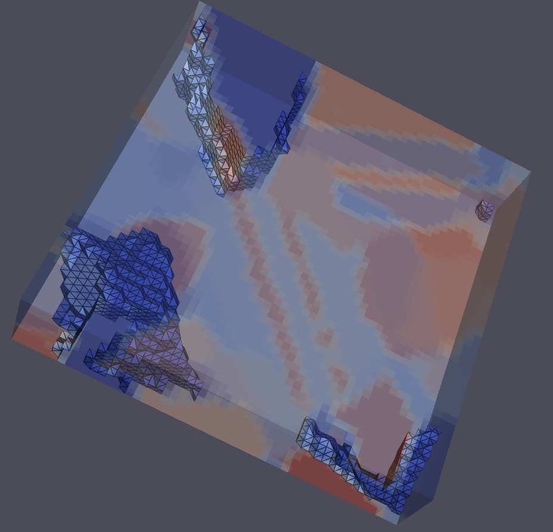

# Contour (Image Contouring)

## Group (Subgroup)

Visual Analysis

## Description

This filter will draw a 3 dimensional contouring line through an Image Geometry based on an input value.

Here's what the results look like:

% Auto generated parameter table will be inserted here

## License & Copyright

Please see the description file distributed with this **Plugin**

## DREAM.3D Interaction

If you need more help with a **Filter**, please consider asking your question on the [DREAM.3D Help Forum!](https://github.com/BlueQuartzSoftware/DREAM3DNX-Issues)
