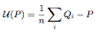
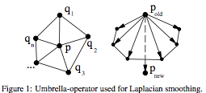
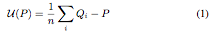
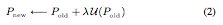

# Laplacian Smoothing

## Group (Subgroup)

Surface Meshing (Smoothing)

## Description

This **Filter** applies **Laplacian smoothing** to any node-based geometry except for a **Vertex Geometry**. Laplacian smoothing repeatedly moves each node toward the average position of its connected neighbors, which reduces high-frequency surface noise and tends to flatten the surface. A. Belyaev [1] gives a concise explanation:

---------------------------

Let us consider a triangulated surface and for any vertex P let us define the so-called umbrella-operator

where summation is taken over all neighbors of P and wi are positive
weights. See Fig. 1 for the geometric idea behind the umbrella-operator.

The weights can be defined, for example, as the inverse distances between P and its neighbors. The simplest umbrella-operator is obtained if *w* i = 1 and the umbrella-operator has the form

where n is the number of neighbors. The local update rule

applied to every point of the triangulated surface is called Laplacian smoothing of the surface. Typically the factor &lambda; is a small positive number, and the process (2) is executed repeatedly. The Laplacian smoothing algorithm reduces the high frequency surface information and tends to flatten the surface. See Fig. 2 where Laplacian smoothing is applied to a triangulated model of a Noh mask.

If &lambda; is too small, one needs more iterations for smoothing and the smoothing process becomes time-consuming. If &lambda; is not small enough, the smoothing process becomes unstable.

---------------------------

In the Laplacian algorithm the &lambda; term is dimensionless with a range of 0 &le; &lambda; &le; 1 and defines the relative distance that a node can move toward the average position of its neighbors. A value of *&lambda; = 0* effectively stops those node types from any movement during the algorithm. By setting this value for specific types of nodes, the user can arrest the shrinkage of the surface mesh during smoothing.

### Taubin's Lambda-Mu Smoothing Algorithm

One of the filter options applies **Taubin's Lambda-Mu** variation on Laplacian smoothing. This variation removes the shrinkage typically found with Laplacian smoothing by adding a second step within each iteration: it moves the points back by the negative of (*Lambda* * *Mu Factor*), effectively pushing them in the **opposite** direction from the initial movement. The *Mu Factor* is a dimensionless multiplier. Because of this negative movement, the number of iterations needed to achieve the same level of smoothing increases greatly, on the order of 10x to 20x.

If you instead need a smoothing method that strictly preserves the mesh topology (triple lines, quadruple points, and feature boundaries), consider [Hierarchical Smoothing](HierarchicalSmoothFilter.md).

### Algorithm Usage and Memory Requirements

Currently, if you lock the *Default Lambda* value to zero (0), the **triple lines** (edges where three features meet) and quadruple points will not be able to move because none of their neighbors can move. The user may want to consider allowing a small value of &lambda; for the default nodes, which will allow some movement of the triple lines and/or quadruple points.

The *Iteration Steps* parameter is a dimensionless count of smoothing passes; more steps produce more smoothing.

This **Filter** creates additional internal arrays to facilitate the calculations:

- Float - lambda values (same size as nodes array)
- 64 bit integer - unique edges array
- 8 bit integer for node type (same size as nodes array)
- Integer for number of connections for each node (same size as nodes array)
- 64 bit float for delta values (3x size of nodes array)

Because of these array allocations, this **Filter** can consume large amounts of memory if the starting mesh has a large number of nodes. At the conclusion of the filter these extra internal arrays are reclaimed by the system.

### Node Type Values

The values for the *Node Type* array can take one of the following values:

    namespace SurfaceMesh {
      namespace NodeType {
        const int8_t Unused = -1;
        const int8_t Default = 2;
        const int8_t TriplePoint = 3;
        const int8_t QuadPoint = 4;
        const int8_t SurfaceDefault = 12;
        const int8_t SurfaceTriplePoint = 13;
        const int8_t SurfaceQuadPoint = 14;
      }
    }

If your surface mesh is lacking a `Node Type` array, you can create a DataArray inside the Vertex Data Attribute Matrix. The type should be "int8" with an initialization value of 3. This will allow **all** nodes to move.

### Required Input Sources

- **Triangle Geometry** -- the surface mesh to smooth, typically produced by a surface-meshing filter such as [Create Surface Mesh (Surface Nets)](SurfaceNetsFilter.md) or [Create Surface Mesh (QuickMesh)](QuickSurfaceMeshFilter.md).
- **Node Type** -- the per-vertex node classification array, produced by the same surface-meshing filter that created the geometry.

% Auto generated parameter table will be inserted here

## References

[1] A. Belyaev, *Mesh smoothing and enhancing curvature estimation*, lecture notes, Max-Planck-Institut fur Informatik. [http://www.mpi-inf.mpg.de/~ag4-gm/handouts/06gm_surf3.pdf](http://www.mpi-inf.mpg.de/~ag4-gm/handouts/06gm_surf3.pdf)

[2] Field, D. A. (1988). *Laplacian smoothing and Delaunay triangulations*. Communications in Applied Numerical Methods, 4(6): 709-712. doi:10.1002/cnm.1630040603

## Example Pipelines

- (02) SmallIN100 Smooth Mesh

## License & Copyright

Please see the description file distributed with this **Plugin**

## DREAM3D-NX Help

If you need help, need to file a bug report or want to request a new feature, please head over to the [DREAM3DNX-Issues](https://github.com/BlueQuartzSoftware/DREAM3DNX-Issues/discussions) GitHub site where the community of DREAM3D-NX users can help answer your questions.
