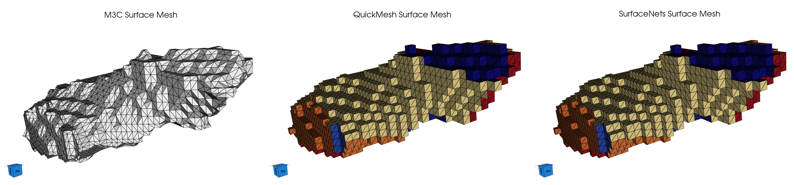

# Create Surface Mesh (M3C Multi-Material Marching Cubes)

## Group (Subgroup)

Surface Meshing (Generation)

## Description

This **Filter** creates a watertight, conformal triangle surface mesh from a segmented volume using
the **Multi-Material Marching Cubes (M3C)** algorithm. The input is an **Image Geometry**
together with a **Cell** **Feature Ids** **Data Array** that assigns every
**Voxel** to a **Feature** (for example a grain). The output is a **Triangle Geometry** whose faces
tile every internal **Feature**–**Feature** interface as well as the outer boundary of the volume.

Classic marching cubes extracts the surface between exactly two regions. A segmented microstructure,
however, has many **Feature** labels that meet along triple lines and at quadruple points. M3C
generalizes marching cubes to the multi-material case: mesh vertices are placed on the **Cell** edges
and faces where the **Feature Id** changes, and a multi-material case table drives how those points
are connected into triangles so that every shared interface is represented by a single, coherent set
of triangles (no cracks and no duplicated surfaces).

The algorithm produces the same output data model as the Create Surface Mesh (QuickMesh) and Surface
Nets **Filters**:

- A **Triangle Geometry** (shared vertex list + shared triangle list).
- **Face Labels** — a two-component `int32` **Data Array** giving the two **Feature Ids** on either
  side of each triangle. The smaller of the two ids is placed in component 0 (matching Surface Nets
  and QuickMesh). Faces on the outer boundary of the volume use a value of *-1* on their exterior
  side (which therefore sorts into component 0).
- **Node Types** — a one-component `int8` **Data Array** classifying each vertex by how many
  **Features** meet there (see the table below).

M3C is a *primal* method (vertices lie on **Cell** edges), whereas Surface Nets is a *dual* method
(one relaxed vertex per boundary **Cell**). The two produce different tessellations of the same
interfaces; M3C is retained because its primal, case-table topology is preferred for some downstream
modeling and simulation workflows.

### Node Types

The **Node Types** array uses the same convention as the Surface Nets **Filter**. Interior values
denote how many **Features** meet at the vertex, capped at 4; the exterior (volume-boundary)
variants add 10. The region outside the volume counts as one of those owners, which is why an
ordinary vertex on the wall between the exterior and a single Feature is `12` — two owners, one
of them the exterior — rather than `11`.

| Node Type | Meaning |
|-----------|---------|
| 2 | On a two-**Feature** interface |
| 3 | On a triple line (three **Features**) |
| 4 | At a quadruple point (four or more **Features**) |
| 12 / 13 / 14 | The 2 / 3 / 4 variants lying on the outer volume boundary |

### Attribute Array Transfer

Any selected **Cell** or **Feature** **Data Arrays** can be transferred onto the created triangle
faces. Because every face borders two **Features**, each transferred array is created on the face
**Attribute Matrix** with its component count doubled — the first half of the components holds the
value for the **Feature** on side 0 of the face and the second half holds the value for side 1.

### Winding Consistency

M3C assigns each triangle's winding (and therefore its normal direction) using a local, per-triangle
heuristic, which does not guarantee globally consistent normals across the whole mesh. Enable
*Attempt to Make Windings Consistent* to run a post-processing pass that makes the triangle winding
consistent across connected faces. This is recommended for meshes that will be used for normal- or
curvature-dependent analysis.

### Omitting the Bounding Box Skin

By default this filter generates triangles covering all six outer walls of the Image
Geometry's bounding box. These faces are artifacts of where the volume was cropped rather
than real interfaces, and they receive a Face Label of `-1` on the exterior side.

Enabling the **Bounding Box Skin** option's **Background-Backed Walls Only** mode suppresses a
wall face when the voxel behind it is background (Feature Id 0) — that is, when its Face Labels would be `{-1, 0}`. Wall faces
that cap a *real* Feature are still generated, because that cut plane is the only possible
closure for a Feature flush with the box. A cylinder sitting flush with the box floor
therefore comes out as a closed surface with no surrounding box.

On a fully-indexed volume with no Feature Id 0 voxels, nothing is dropped and the option
has no effect — every boundary Feature already needs its wall cap to stay closed. The same warning
also fires on a volume whose background is fully enclosed as interior porosity: no bounding-box
wall voxel is background-backed even though the volume is full of Feature Id 0 internally, so the
option again drops nothing. Rather than silently doing nothing, the **Filter** reports this with a
warning (code `-56342`): no bounding-box **wall** face is backed by background, so the option has
nothing to prune on this input. The warning says nothing about whether the volume contains
background elsewhere — only that none of it borders a wall.

Because the test is per-face rather than per-vertex, no triangles are lost along the rim
where an internal boundary meets the box wall. With the option **off**, wherever an internal
Feature-Feature boundary meets the bounding box wall, three faces share that edge: the internal
boundary quad and the two wall quads on either side of it — a non-manifold T-junction that is
inherent to including the full box skin. With the option **on**, the background-backed wall quad
on that edge is dropped, leaving exactly two faces sharing it, which is manifold. The option
therefore does not merely remove unwanted geometry: in the configurations exercised by this
**Filter**'s cross-mesher conformance test (a cylinder **Feature** flush with the box wall) and by
a separate corner-Feature test (a **Feature** occupying a box corner where three suppressed wall
planes meet), enabling it produces a watertight mesh where leaving it off does not. This is not a
universal guarantee of watertightness for arbitrary input.

If every voxel in the volume is background (Feature Id 0), every face is a background-backed
wall face and the option removes all of them. The **Filter** reports a warning (code `-56340`)
and creates the **Triangle Geometry** with zero faces. Unlike Create Surface Mesh (QuickMesh) and
Surface Nets, this is **not** zero vertices for M3C: as described in the note below, M3C's
candidate-node generation leaves a handful of pre-existing orphan vertices that the option's
pruning does not clear, so they remain in the output. This is treated as success, not an error,
because the input is legal — it simply contains no internal interface and no Feature to cap.

### Feature Id Validation

Independently of the **Bounding Box Skin** setting, this **Filter** always rejects a **Feature
Ids** array that contains a negative value or a value equal to `INT32_MAX`, because both collide
with sentinel values M3C's algorithm uses internally to represent ghost cells and the outside of
the volume. A **Feature Id** must therefore be in the range `0` to `INT32_MAX - 1`. A rejected
value produces an error (code `-56343`) naming the offending value, its tuple index, and the
array's **Data Path**. This is a mitigation for the underlying sentinel-collision design (tracked
as issue #1705), not a fix for it.

**Note:** M3C's candidate-node generation always produces a handful of node entries near the
volume boundary that no triangle references, even with the option disabled — these pre-existing
orphan vertices are present in stock M3C output regardless of the **Bounding Box Skin** setting
(tracked as issue #1706). The **Bounding Box Skin** option's **Background-Backed Walls Only** mode
does not touch them: it clears only the vertices that its own pruning orphans (vertices that were
referenced exclusively by a dropped wall face), and leaves every pre-existing orphan exactly as it
was. Consequently, on an all-background volume the pruned output is zero faces with those
pre-existing orphan vertices still present — which is why the `-56340` warning above reports the
remaining vertex count rather than assuming it is zero.

### Notes and Limitations

- The volume is automatically wrapped in a temporary ghost layer so that **Features** touching the
  edge of the volume are meshed correctly; no manual padding is required.
- **Feature Id** values of 0 are handled internally and restored on output.
- Only an **Image Geometry** is accepted as input: the M3C node coordinates assume uniform **Cell**
  spacing, so a **RectGrid Geometry** cannot be meshed correctly by this **Filter**.
- The mesh is generated using multiple threads. For a given input the result is deterministic and
  reproducible — it does not depend on the number of threads.
- **Memory:** the volume is swept one **Z** slice at a time, so the per-**Cell** working scratch is
  proportional to a slice (roughly the square of the in-plane dimension), not to the whole volume.
  Peak memory is therefore dominated by the size of the generated mesh itself (the number of
  triangles and vertices) rather than by the input dimensions; meshes with a very large number of
  small **Features** produce more triangles and use more memory.

This implementation ports the in-memory algorithm of the legacy DREAM.3D `M3CEntireVolume` **Filter**
(it is the functional replacement for the legacy `M3CSliceBySlice` **Filter**), originally
contributed by Dr. Sukbin Lee (Carnegie Mellon University), based on the algorithm of
Wu & Sullivan, "Multiple material marching cubes algorithm," *International Journal for Numerical
Methods in Engineering*, 58(2):189–207, 2003.

## Comparison of Surface Meshing Filters

DREAM3D-NX provides three **Filters** that convert a segmented grid into a multi-material triangle surface mesh. All three produce the same output data model (a **Triangle Geometry** with **Face Labels** and **Node Types**), so they are interchangeable inputs to downstream mesh **Filters**; they differ in how the triangles are generated and therefore in mesh smoothness, triangle count, and performance.

| Aspect | Create Surface Mesh (QuickMesh) | Create Surface Mesh (Surface Nets) | Create Surface Mesh (M3C) |
|---|---|---|---|
| Algorithm | Voxel-face ("staircase") | Dual (SurfaceNets) | Primal multi-material marching cubes |
| Vertex placement | Voxel corners | One relaxed vertex per boundary **Cell** | On **Cell** edges/faces |
| Surface quality | Blocky / stair-stepped | Smooth, sharp edges preserved | Faceted (marching-cubes) |
| Built-in smoothing | No (apply Laplacian Smoothing afterward) | Yes, optional and accuracy-controlled | No (apply Laplacian Smoothing afterward) |
| Relative triangle count | Highest | Lowest | Moderate to high (configuration dependent) |
| Multi-material junctions | Yes | Native | Yes (via case table) |
| Performance | Fastest | Fast (parallelized) | Moderate (multithreaded) |
| Status | Deprecated | Recommended default | Specialized / legacy-compatible |

**Guidance:** Surface Nets is the recommended default for most workflows — it yields the smoothest mesh with the fewest triangles and preserves sharp boundaries. Use M3C when a primal, marching-cubes case-table topology is required for a specific downstream modeling or simulation workflow. QuickMesh is retained for backward compatibility.

% Auto generated parameter table will be inserted here

## Example Pipelines

        Pipelines/SimplnxCore/M3C_Demo.d3dpipeline

## License & Copyright

Please see the description file distributed with this **Plugin**

## DREAM3D-NX Help

If you need help, need to file a bug report or want to request a new feature, please head over to the [DREAM3DNX-Issues](https://github.com/BlueQuartzSoftware/DREAM3DNX-Issues/discussions) GitHub site where the community of DREAM3D-NX users can help answer your questions.
