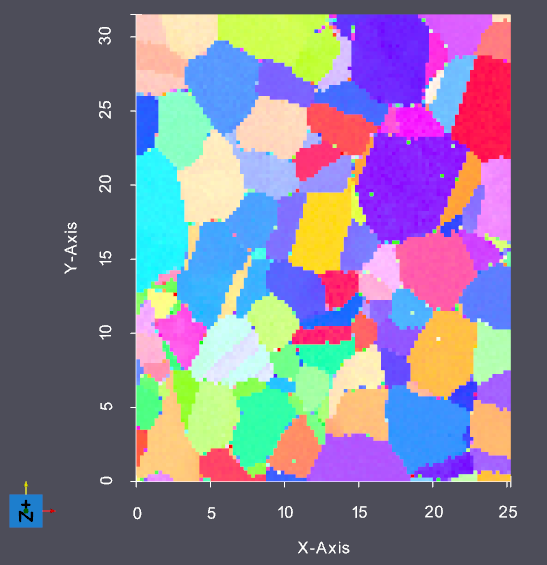
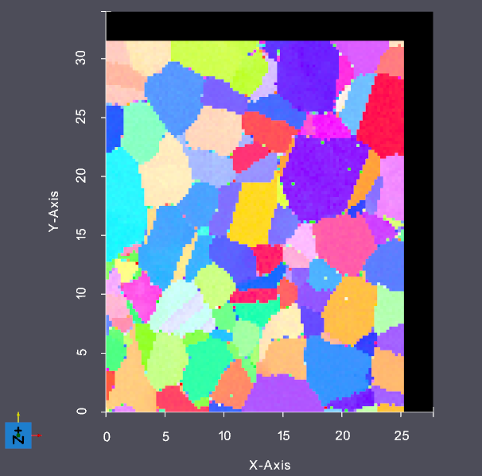

# Pad Image Geometry

## Group (Subgroup) ##

Generic (Generic)

## Description ##

This **Filter** pads an image geometry by the given min/max voxels for each dimension in X, Y, and Z, using the default padding value.
It is also possible to optionally update the origin of the image geometry, which prevents the original data from shifting in space.

For example given the original input geometry in Figure 1:

### Figure 1

Padding the Image Geometry with X Min=0, X Max=10, Y Min=0, Y Max=10 will give the output as shown in Figure 2

### Figure 2

% Auto generated parameter table will be inserted here

## Example Pipelines ##

'pad_image_geometry.d3dpipline'

## License & Copyright ##

Please see the description file distributed with this plugin.

## DREAM3D Mailing Lists ##

If you need more help with a filter, please consider asking your question on the DREAM3D Users mailing list:
https://groups.google.com/forum/?hl=en#!forum/dream3d-users
