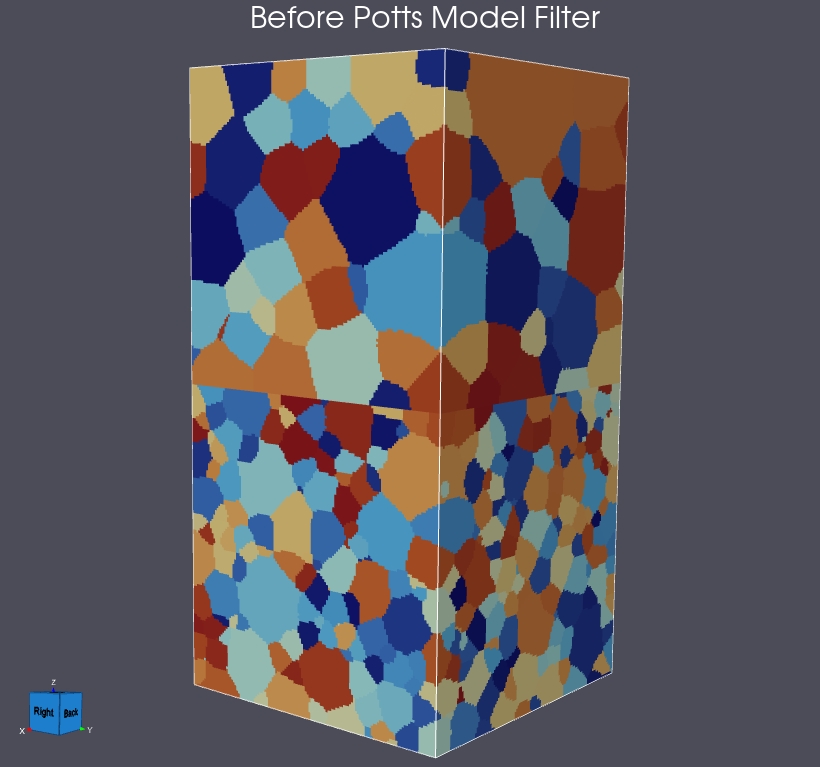

# Potts Model

## Group (Subgroup)

Synthetic Building (Coarsening)

## Description

This **Filter** simulates isotropic grain growth by applying a Monte Carlo Potts model to an integer **Feature Ids** array in an **Image Geometry**. Each positive Feature Id is treated as a lattice spin. The filter changes the selected **Feature Ids** **Data Array** in place, so feature-level measurements and neighbor relationships computed before this filter can become stale and should be recomputed afterward.

|  |  |
|:---:|:---:|

*Feature Ids before (left) and after (right) Potts Model coarsening.*

For each Monte Carlo iteration, the filter makes one attempted update per eligible lattice site. It randomly selects an eligible **Cell**, randomly selects a valid neighboring spin as the candidate, and evaluates the energy change

$$
\Delta E = \frac{1}{2}\sum_n \left[\mathbf{1}(s_n \ne s_c) - \mathbf{1}(s_n \ne s_i)\right],
$$

where $s_i$ is the current spin, $s_c$ is the candidate spin, and $s_n$ is a valid neighboring spin. The fully connected neighborhood contains 8 cells in two dimensions and 26 cells in three dimensions. A candidate is accepted when $\Delta E \le 0$. When $\Delta E > 0$, it is accepted with probability

$$
P = \exp\left(-\frac{\Delta E}{k_B T}\right),
$$

where $k_B = 1.38064852 \times 10^{-23}$ joules per kelvin (J/K) and *Temperature* $T$ is in kelvin (K). This is the legacy-faithful calculation: because the discrete energy difference is divided by the literal Boltzmann constant, thermal acceptance is effectively zero at ordinary temperatures. In practice, almost all accepted changes therefore have $\Delta E \le 0$.

### Dimensionality and Boundaries

If any one image dimension is 1, the filter treats the geometry as a two-dimensional lattice and uses the 8-cell neighborhood in the plane of the two non-singleton dimensions. A geometry with more than one singleton dimension, such as 1 x 1 x N, is rejected. Otherwise, the filter uses the 26-cell three-dimensional neighborhood.

When *Periodic Boundaries* is enabled, neighbors across each image boundary wrap to the opposite side. When it is disabled, a surface **Cell** has only the neighbors that lie within the image bounds.

### Mask and Feature Id 0

When *Use Mask* is enabled, only mask-true cells can be selected for an attempted update. Mask-false cells are never selected, cannot supply a candidate spin, and are excluded from the neighborhood used to calculate $\Delta E$. They remain unchanged and act as pinned sites. The mask can be a boolean or uint8 single-component cell array and must contain the same number of tuples as *Feature Ids*.

Cells whose Feature Id is 0 are also never selected or changed, and Feature Id 0 is never copied into another cell as a candidate spin.

### Cell Data Follows the Spin

When a flip is accepted, the filter copies the tuple in every sibling **Cell Data Array** from the specific neighbor whose spin was adopted. This keeps values such as phases, Euler angles, quaternions, and IPF colors consistent with the final *Feature Ids*.

Use *Attribute Arrays to Ignore* to keep selected arrays unchanged when a cell changes spin. *Feature Ids* is excluded from tuple copying because the accepted spin updates it directly. When *Use Mask* is enabled, the mask array is also excluded automatically and remains unchanged.

Legacy DREAM3D changed only *Feature Ids* and did not propagate sibling cell data. DREAM3D-NX intentionally corrects that behavior as deviation `PottsModel-D1`. To reproduce the legacy data effect, add every sibling cell array to *Attribute Arrays to Ignore*.

### Random Seed

Enable *Use Seed for Random Generation* and provide a fixed *Seed Value* to reproduce a run with the same input and parameters. The filter stores the seed used for every execution in the uint64 array named by *Stored Seed Value Array Name*. Seeded DREAM3D-NX runs do not bit-match legacy DREAM3D results because the legacy implementation used two clock-seeded random-number generators.

### Legacy DREAM3D

This filter was moved from the DREAM3DReview plugin's **Coarsening** subgroup. Its algorithm and ordinary-temperature acceptance behavior remain faithful to that implementation.

% Auto generated parameter table will be inserted here

## Required Geometry

- **Image Geometry** with exactly two or three non-singleton lattice dimensions.

## Required Objects

| Kind | Type | Component Dimensions | Description |
|------|------|----------------------|-------------|
| **Cell Data Array** | int32 | 1 | *Feature Ids* assigns a spin or feature label to each cell and is modified in place. |
| **Cell Data Array** (optional) | bool or uint8 | 1 | *Mask* selects the cells that may participate when *Use Mask* is enabled. |
| **Cell Data Arrays** (optional) | any DataArray type | any | Sibling arrays are copied from the accepted donor cell unless selected by *Attribute Arrays to Ignore*. |

## Created Objects

| Kind | Type | Tuple Dimensions | Component Dimensions | Description |
|------|------|------------------|----------------------|-------------|
| **Data Array** | uint64 | 1 | 1 | Stores the random seed used by the execution. Its name is set by *Stored Seed Value Array Name*. |

## Example Pipelines

- `PM-13_pack_then_potts_coarsening.d3dpipeline` in the Synthetic plugin pipeline matrix.

## References

- Anderson, M. P., Srolovitz, D. J., Grest, G. S., and Sahni, P. S. (1984). "Computer simulation of grain growth-I. Kinetics." *Acta Metallurgica*, 32(5), 783-791. https://doi.org/10.1016/0001-6160(84)90151-2
- Holm, E. A., and Battaile, C. C. (2001). "The computer simulation of microstructural evolution." *JOM*, 53, 20-23. https://doi.org/10.1007/s11837-001-0065-5

## License & Copyright

Please see the description file distributed with this **Plugin**

## DREAM3D-NX Help

If you need help, need to file a bug report or want to request a new feature, please head over to the [DREAM3DNX-Issues](https://github.com/BlueQuartzSoftware/DREAM3DNX-Issues/discussions) GitHub site where the community of DREAM3D-NX users can help answer your questions.
