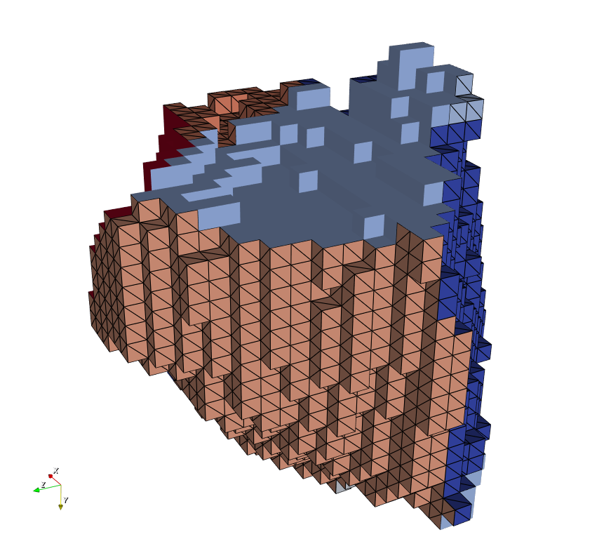
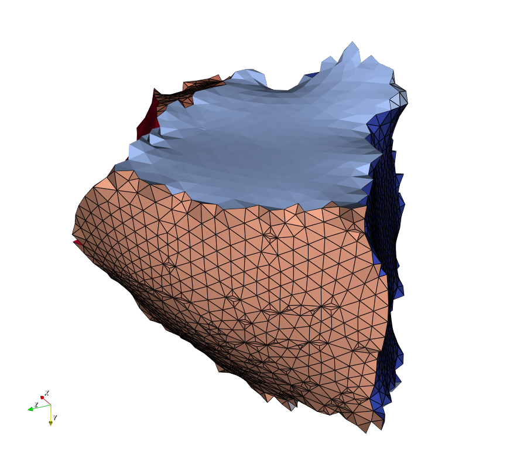
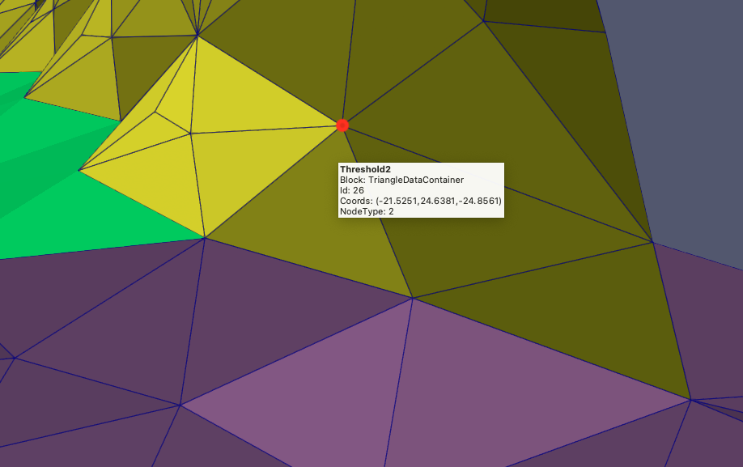
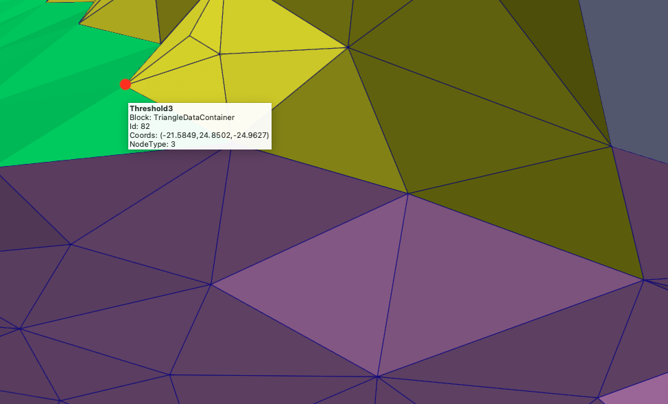
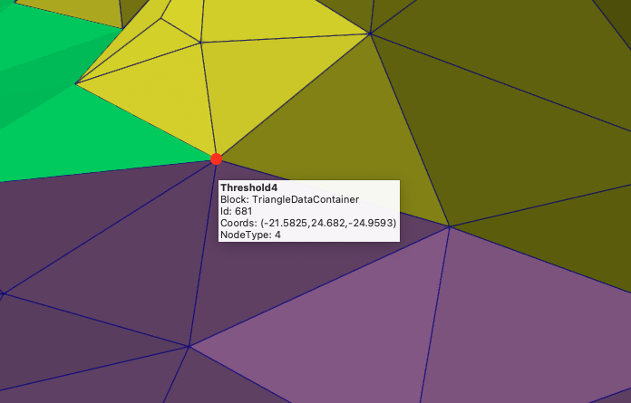

# Quick Surface Mesh

## Group (Subgroup)

Surface Meshing (Generation)

## Description

This **Filter** generates a **Triangle Geometry** from a grid **Geometry** (either an **Image Geometry** or a **RectGrid Geometry**) that represents a surface mesh of the present **Features**. The algorithm proceeds by creating a pair of **Triangles** for each face of the **Cell** where the neighboring **Cells** have a different **Feature** Id value. The meshing operation is extremely quick but can result in a surface mesh that is very "stair stepped". The user is encouraged to use a smoothing operation to reduce this "blockiness".

The user may choose any number of **Cell Attribute Arrays** to transfer to the created **Triangle Geometry**. The **Faces** will gain the values of the **Cells** from which they were created.  Currently, the **Filter** disallows the transferring of data that has a *multi-dimensional* component dimensions vector.  For example, scalar values and vector values are allowed to be transferred, but N x M matrices cannot currently be transferred.

This filter will ensure that the smaller of the 2 **FaceLabel** values will always be in the first component (component[0]). This will allow assumptions made in downstream filters to continue to work correctly.

For more information on surface meshing, visit the tutorial.

---------------

Quick Surface Mesh output **without** any extra smoothing applied

---------------

Quick Surface Mesh output **with** Laplacian Smoothing filter applied.

---------------

NodeType = 2

---------------

NodeType = 3

---------------

NodeType = 4

---------------

### Node Types

One of the arrays to come out of the algorithm is the "Node Type" vertex array. This array uses a value to label each vertex as to what kind of node it was determined to be during the meshing process.

| Value | Description |
|-------|-------------|
| 2 | Node within the interior of the grain face.  |
| 3 | Node along a triple line  |
| 4 | Node that is a Quadruple point  |
| 12 | Node that is on the exterior of the mesh  |
| 13 | Node that is on the exterior of the mesh and is a triple line  |
| 14 | Node that is on the exterior of the mesh and is a quadruple point   |

% Auto generated parameter table will be inserted here

## Example Pipelines

+ (01) SmallIN100 Quick Mesh

## License & Copyright

Please see the description file distributed with this **Plugin**

## DREAM3D-NX Help

If you need help, need to file a bug report or want to request a new feature, please head over to the [DREAM3DNX-Issues](https://github.com/BlueQuartzSoftware/DREAM3DNX-Issues/discussions) GitHub site where the community of DREAM3D-NX users can help answer your questions.
