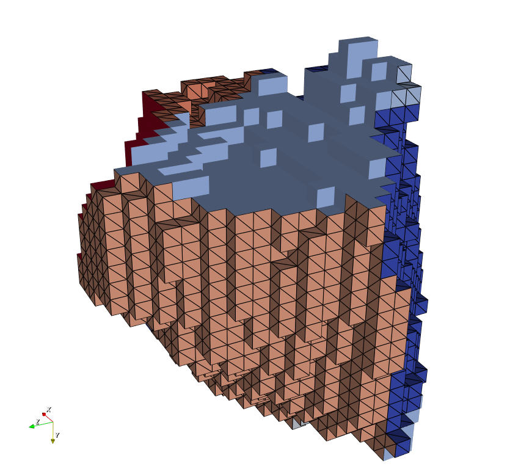
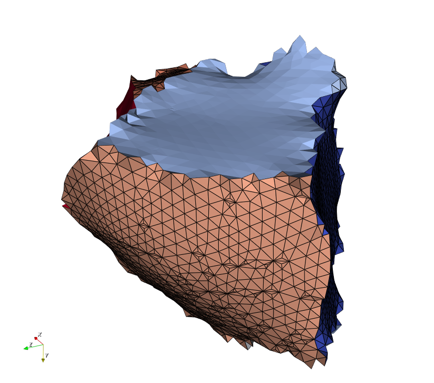
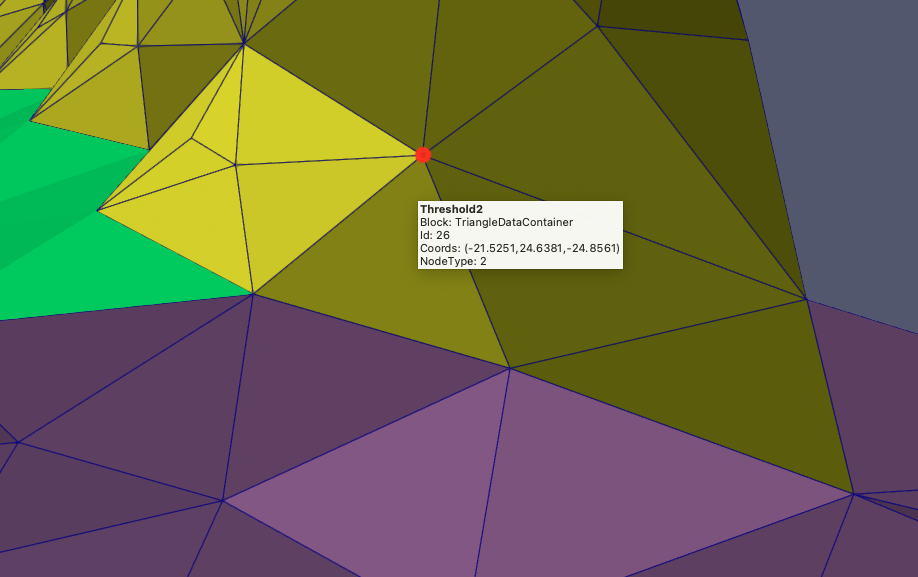
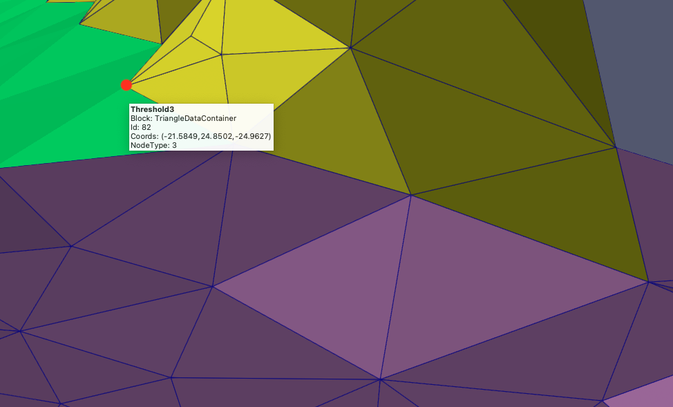
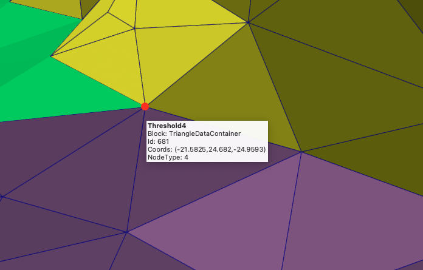

# Create Surface Mesh (QuickMesh)

## Group (Subgroup)

Surface Meshing (Generation)

## ⚠ Deprecation Notice

**This filter is deprecated.** Use the [Surface Nets](SurfaceNetsFilter.md) filter instead. Surface Nets produces a smoother mesh (no stair-stepping), runs faster, and includes smoothing in a single pass. This filter is retained for compatibility with legacy pipelines.

## Description

This **Filter** generates a **Triangle Geometry** surface mesh from a grid **Geometry** (Image or Rectilinear Grid). For every cell face shared between two different **Features** (i.e., a Feature boundary), the filter emits two triangles, producing the *stair-stepped* surface that defines the boundary of each Feature.

The resulting mesh is "blocky" because each triangle aligns with a voxel face. To smooth it, apply [Laplacian Smoothing](LaplacianSmoothingFilter.md) afterward -- or, preferably, use [Surface Nets](SurfaceNetsFilter.md), which combines meshing and smoothing in one step.

*Quick Surface Mesh output without smoothing.*

*Quick Surface Mesh output with Laplacian Smoothing applied.*

### Cell Data Transfer

The user may select any number of **Cell Attribute Arrays** to transfer onto the new **Triangle Geometry**. Each output **Face** inherits the values of the **Cell** it came from. Only scalar and vector arrays can be transferred; multi-dimensional component shapes (e.g., N×M matrices) are not supported.

### Face Labels Convention

Each triangle gets a 2-component *Face Labels* attribute storing the two Feature IDs on either side of the boundary. The filter guarantees the smaller Feature ID is in component 0, so downstream filters can rely on a consistent ordering.

If a triangle borders the outer volume rather than a real Feature (i.e., the cell on one side is outside the geometry), one of its Face Labels is set to **-1**.

### Node Types

A *Node Type* vertex array is produced classifying each vertex by its mesh role:

| Value | Description |
|-------|-------------|
| 2 | Vertex on the interior of a grain face |
| 3 | Vertex on a triple line (3 grains meet) |
| 4 | Vertex on a quadruple point (4 grains meet) |
| 12 | Vertex on the exterior of the mesh, on a grain face |
| 13 | Vertex on the exterior of the mesh, on a triple line |
| 14 | Vertex on the exterior of the mesh, on a quadruple point |

*Node Type 2 -- interior face vertex.*

*Node Type 3 -- triple line vertex.*

*Node Type 4 -- quadruple point vertex.*

### Winding

The filter attempts to repair mesh windings so that triangle normals point outward consistently. This may not always succeed -- see [Verify Triangle Winding](VerifyTriangleWindingFilter.md) for cases where the mesh storage scheme prevents fully consistent windings.

### Required Input Sources

- **Cell Feature Ids** -- produced by a segmentation filter such as [Segment Features (Misorientation)](../OrientationAnalysis/EBSDSegmentFeaturesFilter.md) or [Segment Features (Scalar)](ScalarSegmentFeaturesFilter.md).
- **Image Geometry** -- typically produced by [Create Image Geometry](CreateImageGeometryFilter.md), [ITK Import Image Stack](../ITKImageProcessing/ITKImportImageStackFilter.md), or an EBSD reader.

## Comparison of Surface Meshing Filters

DREAM3D-NX provides three **Filters** that convert a segmented grid into a multi-material triangle surface mesh. All three produce the same output data model (a **Triangle Geometry** with **Face Labels** and **Node Types**), so they are interchangeable inputs to downstream mesh **Filters**; they differ in how the triangles are generated and therefore in mesh smoothness, triangle count, and performance.

| Aspect | Create Surface Mesh (QuickMesh) | Create Surface Mesh (Surface Nets) | Create Surface Mesh (M3C) |
|---|---|---|---|
| Algorithm | Voxel-face ("staircase") | Dual (SurfaceNets) | Primal multi-material marching cubes |
| Vertex placement | Voxel corners | One relaxed vertex per boundary **Cell** | On **Cell** edges/faces |
| Surface quality | Blocky / stair-stepped | Smooth, sharp edges preserved | Faceted (marching-cubes) |
| Built-in smoothing | No (apply Laplacian Smoothing afterward) | Yes, optional and accuracy-controlled | No (apply Laplacian Smoothing afterward) |
| Relative triangle count | Highest | Lowest | Moderate to high (configuration dependent) |
| Multi-material junctions | Yes | Native | Yes (via case table) |
| Performance | Fastest | Fast (parallelized) | Moderate (multithreaded) |
| Status | Deprecated | Recommended default | Specialized / legacy-compatible |

**Guidance:** Surface Nets is the recommended default for most workflows — it yields the smoothest mesh with the fewest triangles and preserves sharp boundaries. Use M3C when a primal, marching-cubes case-table topology is required for a specific downstream modeling or simulation workflow. QuickMesh is retained for backward compatibility.

% Auto generated parameter table will be inserted here

## Example Pipelines

+ (01) SmallIN100 Quick Mesh

## License & Copyright

Please see the description file distributed with this **Plugin**

## DREAM3D-NX Help

If you need help, need to file a bug report or want to request a new feature, please head over to the [DREAM3DNX-Issues](https://github.com/BlueQuartzSoftware/DREAM3DNX-Issues/discussions) GitHub site where the community of DREAM3D-NX users can help answer your questions.
