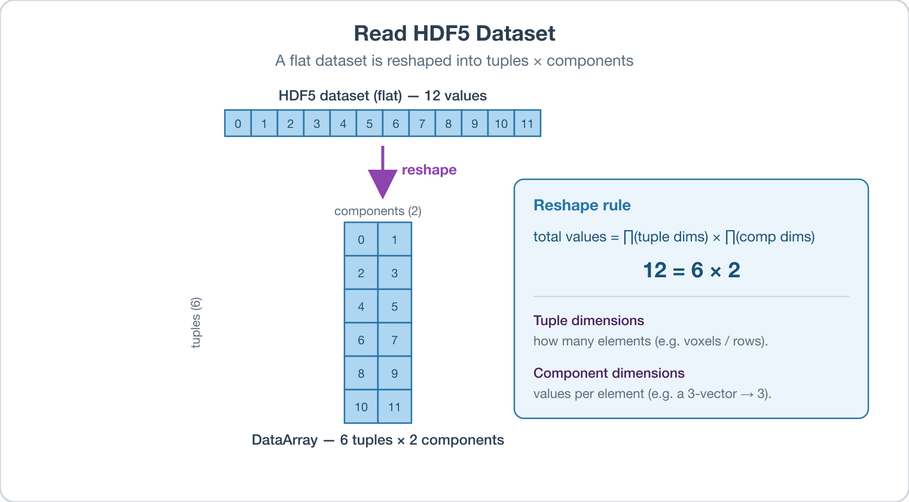
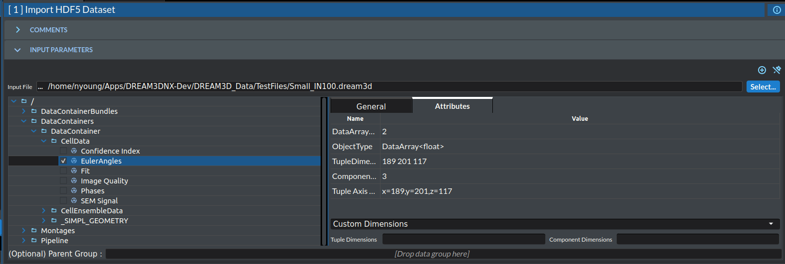

# Read HDF5 Dataset

## Group (Subgroup)

Core (IO/Read)

## Description

This filter imports one or more datasets from an HDF5 file and stores each one as a **Data Array** in DREAM3D-NX. HDF5 (Hierarchical Data Format version 5) is a binary file format that organizes named datasets inside a tree of groups, much like files inside folders on a disk.

When the filter is configured, the user browses the structure of the selected HDF5 file and checks one or more datasets to import. Multiple datasets can be selected and imported in a single pass; each checked dataset becomes its own Data Array. For every checked dataset the user supplies how that dataset's elements should be split into **tuple dimensions** and **component dimensions**:

- **Tuple dimensions** describe how many elements (tuples) the array holds — for example, the number of voxels or rows of data.
- **Component dimensions** describe how many values belong to each tuple — for example, a 3-component vector stores 3 values per tuple.



The filter places the imported array either at the top level of the **Data Structure** or, if the user selects an existing **Data Group** or **Attribute Matrix** as the parent, inside that container. When an Attribute Matrix is chosen as the parent, the tuple dimensions are taken automatically from that Attribute Matrix and do not need to be entered.

### How It Works

The import only succeeds when the math is consistent: the total number of elements actually stored in the HDF5 dataset must equal the number of tuples multiplied by the number of components per tuple.

```
HDF5 dataset element count  ==  (product of tuple dimensions) x (product of component dimensions)
```

If these two totals do not match, the filter reports a preflight error and nothing is imported.

The component dimensions are entered as a comma-separated list. For example:

1. `3, 4` means 3 x 4 = 12 components per tuple
2. `5, 2, 1` means 5 x 2 x 1 = 10 components per tuple
3. `6` means 6 components per tuple

### Worked Examples

**Example 1 (valid):** Suppose an HDF5 file contains a 1D dataset with **12,000** elements.

- The user enters component dimensions of `2` (so 2 components per tuple).
- The user enters tuple dimensions of `6000` (so 6,000 tuples).
- Check: 6,000 tuples x 2 components = 12,000 elements, which equals the HDF5 dataset element count of 12,000. The dataset imports successfully.

**Example 2 (invalid):** Suppose an HDF5 file contains a 1D dataset with **12,000** elements.

- The user enters component dimensions of `5, 2, 2` (so 5 x 2 x 2 = 20 components per tuple).
- The user enters tuple dimensions of `35, 5, 2, 2` (so 35 x 5 x 2 x 2 = 700 tuples).
- Check: 700 tuples x 20 components = 14,000 elements, which does not equal the HDF5 dataset element count of 12,000. The filter reports a preflight error.

**Example 3 (valid, multi-dimensional dataset):** Suppose an HDF5 file contains a dataset whose stored dimensions are **16 x 1001 x 1001**, for a total of 16 x 1001 x 1001 = 16,032,016 elements.

- The user enters component dimensions of `2` (so 2 components per tuple). This means there must be 16,032,016 / 2 = 8,016,008 tuples.
- The user enters tuple dimensions of `8, 1001, 1001` (so 8 x 1001 x 1001 = 8,016,008 tuples).
- Check: 8,016,008 tuples x 2 components = 16,032,016 elements, which equals the HDF5 dataset element count of 16,032,016. The dataset imports successfully.



## Required Input Sources

None — this filter reads directly from an external `.h5`/`.hdf5` file on disk. The imported array may optionally be placed into an existing **Data Group** or **Attribute Matrix** if one is selected as the parent.

% Auto generated parameter table will be inserted here

## Example Pipelines

## License & Copyright

Please see the description file distributed with this **Plugin**

## DREAM3D-NX Help

If you need help, need to file a bug report or want to request a new feature, please head over to the [DREAM3DNX-Issues](https://github.com/BlueQuartzSoftware/DREAM3DNX-Issues/discussions) GitHub site where the community of DREAM3D-NX users can help answer your questions.
