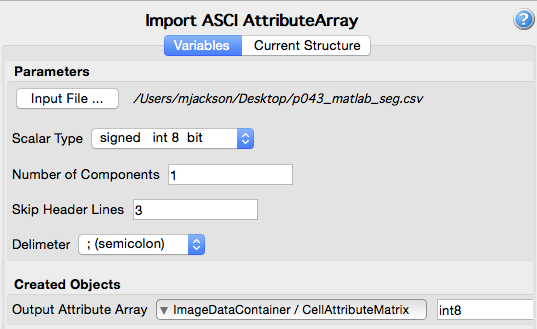

# Read Text Data Array

## Group (Subgroup)

Core (IO/Read)

## Description

This **Filter** allows the user to import a plain text file containing the contents of a single Attribute Array. The delimeters can be one of the following:

    + comma
    + semicolon
    + space
    + colon
    + tab

The filter does not care about how many values per line but only about reading the proper number of values from the file. If you are trying to read an array into DREAM.3D and there is no existing DataContainer or anything else to hold the data then the user will need to insert the following filters **BEFORE** using this filter:

    + Create DataContainer: Give the DataContainer a name
    + Create AttributeMatrix: Give the AttributeMatrix a name and set the tuple dimensions to match the number of values in the input file.
    + OPTIONAL: If the data exists as a regular set of data on a grid then the user can also use the "Create Geometry (Image)" filter before importing the data.

### Example Data

The example data below has 50 elements. This means that it could successfully be read into an array that has 10 Tuples and 5 Componenets or 50 Tuples and 1 Component. The AttributeMatrix would need to have dimensions such that mulplying all the dimensions together yields 50. For example the AttributeMatrix could have X=5, Y=5 and Z=2 or X=10, Y=5 and Z=1. This filter does not require any type of Geometry as the filter is reading data directly into an array.

    0    1    2    3    4    5    6    7    8    9
    10    11    12    13    14    15    16    17    18    19
    20    21    22    23    24    25    26    27    28    29
    30    31    32    33    34    35    36    37    38    39
    40    41    42    43    44    45    46    47    48    49

### Scalar Types

| Value | Type |
|--|------|
| 0 | signed   int 8  bit |
| 1 | unsigned int 8  bit |
| 2 | signed   int 16 bit |
| 3 | unsigned int 16 bit |
| 4 | signed   int 32 bit |
| 5 | unsigned int 32 bit |
| 6 | signed   int 64 bit |
| 7 | unsigned int 64 bit |
| 8 |        Float 32 bit |
| 9 |       Double 64 bit |

### Delimeter Types

| Value | Type |
|--|------|
| 0 | comma |
| 1 | semicolon |
| 2 | space |
| 3 | colon |
| 4 | tab |

% Auto generated parameter table will be inserted here

## Example Pipelines

## License & Copyright

Please see the description file distributed with this **Plugin**

## DREAM3D-NX Help

If you need help, need to file a bug report or want to request a new feature, please head over to the [DREAM3DNX-Issues](https://github.com/BlueQuartzSoftware/DREAM3DNX-Issues) GItHub site where the community of DREAM3D-NX users can help answer your questions.
