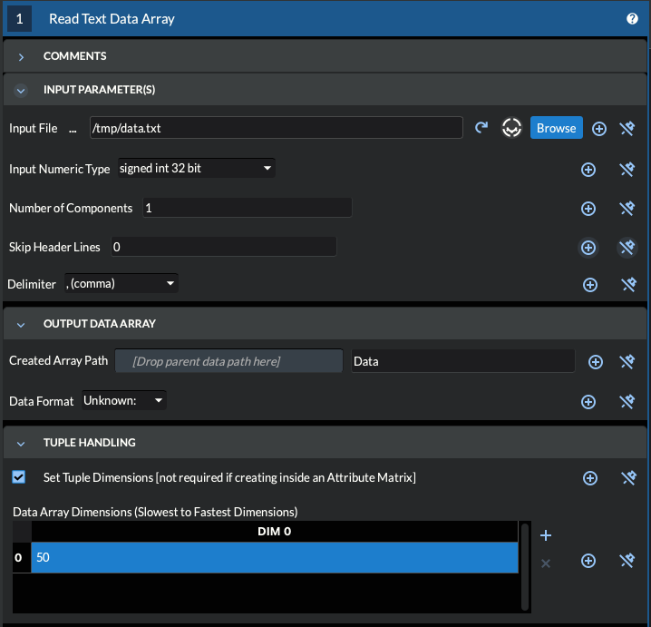

# Read Text Data Array

## Group (Subgroup)

Core (IO/Read)

## Description

This **Filter** allows the user to import a plain text file containing the contents of a single Attribute Array. The filter does not care about how many values per line but only about reading the proper number of values from 
the file.

## Use Cases

There are several use cases for this filter. Both use cases have in common that the data
in the input file should **all** be contained in a single Data Array. If your data file
instead is organized in a table format where each column of data represents a distinct
Data Array then the [Read CSV File](ReadCSVFileFilter.md) filter should be used instead.

### Use Case 1

In this use case the user simply wants to read the data into an array within DREAM3D-NX but
does not need to store that data into an AttributeMatrix. In this case the following 
parameters should be set:

- Set Tuple Dimensions should be **ON**
- DataArray Dimensions should also be created. At the minimum the user will need to set the value to the total number of values that will be read.

### Use Case 2

In this use case the user wants to read the data into an existing Attribute Matrix. In this case
the user should set the "Created Array Path" where the parent object is the target Attribute Matrix and
also set the name of the created Data Array. The following parameters should be set
with the following values:

- Set Tuple Dimensions should be **OFF**
- DataArray Dimensions can be safely ignored as the tuple dimensions from the AttributeMatrix will be used instead.

### Example Data

The example data below has 50 elements. This means that it could successfully be read into an array that 
has 10 Tuples and 5 Components or 50 Tuples and 1 Component. The AttributeMatrix would need to 
have dimensions such that multiplying all the dimensions together yields 50. For example the AttributeMatrix 
could have X=5, Y=5 and Z=2 or X=10, Y=5 and Z=1. This filter does not require any type of Geometry 
as the filter is reading data directly into an array.

    0    1    2    3    4    5    6    7    8    9
    10    11    12    13    14    15    16    17    18    19
    20    21    22    23    24    25    26    27    28    29
    30    31    32    33    34    35    36    37    38    39
    40    41    42    43    44    45    46    47    48    49

### Scalar Types

| Value | Type |
|--|------|
| 0 | signed   int 8  bit |
| 1 | unsigned int 8  bit |
| 2 | signed   int 16 bit |
| 3 | unsigned int 16 bit |
| 4 | signed   int 32 bit |
| 5 | unsigned int 32 bit |
| 6 | signed   int 64 bit |
| 7 | unsigned int 64 bit |
| 8 |        Float 32 bit |
| 9 |       Double 64 bit |

### Delimiter

The *Delimiter* parameter provides the following choices:

- **, (comma) [0]**: Values are separated by a comma character.
- **; (semicolon) [1]**: Values are separated by a semicolon character.
- **  (space) [2]**: Values are separated by a space character.
- **: (colon) [3]**: Values are separated by a colon character.
- **\t (Tab) [4]**: Values are separated by a tab character.

## Required Input Sources

None — this filter reads directly from a plain text file on disk.

% Auto generated parameter table will be inserted here

## Example Pipelines

## License & Copyright

Please see the description file distributed with this **Plugin**

## DREAM3D-NX Help

If you need help, need to file a bug report or want to request a new feature, please head over to the [DREAM3DNX-Issues](https://github.com/BlueQuartzSoftware/DREAM3DNX-Issues/discussions) GitHub site where the community of DREAM3D-NX users can help answer your questions.
