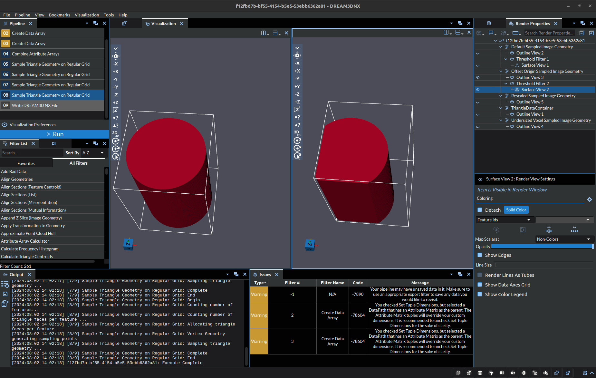
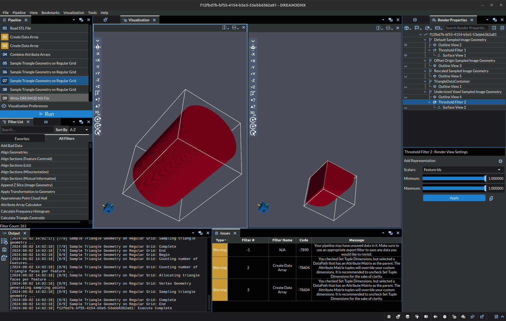
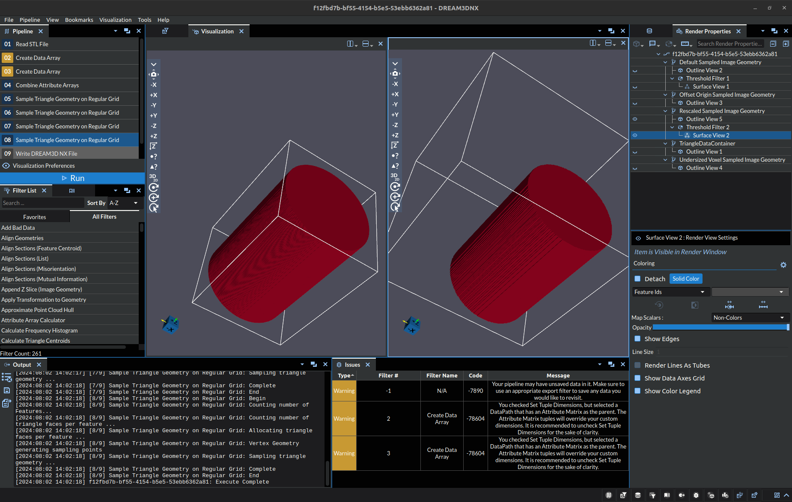
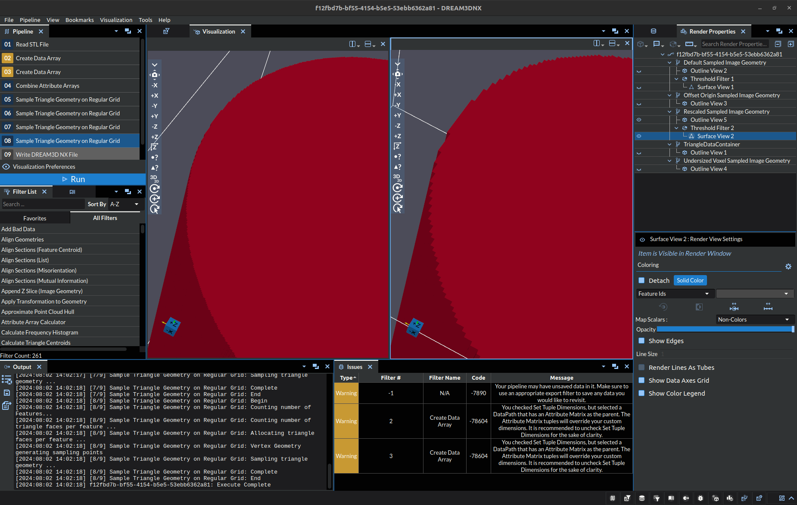

# Sample Triangle Geometry on Regular Grid

## Group (Subgroup)

Sampling (Resolution)

## Description

This **Filter** "samples" a triangulated surface mesh on a rectilinear grid. The user can specify the number of **Cells** along the X, Y, and Z directions in addition to the resolution in each direction and origin to define a rectilinear grid.  The sampling is then performed by the following steps:

1. Determine the bounding box and **Triangle** list of each **Feature** by scanning all **Triangles** and noting the **Features** on either side of the **Triangle**
2. For each **Cell** in the rectilinear grid, determine which bounding box(es) they fall in (*Note:* the bounding box of multiple **Features** can overlap)
3. For each bounding box a **Cell** falls in, check against that **Feature's** **Triangle** list to determine if the **Cell** falls within that n-sided polyhedra (*Note:* if the surface mesh is conformal, then each **Cell** will only belong to one **Feature**, but if not, the last **Feature** the **Cell** is found to fall inside will *own* the **Cell**)
4. Assign the **Feature** number that the **Cell** falls within to the *Feature Ids* array in the new rectilinear grid geometry

### Origin, Dimension, and Spacing's Effect on the Output

***Subsequent images in this section will always have the correct example on the left***. The images below were created by thresholding the `Feature Ids` to `1`.

#### Origin

Take a moment to consider the following image:

In the above picture, the cylinder on the left is a correct output for a specific `.stl` model, the origin used was (-1, -1, -1). On the right, there is a cylinder that had the origin set to (3, 2, -1). The change of origin caused a truncating of the geometry, the white outline is roughly the bounding box for the objects. Thus, when you are defining the origin it is important to consider how the resulting box will intersect the geometry. *For most cases, it is recommended to ensure the origin of the box falls below that of the Geometry to avoid truncation.*

#### Dimension

Take a moment to consider the following image:

In the above picture, the cylinder on the left is a correct output for a specific `.stl` model, the dimensions used was (440, 440, 640). On the right, there is a cylinder that had the dimensions set to (240, 240, 240). The change in dimensions led to a large truncation of the overall geometry. This parameter is the most difficult to fine tune since setting the dimensions too large can easily blow out your RAM needlessly, while too small will truncate sections potentially leading to output looking deformed (such as a rectangle appearing as a square).

#### Scaling

Take a moment to consider the following image:

In the above picture, the cylinder on the left is a correct output for a specific `.stl` model, the scaling used was (0.05, 0.05, 0.05) with dimensions of (440, 440, 640). On the right, there is a cylinder that had the scaling set to (0.15, 0.15, 0.15) with dimensions of (240, 240, 240). You will notice there is no truncation to the geometry despite the smaller box dimensions, thus scaling can be used to reduce the size of the data. **However, there is a caveat, less points means less detail**. The astute may have noticed the cylinder on the right looks more "pixelated" despite having no truncation. Here's a close up image of the edge for easier viewing:

#### Tips

It's easiest to think about these parameters as if you were defining a 3D image to capture. The Dimensions are the pixels (voxels) in your image. They allow you to define the detail (resolution) of the resulting image:

- lower values will save space and run faster, but be pixelated
- higher values will be detailed, but consume more space and take longer to process.

The spacing allows you to scale the size of the bounding box, which can be thought of as similar to zooming a camera in/out from your focal point.

- larger scaling values can make the capture (bounding box/grid) too large, and your focal point will become pixelated because its "too small" in the overall image. Think about zooming in super close to a picture.
- smaller scaling values are bring the focal point closer, ensuring more detail is captured. However, if you get too close pieces of the focal point will be missing from the image, but what you do capture will have lots of detail.

The origin can be thought of as moving the camera left and right and up and down. Allowing you to center the focal point in the image or cut out unwanted parts.

All in all, it is best practice to try to fit the bounding box as closely to the actual geometry as possible to ensure you get the most detail out of the used memory.

% Auto generated parameter table will be inserted here

## License & Copyright

Please see the description file distributed with this **Plugin**
