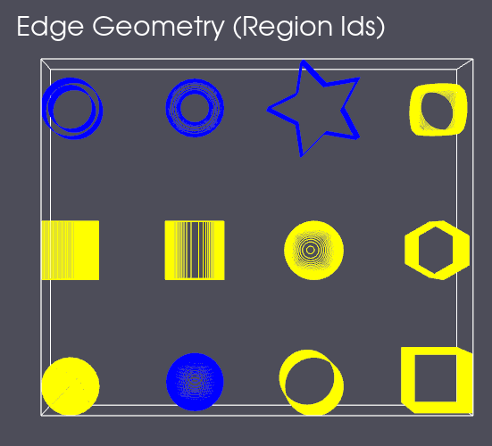
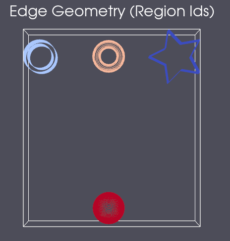

# Remove Flagged Edges

## Group (Subgroup)

Surface Meshing (Misc)

## Description

This **Filter** removes **Edges** from the supplied **Edges Geometry** that are flagged by a (boolean|uint8) mask array as **true|1**.  A new reduced **Edge Geometry** is created that contains all the remaining **Edges**.  It is unknown until run time how many **Edges** will be removed from the **Geometry**. Therefore, this **Filter** requires that a new **EdgeGeom** be created to contain the reduced **Edge Geometry**. This new **Geometry** will *NOT* contain copies of any **Feature Attribute Matrix** or **Ensemble Attribute Matrix** from the original 
**Geometry**. The mask is expected to be over the edges themselves so it should be based on something from the **Edge Data Attribute Matrix**.

## Data Handling

For each of the vertex and edge data attribute matrices, the user can select to copy none, some or all of the associated data arrays
into the newly created geometry. If the user wishes to not copy any of the data, just leave the choice to "Copy Selected XXX Data" [0]
but do not populate the list with any selections.

*Note:* Since it cannot be known before run time how many **Edges** will be removed, the new **Edge Geometry** and all associated **Edge** data to be copied will be initialized to have size 0.

## Example Output

- The next figure shows an edge geometry that has had a mask generated. Yellow parts are flagged as true.

- The next figure shows the result of running the filter.

% Auto generated parameter table will be inserted here

## Example Pipelines

## License & Copyright

Please see the description file distributed with this plugin.

## DREAM3D-NX Help

If you need help, need to file a bug report or want to request a new feature, please head over to the [DREAM3DNX-Issues](https://github.com/BlueQuartzSoftware/DREAM3DNX-Issues) GitHub site where the community of DREAM3D-NX users can help answer your questions.
