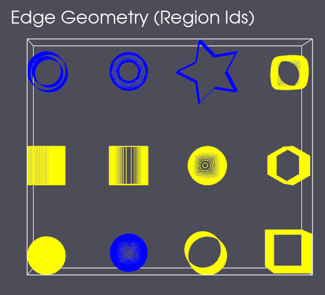
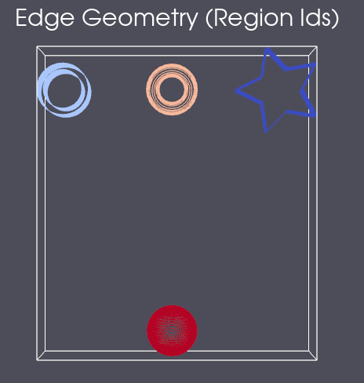

# Remove Flagged Edges

## Group (Subgroup)

Surface Meshing (Cleanup)

## Description

This **Filter** removes edges from an **Edge Geometry** based on a per-edge mask. An **Edge Geometry** is a node-based geometry made of straight line segments (edges), where each edge connects two vertices. A **mask** is a boolean (or *uint8*) value stored for every edge that flags it as either *true* (1) or *false* (0). Every edge flagged *true* is removed; the remaining edges are written into a new, smaller **Edge Geometry**.

Because the number of removed edges is not known until the filter runs, the result must be written to a newly created **Edge Geometry** rather than modifying the input in place. The new geometry will *NOT* contain copies of any **Feature Attribute Matrix** or **Ensemble Attribute Matrix** from the original geometry.

The mask is applied to the edges themselves, so it must come from an array in the **Edge Data Attribute Matrix** (one value per edge).

## Data Handling

For each of the vertex and edge data attribute matrices, the user can select to copy none, some, or all of the associated data arrays into the newly created geometry. To copy none of the data, leave the choice set to *Copy Selected XXX Data* but do not populate the selection list.

### A Note on Vertex Data Handling

The *Vertex Data Handling* parameter controls which vertex data arrays are transferred to the reduced geometry:

- *Copy Selected Vertex Data [0]*: Copies only the vertex arrays selected by the user into the new geometry.
- *Copy All Vertex Data [1]*: Copies all arrays from the vertex attribute matrix into the new geometry.

### A Note on Edge Data Handling

The *Edge Data Handling* parameter controls which edge data arrays are transferred to the reduced geometry:

- *Copy Selected Edge Data [0]*: Copies only the edge arrays selected by the user into the new geometry.
- *Copy All Edge Data [1]*: Copies all arrays from the edge attribute matrix into the new geometry.

*Note:* Because the number of removed edges cannot be known before run time, the new **Edge Geometry** and all associated edge data to be copied are initialized to size 0 and then grown to the final size during execution.

## Example Output

- The next figure shows an edge geometry that has had a mask generated. Yellow parts are flagged as *true*.

- The next figure shows the result of running the filter.

### Required Input Sources

- **Input Edge Geometry** -- an **Edge Geometry**, typically produced by [Slice Triangle Geometry](SliceTriangleGeometryFilter.md) or [Create AM Scan Paths](CreateAMScanPathsFilter.md).
- **Edge Mask** -- a boolean or *uint8* array (one value per edge) in the **Edge Data Attribute Matrix**, typically produced by a thresholding filter such as [Multi-Threshold Objects](MultiThresholdObjectsFilter.md).

% Auto generated parameter table will be inserted here

## License & Copyright

Please see the description file distributed with this **Plugin**

## DREAM3D-NX Help

If you need help, need to file a bug report or want to request a new feature, please head over to the [DREAM3DNX-Issues](https://github.com/BlueQuartzSoftware/DREAM3DNX-Issues/discussions) GitHub site where the community of DREAM3D-NX users can help answer your questions.
