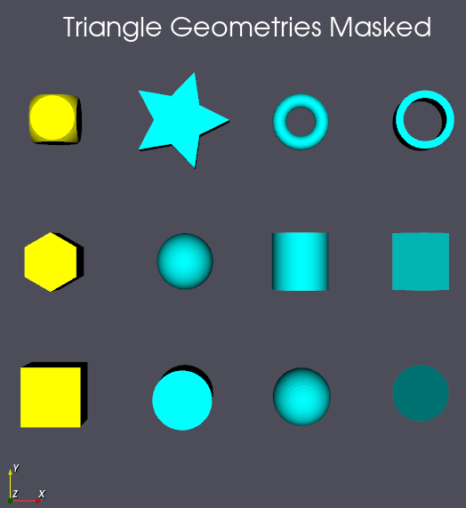
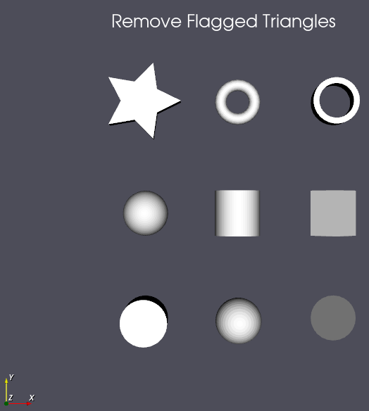

# Remove Flagged Triangles

## Group (Subgroup)

Surface Meshing (Cleanup)

## Description

This **Filter** removes triangles from a **Triangle Geometry** based on a per-triangle mask. A **Triangle Geometry** is a node-based surface mesh made of triangular faces, where each face connects three vertices. A **mask** is a boolean value stored for every triangle (face) that flags it as either *true* or *false*. Every triangle flagged *true* is removed; the remaining triangles are written into a new, smaller **Triangle Geometry**.

Because the number of removed triangles is not known until the filter runs, the result must be written to a newly created **Triangle Geometry** rather than modifying the input in place. The new geometry will *NOT* contain copies of any **Feature Attribute Matrix** or **Ensemble Attribute Matrix** from the original geometry.

The mask is applied to the triangles themselves, so it must come from an array in the **Face Data Attribute Matrix** (one value per triangle face).

## Data Handling

For each of the vertex and triangle (face) data attribute matrices, the user can select to copy none, some, or all of the associated data arrays into the newly created geometry. To copy none of the data, leave the choice set to *Copy Selected XXX Data* but do not populate the selection list.

### A Note About Vertex Data Handling

The *Vertex Data Handling* parameter controls which vertex data arrays are transferred to the reduced geometry:

- *Copy Selected Vertex Data [0]*: Copies only the vertex arrays selected by the user into the new geometry.
- *Copy All Vertex Data [1]*: Copies all arrays from the vertex attribute matrix into the new geometry.

### A Note About Triangle Data Handling

The *Triangle Data Handling* parameter controls which triangle (face) data arrays are transferred to the reduced geometry:

- *Copy Selected Triangle Data [0]*: Copies only the triangle arrays selected by the user into the new geometry.
- *Copy All Triangle Data [1]*: Copies all arrays from the triangle attribute matrix into the new geometry.

*Note:* Because the number of removed triangles cannot be known before run time, the new **Triangle Geometry** and all associated triangle data to be copied are initialized to size 0 and then grown to the final size during execution.

## Example Output

- The next figure shows a triangle geometry that has had a mask generated. Yellow parts are flagged as *true*.

- The next figure shows the result of running the filter.

### Required Input Sources

- **Input Triangle Geometry** -- a **Triangle Geometry** (surface mesh), typically produced by [Create Surface Mesh (QuickMesh)](QuickSurfaceMeshFilter.md).
- **Triangle Mask** -- a boolean array (one value per triangle face) in the **Face Data Attribute Matrix**, typically produced by a thresholding filter such as [Multi-Threshold Objects](MultiThresholdObjectsFilter.md).

% Auto generated parameter table will be inserted here

## Example Pipelines

- Remove_Flagged_Triangles

## License & Copyright

Please see the description file distributed with this **Plugin**

## DREAM3D-NX Help

If you need help, need to file a bug report or want to request a new feature, please head over to the [DREAM3DNX-Issues](https://github.com/BlueQuartzSoftware/DREAM3DNX-Issues/discussions) GitHub site where the community of DREAM3D-NX users can help answer your questions.
