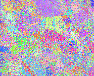
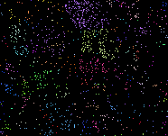
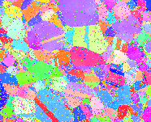
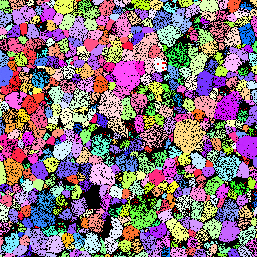
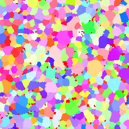
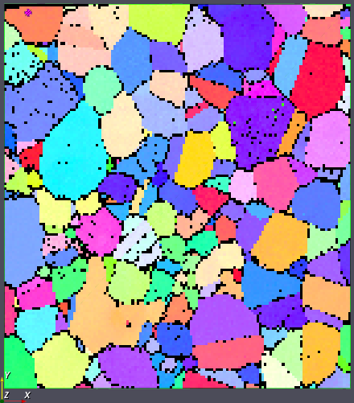
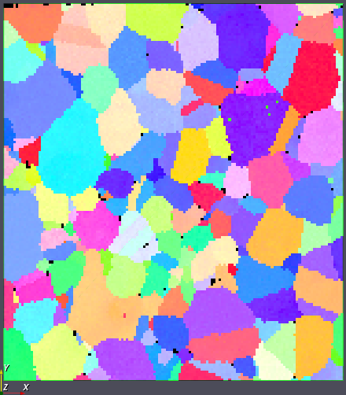

# Replace Element Attributes with Neighbor (Threshold)

## Group (Subgroup)

Processing (Cleanup)

## Description

This **Filter** replaces the attributes of cells that fail a user-defined threshold with the attributes of one of their neighbors -- specifically, the neighbor with the maximum or minimum value of the same scalar. It is a generic threshold-and-replace cleanup tool: any cell-level scalar can drive the threshold, and **all** cell-level arrays in the same attribute matrix follow the chosen neighbor's values.

This filter is most often used to clean up EBSD data using a confidence-related scalar (Confidence Index, Image Quality, MAD, etc.), but it works on any cell-level scalar.

### How This Filter Works

1. For every cell, compare its value of the *Selected Array* to the *Threshold Value* using the *Comparison Operator* (less-than or greater-than).
2. For each cell that passes the comparison (i.e., is flagged for replacement), examine its 6 face-neighbors.
3. Among the neighbors that do **not** pass the comparison, find the one with the maximum (when operator is `<`) or minimum (when operator is `>`) value of the same scalar. This is the "best" neighbor.
4. Copy **all** cell-level arrays in the same attribute matrix from that best neighbor into the flagged cell.

If a flagged cell has only flagged neighbors (i.e., none of its neighbors pass the threshold), it is left unchanged in this pass.

### Comparison Operator

- **< [Less Than] [0]**: Targets cells whose scalar is **less than** the threshold. Replacement neighbor is the one with the **highest** scalar value among neighbors that exceed the threshold. Use this for measures where higher = better (Confidence Index, Image Quality).
- **> [Greater Than] [1]**: Targets cells whose scalar is **greater than** the threshold. Replacement neighbor is the one with the **lowest** scalar value among neighbors that fall below the threshold. Use this for measures where lower = better (Mean Angular Deviation, scan error metrics).

### Loop Until Gone

By default, the filter runs a **single pass**. If a flagged cell's neighbors are all flagged in that pass, the cell is left alone. Enabling *Loop Until Gone* repeats the algorithm until every flagged cell has been replaced (typically because flag-replacements propagate inward across multiple passes).

### Caution: Flood Fill Behavior

If the threshold is set too aggressively or the dataset has large contiguous regions of low-quality cells, *Loop Until Gone* can act like a flood-fill, propagating one neighbor's data across an entire region. The end result may bear little resemblance to the true microstructure. Always inspect the output and, if grain morphology has shifted dramatically, lower the *Threshold Value* or run a single pass.

| Original Data                                           | Threshold CI < 0.1                                                                                     | After Running Filter                              | True Data                                    |
|---------------------------------------------------------|--------------------------------------------------------------------------------------------------------|---------------------------------------------------|----------------------------------------------|
|  |  |  |  |

The example above shows what happens when too much of the data is below threshold: most fine grains and twins do **not** match the true microstructure.

## Example Use Cases

### Reasonable Use of the Filter

| Original Data                                             |     | After Running Filter                                | True Data                                    |
|-----------------------------------------------------------|-----|-----------------------------------------------------|----------------------------------------------|
|  |     |  |  |

### TSL Data (.ang) -- Using Confidence Index

EDAX/TSL ANG files include a *Confidence Index* (CI) array that ranges from 0.0 (no confidence) to 1.0 (absolute confidence). To clean up cells with poor indexing, use:

| Filter Parameter | Value                                         |
|------------------|-----------------------------------------------|
| Threshold Value  | 0.1                                           |
| Operator         | <                                             |
| Selected Array   | [DataContainer] / CellData / Confidence Index |
| Loop Until Gone  | User dependent                                |

This says: for every cell with CI < 0.1, find the neighbor with the highest CI among those above 0.1, and copy that neighbor's data into the cell.

### Oxford/Bruker (.ctf) -- Using Error

CTF files do not include a Confidence Index, but they do have an *Error* value that defaults to 0 for indexed points and is non-zero for non-indexed points. This is the inverse direction from CI:

| Filter Parameter | Value                              |
|------------------|------------------------------------|
| Threshold Value  | 0.0                                |
| Operator         | >                                  |
| Selected Array   | [DataContainer] / CellData / Error |
| Loop Until Gone  | User dependent                     |

| Original Data                                           | After Running Filter                      |
|---------------------------------------------------------|-------------------------------------------|
|  |  |

The black pixels in the original are unindexed cells (Error > 0) and are filled in by the filter.

### Required Input Sources

- **Selected Scalar Array** -- any single-component cell-level scalar suitable for thresholding. Common sources: confidence/quality arrays from [Read H5EBSD](../OrientationAnalysis/ReadH5EbsdFilter.md), [Read CTF Data](../OrientationAnalysis/ReadCtfDataFilter.md), or [Read ANG Data](../OrientationAnalysis/ReadAngDataFilter.md), or any computed per-cell scalar.

## Algorithm

This filter iteratively replaces voxel data that fails a user-defined threshold comparison with data from the best-scoring face neighbor.

### Processing Steps

For each pass over the volume:

1. For each voxel, compare its value in the selected array against the threshold using the chosen comparison operator (less-than or greater-than).
2. If the voxel fails the comparison (e.g., confidence index < 0.1), examine its 6 face-connected neighbors.
3. Among neighbors that pass the threshold, find the one with the best value (highest for less-than mode, lowest for greater-than mode).
4. Mark the failing voxel to be replaced by that neighbor's data.
5. After each Z-slice is scanned, apply all replacements across every array in the Attribute Matrix (not just the comparison array).

If **Loop Until Gone** is enabled, the algorithm repeats until no voxels fail the threshold. Each pass can improve neighbors of previously failing voxels, allowing the cleanup to propagate inward from good-data boundaries.

### Performance

This algorithm is optimized for both in-memory and out-of-core (OOC) data stores. When data resides on disk in chunked format, random voxel access can cause expensive chunk load/evict cycles. The implementation avoids this by:

- **Sequential Z-slice processing**: The volume is scanned one Z-slice at a time, aligning with typical chunk boundaries.
- **3-slice rolling window**: Three adjacent Z-slices of the comparison array are held in typed memory buffers, allowing face-neighbor value lookups without per-voxel store access.
- **Immediate per-slice transfer**: Because replacement marks always point to face neighbors (within one Z-slice), each slice can be committed immediately after its scan completes, keeping writes sequential.
- **O(sliceSize) memory**: A single per-slice mark array replaces a full-volume neighbor array, keeping peak memory proportional to one Z-slice.
- **Type-dispatched inner loop**: The comparison and transfer logic is templated on the input array's element type, avoiding virtual dispatch overhead in the tight inner loop.

% Auto generated parameter table will be inserted here

## Example Pipelines

The example pipeline (pipelines/Examples/ReplaceElementAttributesWithNeighbor.d3dpipeline) will give output similar to the following images.

|  Before Filter | After Filter |
|--|--|
|  |  |

## License & Copyright

Please see the description file distributed with this **Plugin**

## DREAM3D-NX Help

If you need help, need to file a bug report or want to request a new feature, please head over to the [DREAM3DNX-Issues](https://github.com/BlueQuartzSoftware/DREAM3DNX-Issues/discussions) GitHub site where the community of DREAM3D-NX users can help answer your questions.
