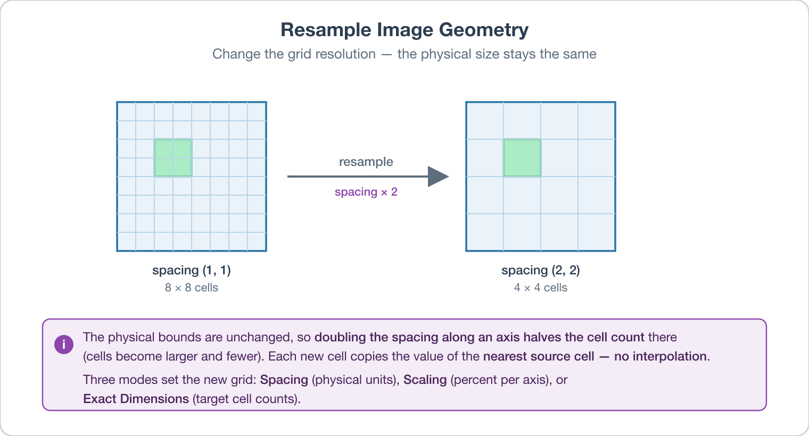

# Resample Data (Image Geometry)

## Group (Subgroup)

Sampling (Resample)

## Description

This **Filter** changes the cell resolution of an **Image Geometry** by overlaying a new regular grid on the existing data and copying the *closest-cell* value from the old grid to each new cell. No interpolation is performed.

The overall **bounds** of the volume do not change -- only the spacing and the number of cells. To scale the physical extent of a geometry, apply a scaling transformation with [Apply Transformation To Geometry](ApplyTransformationToGeometryFilter.md) instead.

### Resampling Mode

The *Resampling Mode* parameter provides three ways to specify the new grid:

- **Spacing [0]**: Set the new spacing directly (in physical units; same as the input geometry's spacing). The cell count adjusts accordingly. Use small spacings cautiously -- they can produce very large cell counts.
- **Scaling [1]**: Scale spacing by a percentage per axis. A scaling factor of 30% reduces cell count to roughly 30% of the original (and increases spacing by ~3.33x).
- **Exact Dimensions [2]**: Set the exact new cell counts per axis (integer). Spacing is computed automatically to span the original bounds.

#### Spacing Examples

Image with cell dimensions (524, 390, 164) and spacing (1, 1, 1) (units in microns/voxel).

- New spacing (2, 2, 2) → cell dimensions (262, 195, 82), spacing (2, 2, 2) microns/voxel.
- New spacing (0.25, 0.7, 2.3) → cell dimensions (2096, 557, 71), spacing (0.25, 0.7, 2.3).

#### Scaling Examples

Same starting image.

- Scaling (30%, 30%, 30%) → cell dimensions (157, 117, 49), spacing (3.333, 3.333, 3.333).
- Scaling (120.4%, 50.74%, 68.12%) → cell dimensions (630, 197, 111), spacing (0.831, 1.971, 1.468).

#### Exact Dimensions Examples

Same starting image.

- Exact dimensions (100, 100, 100) → cell dimensions (100, 100, 100), spacing (5.24, 3.9, 1.64).
- Exact dimensions (100, 500, 20) → cell dimensions (100, 500, 20), spacing (5.24, 0.78, 8.2).

### Resampling Algorithm

A new regular grid is overlaid on the old one. For each new cell, the filter finds the old cell whose center is closest and copies that old cell's attributes (Feature Ids, phases, orientations, etc.) into the new cell. There is **no interpolation** -- this is the right behavior for label data (Feature Ids), but it does mean that small features can disappear during downsampling.

### Renumber Features

When downsampling produces a result in which some Features no longer have any cells, those Features become invalid. Enable *Renumber Features* to detect this case, resize the Cell Feature Attribute Matrix to drop the empty features, and renumber the remaining features so that Feature IDs remain contiguous starting at 1.

## WARNING: NeighborList Removal

When *Renumber Features* is enabled and the Cell Feature Attribute Matrix contains any *NeighborList* arrays, those arrays are **removed** because they refer to the old (pre-renumber) Feature IDs. Re-run [Compute Feature Neighbors](ComputeFeatureNeighborsFilter.md) afterward to rebuild them.

### Required Input Sources

- **Input Image Geometry** -- the geometry to be resampled. Typically produced by [Create Image Geometry](CreateImageGeometryFilter.md), [ITK Import Image Stack](../ITKImageProcessing/ITKImportImageStackFilter.md), or an EBSD reader.

% Auto generated parameter table will be inserted here

## Example Pipelines

SimplnxCore/ResamplePorosityImage

## License & Copyright

Please see the description file distributed with this **Plugin**

## DREAM3D-NX Help

If you need help, need to file a bug report or want to request a new feature, please head over to the [DREAM3DNX-Issues](https://github.com/BlueQuartzSoftware/DREAM3DNX-Issues/discussions) GitHub site where the community of DREAM3D-NX users can help answer your questions.
