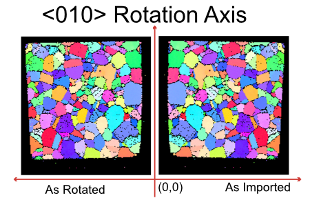

# Rotate Sample Reference Frame

## Group (Subgroup)

Sampling (Rotating/Transforming)

## Description

**NOTE: As of July 2023, this filter is only verified to work with a rotation angle of 180 degrees, a rotation axis of (010), and a (0, 0, 0) origin.**

This **Filter** will rotate the *spatial reference frame* around a user defined axis, by a user defined angle.  The **Filter** will modify the (X, Y, Z) positions of each **Cell** to correctly represent where the **Cell** sits in the newly defined reference frame. For example, if a user selected a *rotation angle* of 90o and a *rotation axis* of (001), then a **Cell** sitting at (10, 0, 0) would be transformed to (0, -10, 0), since the new *reference frame* would have x'=y and y'=-x.

The equivalent rotation matrix for the above rotation would be the following:

|   |   |   |
| - | - | - |
| 0 | -1 | 0 |
| 1 | 0 | 0 |
| 0 | 0 | 1 |

## Example

When importing EBSD data from EDAX typically the user will need to rotate the sample reference frame about the <010> (Y) axis. This results in the image comparison below. Note that in the original image the origin of the data is at (0, 0) microns but after rotation the origin now becomes (-189, 0) microns. If you need to reset the origin back to (0,0) then the filter "Set Origin & Spacing" can be run.

% Auto generated parameter table will be inserted here

## Example Pipelines

+ INL Export
+ Export Small IN100 ODF Data (StatsGenerator)
+ TxCopper_Exposed
+ TxCopper_Unexposed
+ Edax IPF Colors
+ Confidence Index Histogram

## License & Copyright

Please see the description file distributed with this **Plugin**

## DREAM3D-NX Help

If you need help, need to file a bug report or want to request a new feature, please head over to the [DREAM3DNX-Issues](https://github.com/BlueQuartzSoftware/DREAM3DNX-Issues/discussions) GitHub site where the community of DREAM3D-NX users can help answer your questions.
