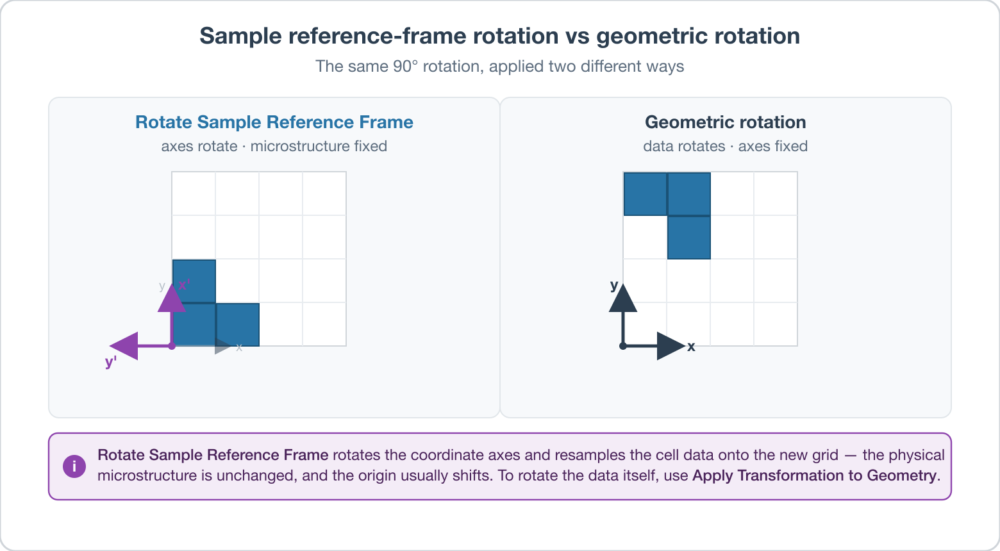
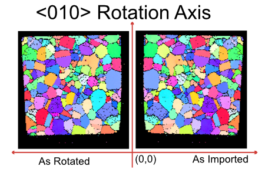

# Rotate Sample Reference Frame

## Group (Subgroup)

Sampling (Rotating/Transforming)

## Description

This **Filter** rotates the *spatial reference frame* of an **Image Geometry** about a principal axis by a multiple of 90 degrees. It modifies the (X, Y, Z) position of every **Cell** so the data is correctly represented in the newly defined reference frame. For example, a 90 degree rotation about the (001) axis moves a **Cell** at (10, 0, 0) to (0, -10, 0), because the new reference frame has x' = y and y' = -x.

### Supported Rotations (Important)

This **Filter** is a *lossless reference-frame rotation*: the output is an exact re-labeling (permutation) of the input **Cells**, with no interpolation, no data loss, and no introduced background. That is only possible when the rotation maps the cubic voxel grid exactly onto itself. Those rotations form the **octahedral rotation group** (the 24 rotational symmetries of a cube):

- the **90, 180, or 270 degree** rotations about the **X (100)**, **Y (010)**, or **Z (001)** axis — the common cases; and
- the other cube-symmetry rotations: a **180 degree** rotation about a face-diagonal axis such as **(110)**, and a **120 or 240 degree** rotation about a body-diagonal axis such as **(111)**.

The **Filter** enforces this in preflight. Any rotation that does **not** map the grid onto itself — an arbitrary angle (e.g. 45 degrees), or an off-group axis/angle combination such as **90 degrees about (111)** — is rejected with an error, because a nearest-neighbor resample of such a rotation would silently drop and duplicate voxels and pad the result with background values. To apply an arbitrary rotation (with interpolation), use the [Apply Transformation To Geometry](ApplyTransformationToGeometryFilter.md) filter instead.

### ⚠ Limited Verification

The *Rotation Representation* parameter selects how the rotation is specified. Both forms must still resolve to a rotation that maps the voxel grid onto itself (see Supported Rotations above):

- **Axis Angle [0]**: a unit axis vector (x, y, z) and an angle in **degrees**.
- **Rotation Matrix [1]**: a 3x3 rotation matrix entered directly. It must be a proper axis-permutation matrix (each entry -1, 0, or +1, one nonzero per row and column, determinant +1).

The rotation matrix equivalent to a 90 degree rotation about (001) is:

|    |    |   |
| -- | -- | - |
| 0  | -1 | 0 |
| 1  | 0  | 0 |
| 0  | 0  | 1 |

### Perform Slice By Slice Transform

The *Perform Slice By Slice Transform* option applies the rotation independently to each Z slice (the slice index is preserved). It is used to express an in-plane sample transform for EBSD data. Because it keeps every output slice tied to the same input slice, it is only valid for rotations that preserve the Z (slice) axis: a rotation about the **Z** axis, or a **180 degree** rotation about the **X** or **Y** axis. A 90 or 270 degree rotation about X or Y reorders slices and is rejected when this option is enabled. This option is specific to EBSD data and is not generally used.

## Notes

The rotation will most likely produce an origin that differs from the input geometry's origin (the transformed bounding box is repositioned). The *Keep Input Geometry's Origin* option preserves the original origin instead; by default it is OFF and the transform-derived origin is used. To reset the origin and spacing afterward, use the [Set Origin & Spacing](SetImageGeomOriginScalingFilter.md) filter.

## Example

When importing EBSD data from EDAX, the user typically rotates the sample reference frame 180 degrees about the (010) (Y) axis. In the comparison below the original data origin is at (0, 0) microns, and after rotation the origin becomes (-189, 0) microns.

### Required Input Sources

- **Selected Image Geometry** -- an **Image Geometry** and all of its **Cell** arrays; produced by any image or EBSD reader, for example [Read H5EBSD File](../OrientationAnalysis/ReadH5EbsdFilter.md), [Import EDAX OIM Data (.h5)](../OrientationAnalysis/ReadH5OimDataFilter.md), or [ITK Import Images (3D Stack)](../ITKImageProcessing/ITKImportImageStackFilter.md).

### Rotation Representation

The *Rotation Representation* parameter selects how the rotation is specified:

- **Axis Angle [0]**: A unit axis vector (x, y, z) plus an angle in **degrees**. The most common form for single-axis rotations.
- **Rotation Matrix [1]**: A 3x3 rotation matrix entered directly.

### Notes on the Output Origin

The rotated geometry will most likely have an origin that differs from the input geometry's origin (see EDAX example above). If you wish to keep the input origin, enable the *Keep Input Geometry's Origin* option. By default, the option is OFF, so the transformation-derived origin is used.

### Required Input Sources

- **Image Geometry** -- the input image whose reference frame is being rotated. Typically produced by an EBSD reader such as [Read H5EBSD](../OrientationAnalysis/ReadH5EbsdFilter.md), [Read CTF Data](../OrientationAnalysis/ReadCtfDataFilter.md), or [Read ANG Data](../OrientationAnalysis/ReadAngDataFilter.md).

% Auto generated parameter table will be inserted here

## Example Pipelines

+ INL Export
+ Export Small IN100 ODF Data (StatsGenerator)
+ TxCopper_Exposed
+ TxCopper_Unexposed
+ Edax IPF Colors
+ Confidence Index Histogram

## License & Copyright

Please see the description file distributed with this **Plugin**

## DREAM3D-NX Help

If you need help, need to file a bug report or want to request a new feature, please head over to the [DREAM3DNX-Issues](https://github.com/BlueQuartzSoftware/DREAM3DNX-Issues/discussions) GitHub site where the community of DREAM3D-NX users can help answer your questions.
