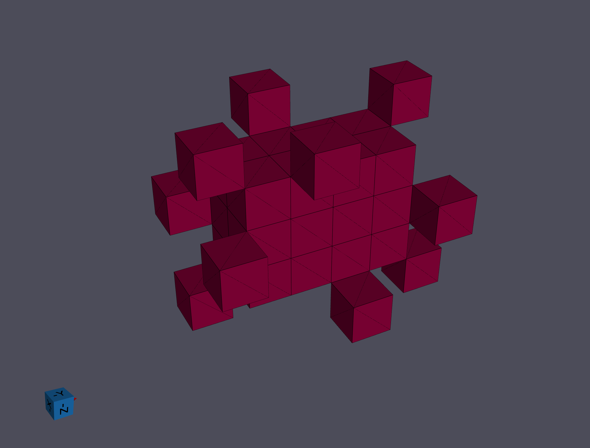
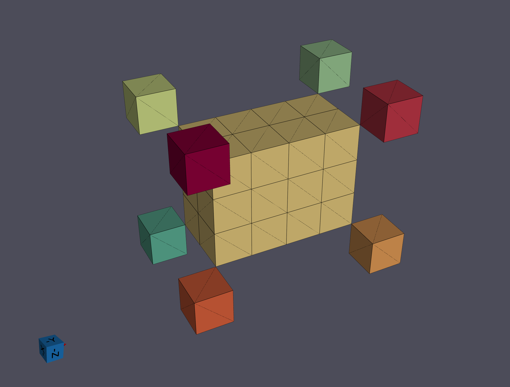
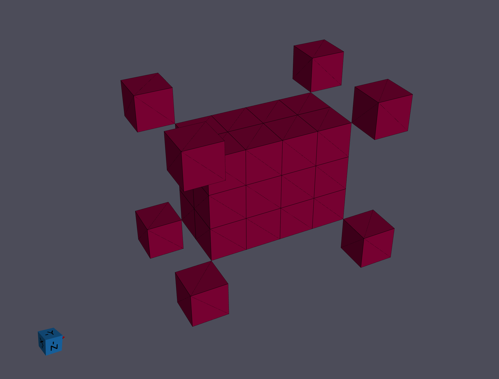
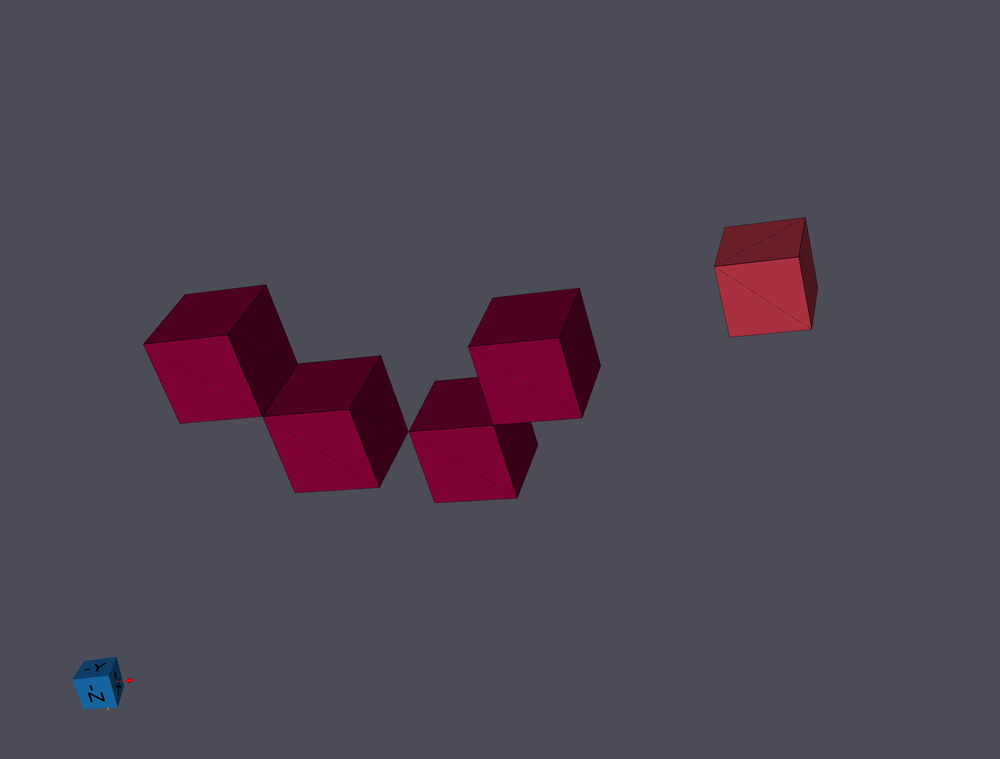

# Segment Features (Scalar)

## Group (Subgroup)

Reconstruction (Segmentation)

## Description

This **Filter** segments the **Features** by grouping neighboring **Cells** that satisfy the *scalar tolerance*, i.e., have a scalar difference less than the value set by the user. The process by which the **Features** are identified is given below and is a standard *burn algorithm*.

1. Randomly select a **Cell**, add it to an empty list and set its *FeatureId* to the current **Feature**
2. Compare the **Cell** to each of its six (6) face-sharing neighbors (i.e., calculate the scalar difference with each neighbor)
3. Add each neighbor **Cell** that has a scalar difference below the user defined tolerance to the list created in 1) and set the *FeatureId* of the neighbor **Cell** to the current **Feature**
4. Remove the current **Cell** from the list and move to the next **Cell** and repeat 2. and 3.; continue until no **Cells** are left in the list
5. Increment the current **Feature** counter and repeat steps 1. through 4.; continue until no **Cells** remain unassigned in the dataset

The user has the option to *Use Mask Array*, which allows the user to set a boolean array for the **Cells** that remove **Cells** with a value of *false* from consideration in the above algorithm. This option is useful if the user has an array that either specifies the domain of the "sample" in the "image" or specifies if the orientation on the **Cell** is trusted/correct.

After all the **Features** have been identified, an **Attribute Matrix** is created for the **Features** and each **Feature** is flagged as *Active* in a boolean array in the matrix.

If the data is specified as **Periodic**, the segmentation will check if features wrap around geometry bounds in a tileable fashion. If any such features are detected, the filter will throw a warning that centroid data may be incorrect.

### Neighbor Scheme

The *Neighbor Scheme* parameter provides the following choices:

- **Face Neighbors [0]**: Only the 6 face-sharing neighbors of a voxel are considered during segmentation.
- **All Connected Neighbors [1]**: All 26 neighbors connected by a face, edge, or vertex are considered during segmentation.

## Note on Neighbor Scheme

Historically DREAM.3D version 6.x has used *only* the 6 face neighbors of a voxel. This release introduces the option
of using all 26 neighboring voxels that are connected by a face, edge or vertex. The default for the filter
is to still use the 6 face neighbors ("Face Only") in order to stay consistent with the output from DREAM.3D version 6.x.

| Neighbor Scheme = "Face Only" | Neighbor Scheme = "All Connected" |
|:--:|:--:|
|  |  |

| Neighbor Scheme = "Face Only" | Neighbor Scheme = "All Connected" |
|:--:|:--:|
|  |  |

| Neighbor Scheme = "Face Only" | Neighbor Scheme = "All Connected" |
|:--:|:--:|
|  |  |

| Neighbor Scheme = "Face Only" | Neighbor Scheme = "All Connected" |
|:--:|:--:|
|  |  |

% Auto generated parameter table will be inserted here

## Example Pipelines

+ (09) Image Segmentation

## License & Copyright

Please see the description file distributed with this **Plugin**

## DREAM3D-NX Help

If you need help, need to file a bug report or want to request a new feature, please head over to the [DREAM3DNX-Issues](https://github.com/BlueQuartzSoftware/DREAM3DNX-Issues/discussions) GitHub site where the community of DREAM3D-NX users can help answer your questions.
