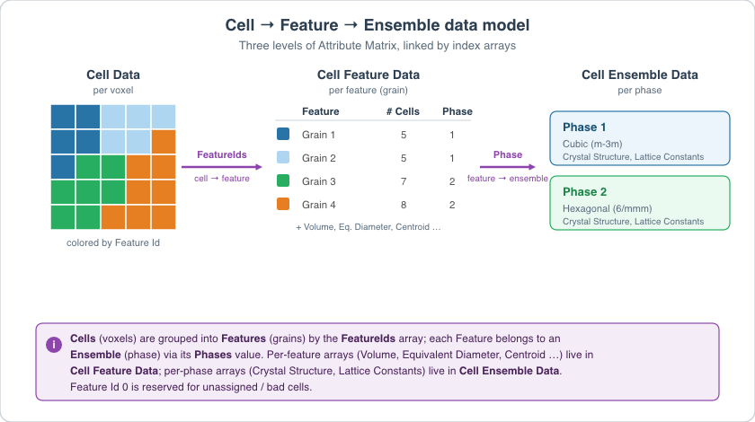

# Segment Features (Scalar)

## Group (Subgroup)

Reconstruction (Segmentation)

## Description

This **Filter** groups neighboring **Cells** (voxels) that have similar scalar values into **Features** (connected regions). The output is a *FeatureIds* array that assigns every cell in the input **Image Geometry** to a numbered feature, so that downstream analyses can operate on features instead of individual cells.

Use this filter whenever your segmentation criterion is a single scalar value per cell -- for example, image quality, confidence index, a phase label, or a computed property. For orientation-based segmentation of EBSD data, see [Segment Features (Misorientation)](../OrientationAnalysis/EBSDSegmentFeaturesFilter.md) or [Segment Features (C-Axis Misalignment)](../OrientationAnalysis/CAxisSegmentFeaturesFilter.md).

### What is Feature Segmentation?

Segmentation groups cells that "belong together" into discrete regions. Each region receives a unique positive integer *Feature Id*; cells that are excluded (for example, by a mask) are assigned Feature Id 0. After segmentation, a new **Feature Attribute Matrix** is created so that per-feature statistics (sizes, centroids, phases, etc.) can be computed and stored.

### How This Filter Works

This filter uses a standard *burn algorithm* to grow each feature outward from a seed cell:

1. Randomly pick an unassigned **Cell** and give it a new *Feature Id*.
2. Compare the cell's scalar value to each of its neighboring cells (see **Neighbor Scheme** below).
3. Any neighbor whose scalar value differs from the seed by less than the user-specified *Scalar Tolerance* is added to the current feature and gets the same *Feature Id*.
4. Repeat step 2-3 from each newly added cell, growing the feature outward until no more neighbors qualify.
5. Increment the feature counter and pick a new unassigned seed cell. Continue until every eligible cell has been assigned.

### Tolerance and Units

The *Scalar Tolerance* is in **the same units as the input scalar array**. There are no universal "good" values; the right tolerance depends entirely on what array you are segmenting:

- For an integer phase map, a tolerance of 0 (or less than 1) groups only cells with exactly the same phase.
- For a floating-point image-quality array with values 0-1, tolerances around 0.05-0.1 are typical.
- For a raw grayscale image with values 0-255, tolerances of 5-20 are typical.

Start conservative (smaller tolerance -> more, smaller features), inspect the result, and loosen the tolerance if features are being over-split.

## Algorithm

The filter has two execution paths selected automatically at runtime:

- **In-core (DFS flood fill)**: The classic depth-first search algorithm described above. Each voxel is visited via element-by-element access through a typed comparator.
- **Out-of-core (Connected-Component Labeling)**: A slice-by-slice CCL algorithm that processes data Z-slice at a time. This path is activated automatically when the data resides in an out-of-core (OOC) DataStore.

Both paths produce identical segmentation results. After segmentation, the Feature Attribute Matrix is resized, the Active array is initialized, and Feature IDs are optionally randomized.

### Performance

When operating on out-of-core data, the CCL path uses a rolling 2-slot buffer system. Before processing each Z-slice, the algorithm bulk-reads the scalar input and mask arrays for that slice into contiguous in-memory buffers. All voxel comparisons then read from these buffers rather than the underlying disk-backed DataStore, eliminating chunk load/evict cycles. Two buffer slots are maintained simultaneously (current and previous slice) because the CCL algorithm must compare voxels across adjacent slices.

All scalar types are converted to `float64` in the buffer for uniform comparison, so a single comparison code path handles all input data types.

### Neighbor Scheme

The *Neighbor Scheme* parameter provides the following choices:

- **Face Neighbors [0]**: Only the 6 face-sharing neighbors of a voxel are considered during segmentation.
- **All Connected Neighbors [1]**: All 26 neighbors connected by a face, edge, or vertex are considered during segmentation.

DREAM.3D version 6.x only used face neighbors. The default here is still *Face Only* for backward compatibility; switch to *All Connected* when diagonal connectivity should merge a feature that would otherwise be split.

| Neighbor Scheme = "Face Only" | Neighbor Scheme = "All Connected" |
|:--:|:--:|
|  |  |

| Neighbor Scheme = "Face Only" | Neighbor Scheme = "All Connected" |
|:--:|:--:|
|  |  |

| Neighbor Scheme = "Face Only" | Neighbor Scheme = "All Connected" |
|:--:|:--:|
|  |  |

| Neighbor Scheme = "Face Only" | Neighbor Scheme = "All Connected" |
|:--:|:--:|
|  |  |

### Mask Array

If *Use Mask Array* is enabled, cells flagged *false* in the mask are excluded from segmentation and left with a Feature Id of 0. Masks are commonly used to restrict segmentation to valid sample regions -- for example, a quality threshold on an EBSD confidence index (see [Multi-Threshold Objects](MultiThresholdObjectsFilter.md)).

### Periodic Option

If the input data represents a **periodic** structure (i.e., features are allowed to wrap across opposite faces of the volume), enable *Is Periodic*. The filter will detect features that tile across the geometry bounds and emit a warning that centroid and other spatial statistics may be incorrect for those features.

### Required Input Sources

- **Input Scalar Array** -- any single-component cell-level scalar array suitable for thresholding. Common sources include image readers such as [ITK Import Image Stack](../ITKImageProcessing/ITKImportImageStackFilter.md), phase or quality arrays from EBSD readers such as [Read H5EBSD](../OrientationAnalysis/ReadH5EbsdFilter.md), or any computed per-cell scalar from an earlier filter in the pipeline.
- **Mask Array** (optional) -- a boolean array marking valid cells, typically produced by [Multi-Threshold Objects](MultiThresholdObjectsFilter.md).

% Auto generated parameter table will be inserted here

## Example Pipelines

+ (09) Image Segmentation

## License & Copyright

Please see the description file distributed with this **Plugin**

## DREAM3D-NX Help

If you need help, need to file a bug report or want to request a new feature, please head over to the [DREAM3DNX-Issues](https://github.com/BlueQuartzSoftware/DREAM3DNX-Issues/discussions) GitHub site where the community of DREAM3D-NX users can help answer your questions.
