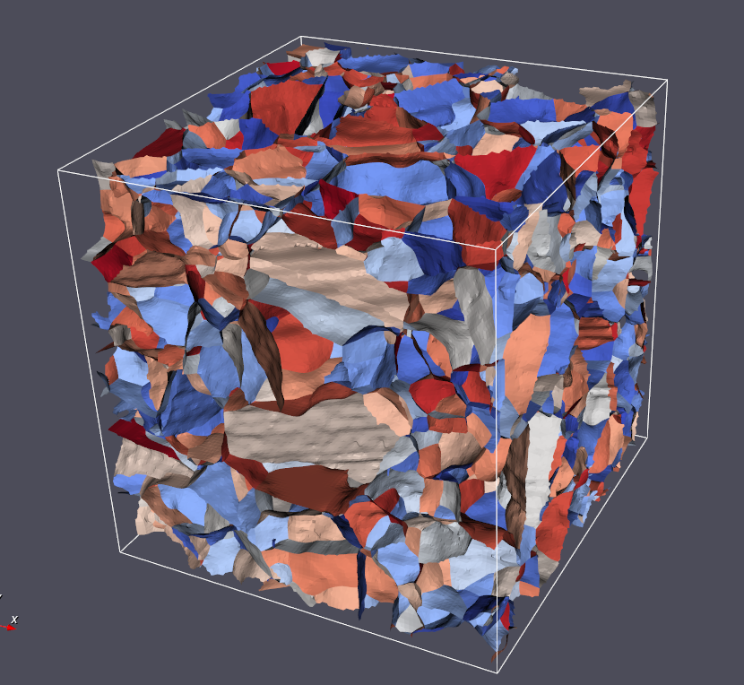
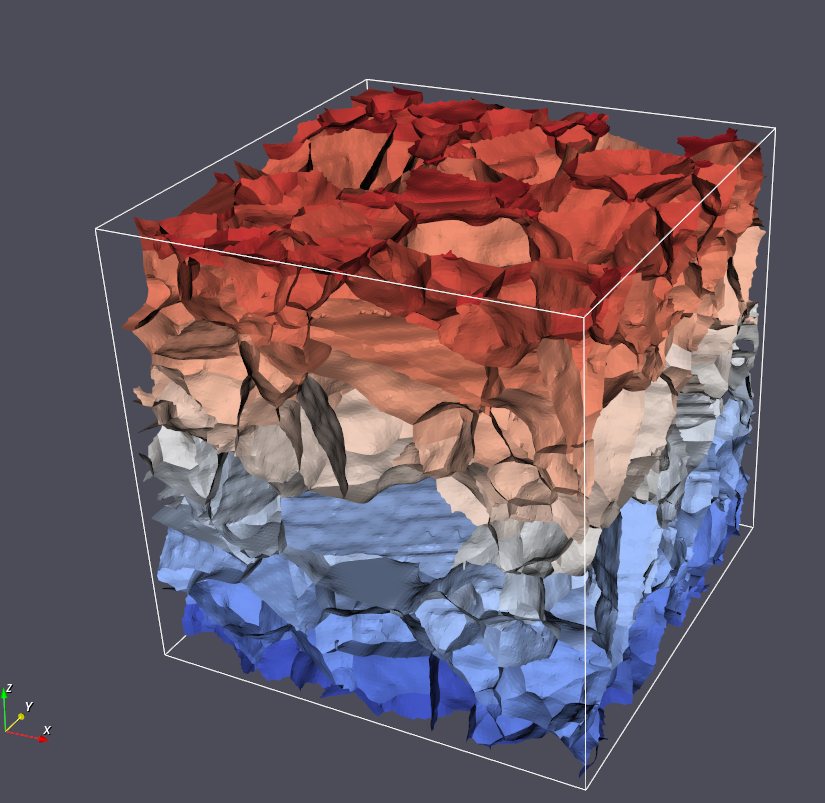

# Generate Triangle Face Ids

## Group (Subgroup)

Surface Meshing (Connectivity/Arrangement)

## Description

This **Filter** assigns a unique Id to each **Triangle** in a **Triangle Geometry** that represents the _unique boundary_ 
on which that **Triangle** resides. For example, if there were only two **Features** that shared one boundary,
then the **Triangles** on that boundary would be labeled with a single unique Id. This procedure creates _unique groups_
of **Triangles**, which themselves are a set of **Features**. Thus, this **Filter** also creates a **Feature Attribute
Matrix** for this new set of **Features**, and creates **Attribute Arrays** for their Ids and number of **Triangles**. This
process can be considered a **segmentation** where each unique id is the shared boundary between two features.

Because the algorithm is essentially segmenting the triangles based on the unique combination of face labels, the filter will
also generate a Feature level Attribute Matrix and place two additional _DataArrays_ into that feature attribute matrix
that store the following information:

1. The number of triangles in each unique boundary
2. The pair of Face Label values that made up the unique boundary.

### Generated Feature Boundaries _with_ Randomization

### Generated Feature Boundaries _without_ Randomization

---------------

% Auto generated parameter table will be inserted here

## Example Pipelines

"(03) Small IN100 Mesh Statistics.d3dpipeline"

## License & Copyright

Please see the description file distributed with this **Plugin**

## DREAM3D-NX Help

If you need help, need to file a bug report or want to request a new feature, please head over to the [DREAM3DNX-Issues](https://github.com/BlueQuartzSoftware/DREAM3DNX-Issues/discussions) GItHub site where the community of DREAM3D-NX users can help answer your questions.
