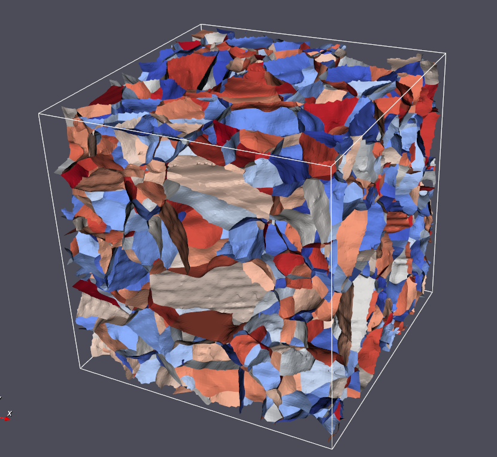
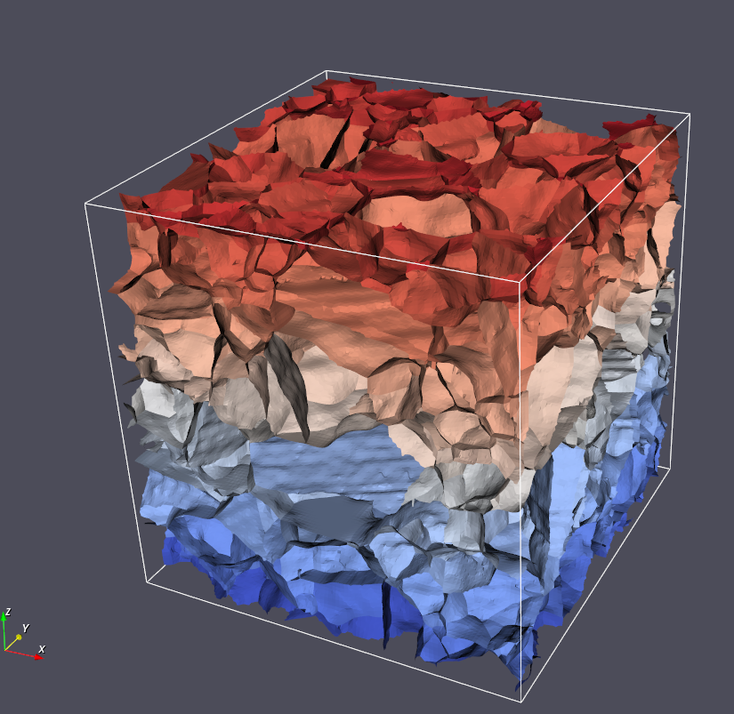

# Compute Triangle Face Ids

## Group (Subgroup)

Surface Meshing (Connectivity/Arrangement)

(Note: this filter's human name is *Compute Triangle Face Ids*, even though its source file is named `SharedFeatureFace`.)

## Description

This filter assigns a unique Id to each **Triangle** in a **Triangle Geometry** (a surface mesh built from triangles) that identifies the *unique boundary* on which that triangle resides. A **Feature** is a region of material; the **Face Labels** of a triangle are the pair of **Feature** Ids on either side of it. All triangles sharing the same pair of **Face Labels** form one shared boundary and receive the same unique Id.

For example, if only two **Features** shared a single boundary, every triangle on that boundary would be labeled with one unique Id. This procedure groups the triangles into unique boundaries, which are themselves treated as a new set of **Features** (one per shared boundary).

The filter therefore also creates a **Feature Attribute Matrix** (a table holding one row of data per shared-boundary feature) and places two **Attribute Arrays** into it:

1. The number of triangles in each unique boundary.
2. The pair of **Face Labels** values that made up each unique boundary.

This process can be viewed as a **segmentation** in which each unique Id is the shared boundary between two features.

### Randomize Face IDs

The *Randomize Face IDs* parameter shuffles the assigned boundary Id values. The grouping of triangles is unchanged; only the numeric Id labels are permuted. This is purely a visualization aid: with sequential Ids, neighboring boundaries can map to similar colors and blend together, whereas randomized Ids spread adjacent boundaries across the color map so they are easier to tell apart. The two figures below illustrate the difference.

### Generated Feature Boundaries _with_ Randomization

### Generated Feature Boundaries _without_ Randomization

### Required Input Sources

- **Triangle Geometry** -- a surface mesh, typically produced by a surface-meshing filter such as [Create Surface Mesh (Surface Nets)](SurfaceNetsFilter.md) or [Create Surface Mesh (QuickMesh)](QuickSurfaceMeshFilter.md).
- **Face Labels** -- the per-triangle pair of **Feature** Ids, produced alongside the mesh by the surface-meshing filter above.

% Auto generated parameter table will be inserted here

## Example Pipelines

+ (03) Small IN100 Mesh Statistics

## License & Copyright

Please see the description file distributed with this **Plugin**

## DREAM3D-NX Help

If you need help, need to file a bug report or want to request a new feature, please head over to the [DREAM3DNX-Issues](https://github.com/BlueQuartzSoftware/DREAM3DNX-Issues/discussions) GitHub site where the community of DREAM3D-NX users can help answer your questions.
